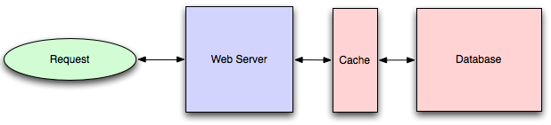
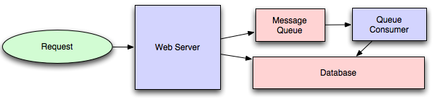
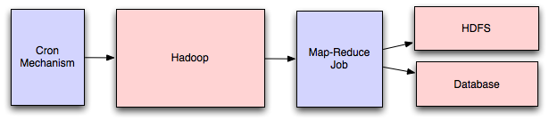
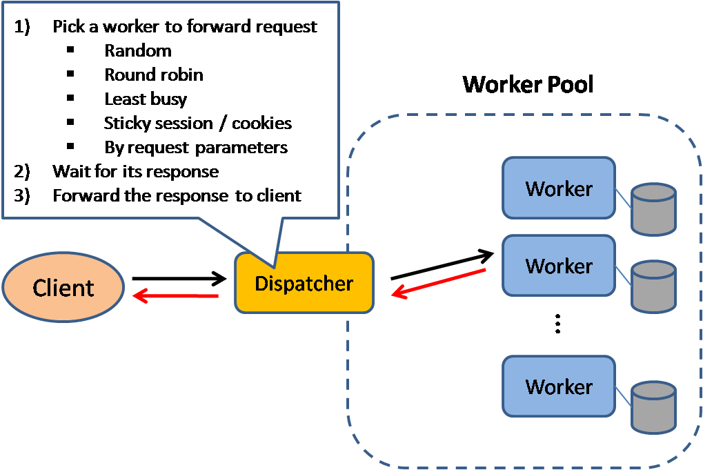

# The System Design Primer

  
   

## Load balancing

   

## Application caching 

   

## Database caching

   

## Content distribution networks

   

## Message queues

   

## Map-reduce

   

## Application layer
and
## Platform layer

  
   
  <i><a href=http://lethain.com/introduction-to-architecting-systems-for-scale/#platform_layer>Source: Intro to architecting systems for scale</a></i>

## Asynchronism

  
   
  <i><a href=http://lethain.com/introduction-to-architecting-systems-for-scale/#platform_layer>Source: Intro to architecting systems for scale</a></i>

## Load balancer

  
   
  <i><a href=http://horicky.blogspot.com/2010/10/scalable-system-design-patterns.html>Source: Scalable system design patterns</a></i>

## Cache

  
   
  <i><a href=http://horicky.blogspot.com/2010/10/scalable-system-design-patterns.html>Source: Scalable system design patterns</a></i>

### Real world architectures

  
   
  <i><a href=https://www.infoq.com/presentations/Twitter-Timeline-Scalability>Source: Twitter timelines at scale</a></i>

## Database

  
   
  <i><a href=https://www.youtube.com/watch?v=w95murBkYmU>Source: Scaling up to your first 10 million users</a></i>

#### Federation

  
   
  <i><a href=https://www.youtube.com/watch?v=w95murBkYmU>Source: Scaling up to your first 10 million users</a></i>

#### Sharding

  
   
  <i><a href=http://www.slideshare.net/jboner/scalability-availability-stability-patterns/>Source: Scalability, availability, stability, patterns</a></i>

## Reverse proxy (web server)

  
   
  <i><a href=https://upload.wikimedia.org/wikipedia/commons/6/67/Reverse_proxy_h2g2bob.svg>Source: Wikipedia</a></i>
   

