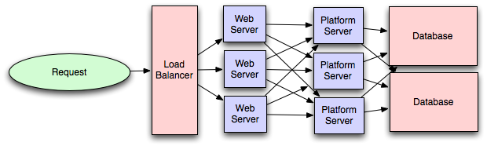

# The System Design Primer

<p align="center">
  
  <br/>
</p>

* DNS( A Domain Name System e.g. CloudFlare, Route 53 ) translates a domain name such as www.example.com to an IP address
* CDN( Content distribution networks ) searves static assets(images, JavaScript files).e.g. Cloudflare CDN
* Load balancers distribute incoming client requests to computing resources such as application servers and databases.
  e.g. nginx, HAProxy

* Queues: Off-line processing. 
	- Message queues(RabbitMQ / Redis / Amazon SQS ). In Bigdata environment(Kafka for message queues and streaming)
		- Scheduling periodic tasks(Cron, puppet, Airflow). In Bigdata environment(Oozie)
	- Task queues (Celery). In Bigdata environment(Kafka / Pulsar)
		Hive/HBase, Map Reduce/Spark etc are used for processing data in a bigdata environment


* In-memory caches: Caches in memory. Ex. Redis, Memcached
* Object storage: a specialized type of NoSQL database designed to handle data created by applications that use object-oriented programming techniques, avoiding the Object to Relational Mapping overhead required
	e.g. storing photos on Facebook, songs on Spotify, or files in online collaboration services, such as Dropbox.

* NoSQL: collection of data items represented in a key-value store, document-store, wide column store, or a graph database. Data is denormalized, and joins are generally done in the application code. Most NoSQL stores lack true ACID transactions and favor eventual consistency.
	- key-value store : Redis, Memcached, DynamoDB 
	- Document store: MongoDB, CouchDB, ElasticSearch, DynamoDB 
	- wide column store: Bigtable, HBase, Cassandra
	- Graph databases  : Graph database, Neo4j, FlockDB

## Motivation

> Learn how to design large-scale systems.
>
> Prep for the system design interview.

Additional topics for interview prep:

* [Study guide](#study-guide)
* [How to approach a system design interview question](#how-to-approach-a-system-design-interview-question)
* [System design interview questions, **with solutions**](#system-design-interview-questions-with-solutions)
* [Object-oriented design interview questions, **with solutions**](#object-oriented-design-interview-questions-with-solutions)
* [Additional system design interview questions](#additional-system-design-interview-questions)

## Anki flashcards

<p align="center">
  
  <br/>
</p>

The provided [Anki flashcard decks](https://apps.ankiweb.net/) use spaced repetition to help you retain key system design concepts.

* [System design deck](https://github.com/donnemartin/system-design-primer/tree/master/resources/flash_cards/System%20Design.apkg)
* [System design exercises deck](https://github.com/donnemartin/system-design-primer/tree/master/resources/flash_cards/System%20Design%20Exercises.apkg)
* [Object oriented design exercises deck](https://github.com/donnemartin/system-design-primer/tree/master/resources/flash_cards/OO%20Design.apkg)

Great for use while on-the-go.

### Coding Resource: Interactive Coding Challenges

Looking for resources to help you prep for the [**Coding Interview**](https://github.com/donnemartin/interactive-coding-challenges)?

<p align="center">
  
  <br/>
</p>

Check out the sister repo [**Interactive Coding Challenges**](https://github.com/donnemartin/interactive-coding-challenges), which contains an additional Anki deck:

* [Coding deck](https://github.com/donnemartin/interactive-coding-challenges/tree/master/anki_cards/Coding.apkg)


## Index of system design topics

> Summaries of various system design topics, including pros and cons.  **Everything is a trade-off**.
>
> Each section contains links to more in-depth resources.

<p align="center">
  
  <br/>
</p>

* [System design topics: start here](#system-design-topics-start-here)
    * [Step 1: Review the scalability video lecture](#step-1-review-the-scalability-video-lecture)
    * [Step 2: Review the scalability article](#step-2-review-the-scalability-article)
    * [Next steps](#next-steps)
* [Performance vs scalability](#performance-vs-scalability)
* [Latency vs throughput](#latency-vs-throughput)
* [Availability vs consistency](#availability-vs-consistency)
    * [CAP theorem](#cap-theorem)
        * [CP - consistency and partition tolerance](#cp---consistency-and-partition-tolerance)
        * [AP - availability and partition tolerance](#ap---availability-and-partition-tolerance)
* [Consistency patterns](#consistency-patterns)
    * [Weak consistency](#weak-consistency)
    * [Eventual consistency](#eventual-consistency)
    * [Strong consistency](#strong-consistency)
* [Availability patterns](#availability-patterns)
    * [Fail-over](#fail-over)
    * [Replication](#replication)
* [Domain name system](#domain-name-system)
* [Content delivery network](#content-delivery-network)
    * [Push CDNs](#push-cdns)
    * [Pull CDNs](#pull-cdns)
* [Load balancer](#load-balancer)
    * [Active-passive](#active-passive)
    * [Active-active](#active-active)
    * [Layer 4 load balancing](#layer-4-load-balancing)
    * [Layer 7 load balancing](#layer-7-load-balancing)
    * [Horizontal scaling](#horizontal-scaling)
    * [Elastic Load Balancer](#elastic-load-balancer)
* [Reverse proxy (web server)](#reverse-proxy-web-server)
    * [Load balancer vs reverse proxy](#load-balancer-vs-reverse-proxy)
* [Application layer](#application-layer)
    * [Microservices](#microservices)
    * [Service discovery](#service-discovery)
* [Database](#database)
    * [Relational database management system (RDBMS)](#relational-database-management-system-rdbms)
        * [Master-slave replication](#master-slave-replication)
        * [Master-master replication](#master-master-replication)
        * [Federation](#federation)
        * [Sharding](#sharding)
        * [Denormalization](#denormalization)
        * [SQL tuning](#sql-tuning)
    * [NoSQL](#nosql)
        * [Key-value store](#key-value-store)
        * [Document store](#document-store)
        * [Wide column store](#wide-column-store)
        * [Graph Database](#graph-database)
    * [SQL or NoSQL](#sql-or-nosql)
* [Cache](#cache)
    * [Client caching](#client-caching)
    * [CDN caching](#cdn-caching)
    * [Web server caching](#web-server-caching)
    * [Database caching](#database-caching)
    * [Application caching](#application-caching)
    * [Caching at the database query level](#caching-at-the-database-query-level)
    * [Caching at the object level](#caching-at-the-object-level)
    * [When to update the cache](#when-to-update-the-cache)
        * [Cache-aside](#cache-aside)
        * [Write-through](#write-through)
        * [Write-behind (write-back)](#write-behind-write-back)
        * [Refresh-ahead](#refresh-ahead)
* [Databases! How do you know it's the right one?](#databases-how-do-you-know-it-the-right-one)
* [Asynchronism](#asynchronism)
    * [Message queues](#message-queues)
    * [Task queues](#task-queues)
    * [Back pressure](#back-pressure)
* [Communication](#communication)
    * [Transmission control protocol (TCP)](#transmission-control-protocol-tcp)
    * [User datagram protocol (UDP)](#user-datagram-protocol-udp)
    * [Remote procedure call (RPC)](#remote-procedure-call-rpc)
    * [Representational state transfer (REST)](#representational-state-transfer-rest)
* [Security](#security)
* [Appendix](#appendix)
    * [Powers of two table](#powers-of-two-table)
    * [Latency numbers every programmer should know](#latency-numbers-every-programmer-should-know)
    * [Additional system design interview questions](#additional-system-design-interview-questions)
    * [Real world architectures](#real-world-architectures)
    * [Company architectures](#company-architectures)
    * [Company engineering blogs](#company-engineering-blogs)
* [Under development](#under-development)
* [Credits](#credits)
* [Contact info](#contact-info)
* [License](#license)

## Study guide

> Suggested topics to review based on your interview timeline (short, medium, long).

**Q: For interviews, do I need to know everything here?**
**A: No, you don't need to know everything here to prepare for the interview**.

What you are asked in an interview depends on variables such as:

* How much experience you have
* What your technical background is
* What positions you are interviewing for
* Which companies you are interviewing with
* Luck

Start broad and go deeper in a few areas.  It helps to know a little about various key system design topics.  Adjust the following guide based on your timeline, experience, what positions you are interviewing for, and which companies you are interviewing with.

* **Short timeline** - Aim for **breadth** with system design topics.  Practice by solving **some** interview questions.
* **Medium timeline** - Aim for **breadth** and **some depth** with system design topics.  Practice by solving **many** interview questions.
* **Long timeline** - Aim for **breadth** and **more depth** with system design topics.  Practice by solving **most** interview questions.

| | Short | Medium | Long |
|---|---|---|---|
| Read through the [System design topics](#index-of-system-design-topics) to get a broad understanding of how systems work | :+1: | :+1: | :+1: |
| Read through a few articles in the [Company engineering blogs](#company-engineering-blogs) for the companies you are interviewing with | :+1: | :+1: | :+1: |
| Read through a few [Real world architectures](#real-world-architectures) | :+1: | :+1: | :+1: |
| Review [How to approach a system design interview question](#how-to-approach-a-system-design-interview-question) | :+1: | :+1: | :+1: |
| Work through [System design interview questions with solutions](#system-design-interview-questions-with-solutions) | Some | Many | Most |
| Work through [Object-oriented design interview questions with solutions](#object-oriented-design-interview-questions-with-solutions) | Some | Many | Most |
| Review [Additional system design interview questions](#additional-system-design-interview-questions) | Some | Many | Most |

## How to approach a system design interview question

> How to tackle a system design interview question.

The system design interview is an **open-ended conversation**.  You are expected to lead it.

You can use the following steps to guide the discussion.  To help solidify this process, work through the [System design interview questions with solutions](#system-design-interview-questions-with-solutions) section using the following steps.

### Step 1: Outline use cases, constraints, and assumptions

Gather requirements and scope the problem.  Ask questions to clarify use cases and constraints.  Discuss assumptions.

* Who is going to use it?
* How are they going to use it?
* How many users are there?
* What does the system do?
* What are the inputs and outputs of the system?
* How much data do we expect to handle?
* How many requests per second do we expect?
* What is the expected read to write ratio?

### Step 2: Create a high level design

Outline a high level design with all important components.

* Sketch the main components and connections
* Justify your ideas

### Step 3: Design core components

Dive into details for each core component.  For example, if you were asked to [design a url shortening service](solutions/system_design/pastebin/README.md), discuss:

* Generating and storing a hash of the full url
    * [MD5](solutions/system_design/pastebin/README.md) and [Base62](solutions/system_design/pastebin/README.md)
    * Hash collisions
    * SQL or NoSQL
    * Database schema
* Translating a hashed url to the full url
    * Database lookup
* API and object-oriented design

### Step 4: Scale the design

Identify and address bottlenecks, given the constraints.  For example, do you need the following to address scalability issues?

* Load balancer
* Horizontal scaling
* Caching
* Database sharding

Discuss potential solutions and trade-offs.  Everything is a trade-off.  Address bottlenecks using [principles of scalable system design](#index-of-system-design-topics).

### Back-of-the-envelope calculations

You might be asked to do some estimates by hand.  Refer to the [Appendix](#appendix) for the following resources:

* [Use back of the envelope calculations](http://highscalability.com/blog/2011/1/26/google-pro-tip-use-back-of-the-envelope-calculations-to-choo.html)
* [Powers of two table](#powers-of-two-table)
* [Latency numbers every programmer should know](#latency-numbers-every-programmer-should-know)

### Source(s) and further reading

Check out the following links to get a better idea of what to expect:

* [How to ace a systems design interview](https://www.palantir.com/2011/10/how-to-rock-a-systems-design-interview/)
* [The system design interview](http://www.hiredintech.com/system-design)
* [Intro to Architecture and Systems Design Interviews](https://www.youtube.com/watch?v=ZgdS0EUmn70)

# Single-Tenant vs Multi-Tenant Model(Singletenancy vs Multitenancy):


# Difference between Shared Nothing Architecture and Shared Disk Architecture :

SHARED NOTHING ARCHITECTURE  | SHARED DISK ARCHITECTURE
------------- | -------------
nodes do not share memory or storage  | nodes share memory as well as the storage
cheaper  | expensive
data is strictly partitioned  | data is not partitioned
fixed load balancing  | dynamic load balancing
Its advantage is that it has high availability  | Its advantage is that it has unlimited scalability

# N-Tier Architecture

In N-tier, "N" refers to a number of tiers or layers are being used like – 2-tier, 3-tier or 4-tier, etc. It is also called "Multi-Tier Architecture".

## 3-tier architecture:

	* logic tier
	* presentation tier
	* data tier


Some of the popular sites who have applied this architecture are
```
MakeMyTrip.com
Sales Force enterprise application
Indian Railways – IRCTC
Amazon.com, etc.
```

<details>
	<summary> more </summary>

## 2-Tier Architecture:

It is like Client-Server architecture, where communication takes place between client and server.

In this type of software architecture, the presentation layer or user interface layer runs on the client side while dataset layer gets executed and stored on server side.

There is no Business logic layer or immediate layer in between client and server.

## Single Tier or 1-Tier Architecture:

It is the simplest one as it is equivalent to running the application on the personal computer. All of the required components for an application to run are on a single application or server.

Presentation layer, Business logic layer, and data layer are all located on a single machine.

</details>

These are the 3 separate comonents of a 3 tier architecture of an online service.

A web server's task is to accept a http request and serve the resource with certain http response. But at the backend a server might have to make a lot of other processing to create the desired response. Like it might be using some script like python, php or java servlets to create that resource dynamically on the fly. The application server's task is to understand the script and provide a framework for its execution. Application servers are application platform specific while web servers are http protocol specific.

A database server is specific to connecting to a database using a database client or application client to query and manipulate data on the database.

### Web Server -

Basically HTTP server. Server on which your website is hosted. This server will have installed web servers such as Microsoft IIS, apache, etc. It typically listens on port 80 / 443 and is capable of handling HTTP requests. Incoming requests are forwarded to relevant application. Examples are Apache and Nginx. serves web resources using HTTP protocol. The resource can be anything - a static html, js or css file, a image or some dynamic script generated html or other media type.

### Application Server(Platform layer) -

Server that works between Web server and database server and basically manages, processes the data. Server on which your created applications which are utilizing your database, web service, etc. This application server will host business layer (wrapped with web services), scheduled jobs, windows services, etc. Examples are Apache Tomcat. Application servers respond to any number of protocols depending on the application business logic.

### Database Server -

Database server handles database queries. It runs on MySQL, PostgreSQL, MariaDB, etc.

#### Explanation with example:

Server is anything that is ready to handle requests 24 * 7 as it’s connected with the internet all the time. I will make it as easy as possible to understand the difference. So, we’ll start with an example.

Let’s say you have a website that gets 1000 visitors a day. And your budget to host your website is $10 per month. In that case, you will get one Shared hosting or tiny VPS to host your website.

Now, You are hosting your website on a single server that responds your Web requests (Apache/Nginx), Processes your data(PHP/Python) and handles your database queries(MySQL/MariaDB/Postgres)

All of these softwares are installed in a same machine and a single machine handles Web requests, Application processes and Database queries. It means, a single machine has Web server, Application server and Database server.

Now, you made progress and your website is getting 1,000,000 visitors per month. In this case, to maximize the uptime and to improve monitoring, you will host your database on different machine and call it a Database server. Because it handles all your database queries.

Now, your traffic is 1.5M visitors every month and you want to maximize your revenue by processing their data which will require too much processing. It will increase load on your server that handles your web requests and application processes.

So, you will host your application on another machine that handle requests from the web server. It will become your Application server and the server that is handling your web requests will become your dedicated Web server.

Now, you have one machine that handles your web requests which is called Web server. You have one server that runs all the processes your application requires in order to work properly which is called your Application server. And you have one server that handles database queries and we call it Database server.

Now you get better monitoring and can find out bugs and unusual activities on each and every part of your web application. To wrap it up, I am going to give you differences in a single lines.

Pretty much the platform layer is where your business logic resides. Imagine you have a site for selling cookies.

You have a web server running apache/iis that handles http requests
You have an application server ( windows/linux/etc. ) that exposes a custom API for handling sales, reports etc - you call a method via http get or some web service to get the report for sales ... etc ... etc ...
And finally you have a Database server which handles ... data storage.
Imagine your site grows to the size of amazon.com, then adding new web servers, app servers (platform layer) and db servers get easier.

Scalling out it is called.

## Distributed Network: 

It is a network architecture, where the components located at network computers coordinate and communicate their actions only by passing messages. It is a collection of multiple systems situated at different nodes but appears to the user as a single system.
It provides a single data communication network which can be managed separately by different networks.
An example of Distributed Network– where different clients are connected within LAN architecture on one side and on the other side they are connected to high-speed switches along with a rack of servers containing service nodes.

# Principles of Web Distributed Systems Design
Below are some of the key principles that influence the design of large-scale web systems:
                                       C R A M P S
  #### Cost: 
    Cost is an important factor. This obviously can include hardware and software costs,
    but it is also important to consider other facets needed to deploy and maintain the system.
    The amount of developer time the system takes to build, the amount of operational effort
    required to run the system, and even the amount of training required should all be considered. 
    Cost is the total cost of ownership.
  #### Reliability: 
    A system needs to be reliable, such that a request for data will consistently
    return the same data. In the event the data changes or is updated, then that same request
    should return the new data. Users need to know that if something is written to the system,
    or stored, it will persist and can be relied on to be in place for future retrieval.
 #### Availability: 
    The uptime of a website is absolutely critical to the reputation and functionality
    of many companies. For some of the larger online retail sites, being unavailable for even
    minutes can result in thousands or millions of dollars in lost revenue, so designing their
    systems to be constantly available and resilient to failure is both a fundamental business and
    a technology requirement. High availability in distributed systems requires the careful
    consideration of redundancy for key components, rapid recovery in the event of partial
    system failures, and graceful degradation when problems occur.
  #### Manageability: 
    Designing a system that is easy to operate is another important consideration. The manageability 
    of the system equates to the scalability of operations: maintenance and updates. Things to consider 
    for manageability are the ease of diagnosing and understanding problems when they occur, ease of making 
    updates or modifications, and how simple the system is to operate. (I.e., does it routinely operate 
    without failure or exceptions?)
 #### Performance: 
    Website performance has become an important consideration for most sites.
    The speed of a website affects usage and user satisfaction, as well as search engine rankings,
    a factor that directly correlates to revenue and retention. As a result, creating a system that
    is optimized for fast responses and low latency is key.
 #### Scalability: 
    When it comes to any large distributed system, size is just one aspect of scale
    that needs to be considered. Just as important is the effort required to increase capacity to
    handle greater amounts of load, commonly referred to as the scalability of the system.
    Scalability can refer to many different parameters of the system: how much additional traffic
    can it handle, how easy is it to add more storage capacity, or even how many more transactions 
    can be processed.

  This section is focused on some of the core factors that are central to almost all large web 
  applications: services, redundancy, partitions, and handling failure.
   
Example: Image Hosting Application
For big sites that host and deliver lots of images, there are challenges in building an
architecture that is cost-effective, highly available, and has low latency (fast retrieval).

<p align="center">

  <br/>
</p>

# Introduction to architecting systems for scale.
April 4, 2011. Filed under [infrastructurearchitecture](https://lethain.com/tags/infrastructure/)

Few computer science or software development programs attempt to teach the building
blocks of scalable systems. Instead, system architecture is usually picked up on the job by
[working through the pain of a growing product](https://about.twitter.com) or by working with engineers who have
already learned through that suffering process.

In this post I&#39;ll attempt to document some of the scalability architecture lessons I&#39;ve learned
while working on systems at Yahoo! and Digg.
I&#39;ve attempted to maintain a color convention for diagrams:
 > green is an external request from an external client (an HTTP request from a browser, etc),
 > blue is your code running in some container (a Django app running on mod_wsgi, a Python
script listening to RabbitMQ, etc), and
 > red is a piece of infrastructure (MySQL, Redis, RabbitMQ,

## Load balancing
The ideal system increases capacity linearly with adding hardware. In such a system, if you have one machine and add another, your capacity would double. If you had three and you add another, your capacity would increase by 33%. Let's call this horizontal scalability.

On the failure side, an ideal system isn't disrupted by the loss of a server. Losing a server should simply decrease system capacity by the same amount it increased overall capacity when it was added. Let's call this redundancy.

Both horizontal scalability and redundancy are usually achieved via load balancing.

(This article won't address vertical scalability, as it is usually an undesirable property for a large system, as there is inevitably a point where it becomes cheaper to add capacity in the form on additional machines rather than additional resources of one machine, and redundancy and vertical scaling can be at odds with one-another.)

<p align="center">

  <br/>
</p>

Load balancing is the process of spreading requests across multiple resources according to some metric (random, round-robin, random with weighting for machine capacity, etc) and their current status (available for requests, not responding, elevated error rate, etc).

Load needs to be balanced between user requests and your web servers, but must also be balanced at every stage to achieve full scalability and redundancy for your system. A moderately large system may balance load at three layers:

 > user to your web servers,
 > web servers to an internal platform layer,
 > internal platform layer to your database.
 
There are a number of ways to implement load balancing.

## Smart clients

Adding load-balancing functionality into your database (cache, service, etc) client is usually an attractive solution for the developer. Is it attractive because it is the simplest solution? Usually, no. Is it seductive because it is the most robust? Sadly, no. Is it alluring because it'll be easy to reuse? Tragically, no.

Developers lean towards smart clients because they are developers, and so they are used to writing software to solve their problems, and smart clients are software.

With that caveat in mind, what is a smart client? It is a client which takes a pool of service hosts and balances load across them, detects downed hosts and avoids sending requests their way (they also have to detect recovered hosts, deal with adding new hosts, etc, making them fun to get working decently and a terror to setup).

## Hardware load balancers

The most expensive--but very high performance--solution to load balancing is to buy a dedicated hardware load balancer (something like a [Citrix NetScaler](https://www.citrix.com/products/?contentID=21679)). While they can solve a remarkable range of problems, hardware solutions are remarkably expensive, and they are also "non-trivial" to configure.

As such, generally even large companies with substantial budgets will often avoid using dedicated hardware for all their load-balancing needs; instead they use them only as the first point of contact from user requests to their infrastructure, and use other mechanisms (smart clients or the hybrid approach discussed in the next section) for load-balancing for traffic within their network.

## Software load balancers

If you want to avoid the pain of creating a smart client, and purchasing dedicated hardware is excessive, then the universe has been kind enough to provide a hybrid: software load-balancers.

[HAProxy](http://haproxy.1wt.eu/) is a great example of this approach. It runs locally on each of your boxes, and each service you want to load-balance has a locally bound port. For example, you might have your platform machines accessible via [localhost:9000], your database read-pool at [localhost:9001] and your database write-pool at [localhost:9002]. HAProxy manages healthchecks and will remove and return machines to those pools according to your configuration, as well as balancing across all the machines in those pools as well.

For most systems, I'd recommend starting with a software load balancer and moving to smart clients or hardware load balancing only with deliberate need.

## Caching

Load balancing helps you scale horizontally across an ever-increasing number of servers, but caching will enable you to make vastly better use of the resources you already have, as well as making otherwise unattainable product requirements feasible.

Caching consists of: precalculating results (e.g. the number of visits from each referring domain for the previous day), pre-generating expensive indexes (e.g. suggested stories based on a user's click history), and storing copies of frequently accessed data in a faster backend (e.g.[Memcache](http://memcached.org/) instead of [PostgreSQL](http://www.postgresql.org/).

In practice, caching is important earlier in the development process than load-balancing, and starting with a consistent caching strategy will save you time later on. It also ensures you don't optimize access patterns which can't be replicated with your caching mechanism or access patterns where performance becomes unimportant after the addition of caching (I've found that many heavily optimized Cassandra applications are a challenge to cleanly add caching to if/when the database's caching strategy can't be applied to your access patterns, as the datamodel is generally inconsistent between the [Cassandra](http://cassandra.apache.org/) and your cache).

## Application vs. database caching

There are two primary approaches to caching: application caching and database caching (most systems rely heavily on both).

<p align="center">

  <br/>
</p>

Application caching requires explicit integration in the application code itself. Usually it will check if a value is in the cache; if not, retrieve the value from the database; then write that value into the cache (this value is especially common if you are using a cache which observes the [least recently used caching algorithm](http://en.wikipedia.org/wiki/Cache_algorithms#Least_Recently_Used)). The code typically looks like (specifically this is a read-through cache, as it reads the value from the database into the cache if it is missing from the cache):

key = "user.%s" % user_id
user_blob = memcache.get(key)
if user_blob is None:
    user = mysql.query("SELECT * FROM users WHERE user_id=\"%s\"", user_id)
    if user:
        memcache.set(key, json.dumps(user))
    return user
else:
    return json.loads(user_blob)
The other side of the coin is database caching.

<p align="center">

  <br/>
</p>

When you flip your database on, you're going to get some level of default configuration which will provide some degree of caching and performance. Those initial settings will be optimized for a generic usecase, and by tweaking them to your system's access patterns you can generally squeeze a great deal of performance improvement.

The beauty of database caching is that your application code gets faster "for free", and a talented DBA or operational engineer can uncover quite a bit of performance without your code changing a whit (my colleague Rob Coli spent some time recently optimizing our configuration for Cassandra row caches, and was succcessful to the extent that he spent a week harassing us with graphs showing the I/O load dropping dramatically and request latencies improving substantially as well).

## In-memory caches

The most potent--in terms of raw performance--caches you'll encounter are those which store their entire set of data in memory. [Memcached](http://memcached.org/) and [Redis](http://redis.io/) are both examples of in-memory caches (caveat: Redis can be configured to store some data to disk). This is because accesses to RAM are [orders of magnitude](http://en.wikipedia.org/wiki/RAM_disk) faster than those to disk.

On the other hand, you'll generally have far less RAM available than disk space, so you'll need a strategy for only keeping the hot subset of your data in your memory cache. The most straightforward strategy is [least recently used](http://en.wikipedia.org/wiki/Cache_algorithms#Least_Recently_Used), and is employed by Memcache (and Redis as of 2.2 can be configured to employ it as well). LRU works by evicting less commonly used data in preference of more frequently used data, and is almost always an appropriate caching strategy.

## Content distribution networks

A particular kind of cache (some might argue with this usage of the term, but I find it fitting) which comes into play for sites serving large amounts of static media is the content distribution network.

<p align="center">

  <br/>
</p>

CDNs take the burden of serving static media off of your application servers (which are typically optimzed for serving dynamic pages rather than static media), and provide geographic distribution. Overall, your static assets will load more quickly and with less strain on your servers (but a new strain of business expense).

In a typical CDN setup, a request will first ask your CDN for a piece of static media, the CDN will serve that content if it has it locally available (HTTP headers are used for configuring how the CDN caches a given piece of content). If it isn't available, the CDN will query your servers for the file and then cache it locally and serve it to the requesting user (in this configuration they are acting as a read-through cache).

If your site isn't yet large enough to merit its own CDN, you can ease a future transition by serving your static media off a separate subdomain (e.g. static.example.com) using a lightweight HTTP server like [Nginx](http://nginx.org/), and cutover the DNS from your servers to a CDN at a later date.

## Cache invalidation

While caching is fantastic, it does require you to maintain consistency between your caches and the source of truth (i.e. your database), at risk of truly bizarre applicaiton behavior.

Solving this problem is known as cache invalidation.

If you're dealing with a single datacenter, it tends to be a straightforward problem, but it's easy to introduce errors if you have multiple codepaths writing to your database and cache (which is almost always going to happen if you don't go into writing the application with a caching strategy already in mind). At a high level, the solution is: each time a value changes, write the new value into the cache (this is called a write-through cache) or simply delete the current value from the cache and allow a read-through cache to populate it later (choosing between read and write through caches depends on your application's details, but generally I prefer write-through caches as they reduce likelihood of a stampede on your backend database).

Invalidation becomes meaningfully more challenging for scenarios involving fuzzy queries (e.g if you are trying to add application level caching in-front of a full-text search engine like [SOLR](http://lucene.apache.org/solr/)), or modifications to unknown number of elements (e.g. deleting all objects created more than a week ago).

In those scenarios you have to consider relying fully on database caching, adding aggressive expirations to the cached data, or reworking your application's logic to avoid the issue (e.g. instead of [DELETE FROM a WHERE...], retrieve all the items which match the criteria, invalidate the corresponding cache rows and then delete the rows by their primary key explicitly).

## Off-line processing

As a system grows more complex, it is almost always necessary to perform processing which can't be performed in-line with a client's request either because it is creates unacceptable latency (e.g. you want to want to propagate a user's action across a social graph) or it because it needs to occur periodically (e.g. want to create daily rollups of analytics).

## Message queues

For processing you'd like to perform inline with a request but is too slow, the easiest solution is to create a message queue (for example, [RabbitMQ](http://www.rabbitmq.com/)). Message queues allow your web applications to quickly publish messages to the queue, and have other consumers processes perform the processing outside the scope and timeline of the client request.

Dividing work between off-line work handled by a consumer and in-line work done by the web application depends entirely on the interface you are exposing to your users. Generally you'll either:

     1. perform almost no work in the consumer (merely scheduling a task) and inform your user that the task will occur offline, usually with a polling mechanism to update the interface once the task is complete (for example, provisioning a new VM on Slicehost follows this pattern), or
     2. perform enough work in-line to make it appear to the user that the task has completed, and tie up hanging ends afterwards (posting a message on Twitter or Facebook likely follow this pattern by updating the tweet/message in your timeline but updating your followers' timelines out of band; it's simple isn't feasible to update all the followers for a [Scobleizer](http://twitter.com/#!/scobleizer) in real-time).

<p align="center">

  <br/>
</p>

Message queues have another benefit, which is that they allow you to create a separate machine pool for performing off-line processing rather than burdening your web application servers. This allows you to target increases in resources to your current performance or throughput bottleneck rather than uniformly increasing resources across the bottleneck and non-bottleneck systems.

## Scheduling periodic tasks

Almost all large systems require daily or hourly tasks, but unfortunately this seems to still be a problem waiting for a widely accepted solution which easily supports redundancy. In the meantime you're probably still stuck with cron, but you could use the cronjobs to publish messages to a consumer, which would mean that the [cron](http://en.wikipedia.org/wiki/Cron) machine is only responsible for scheduling rather than needing to perform all the processing.

Does anyone know of recognized tools which solve this problem? I've seen many homebrew systems, but nothing clean and reusable. Sure, you can store the cronjobs in a [Puppet](http://www.puppetlabs.com/) config for a machine, which makes recovering from losing that machine easy, but it would still require a manual recovery, which is likely acceptable but not perfect.

## Map-reduce

If your large scale application is dealing with a large quantity of data, at some point you're likely to add support for [map-reduce](http://en.wikipedia.org/wiki/MapReduce), probably using [Hadoop](http://hadoop.apache.org/), and maybe [Hive](http://hive.apache.org/) or [HBase](http://hbase.apache.org/).

<p align="center">

  <br/>
</p>

Adding a map-reduce layer makes it possible to perform data and/or processing intensive operations in a reasonable amount of time. You might use it for calculating suggested users in a social graph, or for generating analytics reports.

For sufficiently small systems you can often get away with adhoc queries on a SQL database, but that approach may not scale up trivially once the quantity of data stored or write-load requires sharding your database, and will usually require dedicated slaves for the purpose of performing these queries (at which point, maybe you'd rather use a system designed for analyzing large quantities of data, rather than fighting your database).

## Platform layer / Application layer / Application server / App server

Most applications start out with a web application communicating directly with a database. This approach tends to be sufficient for most applications, but there are some compelling reasons for adding a platform layer, such that your web applications communicate with a platform layer which in turn communicates with your databases.

<p align="center">

  <br/>
  <i><a href=http://lethain.com/introduction-to-architecting-systems-for-scale/#platform_layer>Source: Intro to architecting systems for scale</a></i>
</p>

Separating out the web layer from the application layer (also known as platform layer) allows you to scale and configure both layers independently.  Adding a new API results in adding application servers without necessarily adding additional web servers.  The **single responsibility principle** advocates for small and autonomous services that work together.  Small teams with small services can plan more aggressively for rapid growth.

Workers in the application layer also help enable [asynchronism](#asynchronism).

If you add a new API, you can add platform servers without adding unnecessary capacity for your web application tier. (Generally, specializing your servers' role opens up an additional level of configuration optimization which isn't available for general purpose machines; your database machine will usually have a high I/O load and will benefit from a solid-state drive, but your well-configured application server probably isn't reading from disk at all during normal operation, but might benefit from more CPU.)

Second, adding a platform layer can be a way to reuse your infrastructure for multiple products or interfaces (a web application, an API, an iPhone app, etc) without writing too much redundant boilerplate code for dealing with caches, databases, etc.

Third, a sometimes underappreciated aspect of platform layers is that they make it easier to scale an organization. At their best, a platform exposes a crisp product-agnostic interface which masks implementation details. If done well, this allows multiple independent teams to develop utilizing the platform's capabilities, as well as another team implementing/optimizing the platform itself.

## System design interview questions with solutions

> Common system design interview questions with sample discussions, code, and diagrams.
>
> Solutions linked to content in the `solutions/` folder.

| Question | |
|---|---|
| Design Pastebin.com (or Bit.ly) OR Design a URL Shortening Service (TinyURL) | [Solution](solutions/system_design/pastebin/README.md) |
| Design YouTube/Netflix (a global video streaming service) | [Solution](solutions/system_design/netflix/README.md) |
| Design the Twitter timeline and search (or Facebook feed and search) | [Solution](solutions/system_design/twitter/README.md) |
| Design the data structures for a social network(like Facebook or LinkedIn) or Design a simple model of Facebook | [Solution](solutions/system_design/social_graph/README.md) |
| Design a key-value store for a search engine | [Solution](solutions/system_design/query_cache/README.md) |
| Design a web crawler | [Solution](solutions/system_design/web_crawler/README.md) |
| Design Amazon's sales ranking by category feature | [Solution](solutions/system_design/sales_rank/README.md) |
| Design Mint.com | [Solution](solutions/system_design/mint/README.md) |
| Design a system that scales to millions of users on AWS | [Solution](solutions/system_design/scaling_aws/README.md) |
| Add a system design question | [Contribute](#contributing) |


### Design the Twitter timeline and search (or Facebook feed and search)

[View exercise and solution](solutions/system_design/twitter/README.md)


OR


[Youtube](https://www.youtube.com/watch?v=wYk0xPP_P_8&list=PLkQkbY7JNJuBoTemzQfjym0sqbOHt5fnV&index=3)

### Design the data structures for a social network

[View exercise and solution](solutions/system_design/social_graph/README.md)


### Design a key-value store for a search engine

[View exercise and solution](solutions/system_design/query_cache/README.md)


### Design a web crawler

[View exercise and solution](solutions/system_design/web_crawler/README.md)


### Design Amazon's sales ranking by category feature

[View exercise and solution](solutions/system_design/sales_rank/README.md)


### Design Pastebin.com (or Bit.ly)

[View exercise and solution](solutions/system_design/pastebin/README.md)


## URL shortener system design | tinyurl system design | bitly system design

[Youtube 1](https://www.youtube.com/watch?v=JQDHz72OA3c)

[Youtube 2](https://www.youtube.com/watch?v=fMZMm_0ZhK4)

## Whatsapp System Design: Chat Messaging Systems

[Youtube 1](https://www.youtube.com/watch?v=vvhC64hQZMk)

[Youtube 2](https://www.youtube.com/watch?v=L7LtmfFYjc4)

### Design Mint.com

[View exercise and solution](solutions/system_design/mint/README.md)


## Dropbox system design | Google drive system design | System design file share and upload


OR


[README Here](https://github.com/samirsahoo007/system-design-primer/tree/master/solutions/system_design/dropbox)

[Youtube](https://www.youtube.com/watch?v=U0xTu6E2CT8)

[How We've Scaled Dropbox: from Dropbox guys](https://www.youtube.com/watch?v=PE4gwstWhmc)

References: 
https://medium.com/@narengowda/system-design-dropbox-or-google-drive-8fd5da0ce55b
https://www.geeksforgeeks.org/design-dropbox-a-system-design-interview-question/

### Design a system that scales to millions of users on AWS

[View exercise and solution](solutions/system_design/scaling_aws/README.md)


## UBER System design | OLA system design | LYFT system design | uber architecture


[Solution](https://www.youtube.com/watch?v=umWABit-wbk)

[Read it Here](https://github.com/samirsahoo007/system-design-primer/tree/master/solutions/system_design/uber)


## NETFLIX System design | software architecture for netflix OR YOUTUBE or  HOTSTAR


[README Here](solutions/system_design/netflix/README.md)

[Youtube](https://www.youtube.com/watch?v=psQzyFfsUGU)

## BOOKMYSHOW System Design, FANDANGO System Design | Software architecture for online ticket booking


OR


[Youtube](https://www.youtube.com/watch?v=lBAwJgoO3Ek&list=PLkQkbY7JNJuBoTemzQfjym0sqbOHt5fnV&index=7)

## CRICINFO system design | CRICBUZZ System desing


[Youtube](https://www.youtube.com/watch?v=exSwQtMxGd4&list=PLkQkbY7JNJuBoTemzQfjym0sqbOHt5fnV&index=2)

[Read it Here](https://github.com/samirsahoo007/system-design-primer/tree/master/cricinfo)

## Google Docs System design 


OR


[README](https://github.com/samirsahoo007/system-design-primer/tree/master/solutions/system_design/google_docs)


[Youtube | Part 1| Operational transformation | differentail synchronisation](https://www.youtube.com/watch?v=2auwirNBvGg)

[Youtube | Part 2| System components explanation micro services arcitecture](https://www.youtube.com/watch?v=U2lVmSlDJhg)


## Object-oriented design interview questions with solutions

> Common object-oriented design interview questions with sample discussions, code, and diagrams.
>
> Solutions linked to content in the `solutions/` folder.

>**Note: This section is under development**

| Question | |
|---|---|
| Design a hash map | [Solution](solutions/object_oriented_design/hash_table/hash_map.ipynb)  |
| Design a least recently used cache | [Solution](solutions/object_oriented_design/lru_cache/lru_cache.ipynb)  |
| Design a call center | [Solution](solutions/object_oriented_design/call_center/call_center.ipynb)  |
| Design a deck of cards | [Solution](solutions/object_oriented_design/deck_of_cards/deck_of_cards.ipynb)  |
| Design a parking lot | [Solution](solutions/object_oriented_design/parking_lot/parking_lot.ipynb)  |
| Design a chat server | [Solution](solutions/object_oriented_design/online_chat/online_chat.ipynb)  |
| Design a circular array | [Contribute](#contributing)  |
| Add an object-oriented design question | [Contribute](#contributing) |

## System design topics: start here

New to system design?

First, you'll need a basic understanding of common principles, learning about what they are, how they are used, and their pros and cons.

### Step 1: Review the scalability video lecture

[Scalability Lecture at Harvard](https://www.youtube.com/watch?v=-W9F__D3oY4)

* Topics covered:
    * Vertical scaling
    * Horizontal scaling
    * Caching
    * Load balancing
    * Database replication
    * Database partitioning

### Step 2: Review the scalability article

[Scalability](http://www.lecloud.net/tagged/scalability/chrono)

* Topics covered:
    * [Clones](http://www.lecloud.net/post/7295452622/scalability-for-dummies-part-1-clones)
    * [Databases](http://www.lecloud.net/post/7994751381/scalability-for-dummies-part-2-database)
    * [Caches](http://www.lecloud.net/post/9246290032/scalability-for-dummies-part-3-cache)
    * [Asynchronism](http://www.lecloud.net/post/9699762917/scalability-for-dummies-part-4-asynchronism)

### Next steps

Next, we'll look at high-level trade-offs:

* **Performance** vs **scalability**
* **Latency** vs **throughput**
* **Availability** vs **consistency**

Keep in mind that **everything is a trade-off**.

Then we'll dive into more specific topics such as DNS, CDNs, and load balancers.

## Performance vs scalability

A service is **scalable** if it results in increased **performance** in a manner proportional to resources added. Generally, increasing performance means serving more units of work, but it can also be to handle larger units of work, such as when datasets grow.<sup><a href=http://www.allthingsdistributed.com/2006/03/a_word_on_scalability.html>1</a></sup>

Another way to look at performance vs scalability:

* If you have a **performance** problem, your system is slow for a single user.
* If you have a **scalability** problem, your system is fast for a single user but slow under heavy load.

### Source(s) and further reading

* [A word on scalability](http://www.allthingsdistributed.com/2006/03/a_word_on_scalability.html)
* [Scalability, availability, stability, patterns](http://www.slideshare.net/jboner/scalability-availability-stability-patterns/)

## Latency vs throughput

**Latency** is the time to perform some action or to produce some result.

**Throughput** is the number of such actions or results per unit of time.

Generally, you should aim for **maximal throughput** with **acceptable latency**.

### Source(s) and further reading

* [Understanding latency vs throughput](https://community.cadence.com/cadence_blogs_8/b/sd/archive/2010/09/13/understanding-latency-vs-throughput)

## Availability vs consistency

### CAP theorem

<p align="center">
  
  <br/>
  <i><a href=http://robertgreiner.com/2014/08/cap-theorem-revisited>Source: CAP theorem revisited</a></i>
</p>

In a distributed computer system, you can only support two of the following guarantees:

* **Consistency** - Every read receives the most recent write or an error
* **Availability** - Every request receives a response, without guarantee that it contains the most recent version of the information
* **Partition Tolerance** - Partition tolerance means that the cluster continues to function even if there is a "partition" (communication break) between two nodes (both nodes are up, but can't communicate) due to network failures.

*Networks aren't reliable, so you'll need to support partition tolerance.  You'll need to make a software tradeoff between consistency and availability.*

#### CP - consistency and partition tolerance

Waiting for a response from the partitioned node might result in a timeout error.  CP is a good choice if your business needs require atomic reads and writes.

#### AP - availability and partition tolerance

Responses return the most recent version of the data available on a node, which might not be the latest.  Writes might take some time to propagate when the partition is resolved.

AP is a good choice if the business needs allow for [eventual consistency](#eventual-consistency) or when the system needs to continue working despite external errors.

### Source(s) and further reading

* [CAP theorem revisited](http://robertgreiner.com/2014/08/cap-theorem-revisited/)
* [A plain english introduction to CAP theorem](http://ksat.me/a-plain-english-introduction-to-cap-theorem/)
* [CAP FAQ](https://github.com/henryr/cap-faq)

## Consistency patterns

With multiple copies of the same data, we are faced with options on how to synchronize them so clients have a consistent view of the data.  Recall the definition of consistency from the [CAP theorem](#cap-theorem) - Every read receives the most recent write or an error.

### Weak consistency

After a write, reads may or may not see it.  A best effort approach is taken.

This approach is seen in systems such as memcached.  Weak consistency works well in real time use cases such as VoIP, video chat, and realtime multiplayer games.  For example, if you are on a phone call and lose reception for a few seconds, when you regain connection you do not hear what was spoken during connection loss.

### Eventual consistency

After a write, reads will eventually see it (typically within milliseconds).  Data is replicated asynchronously.

This approach is seen in systems such as DNS and email.  Eventual consistency works well in highly available systems.

### Strong consistency

After a write, reads will see it.  Data is replicated synchronously.

This approach is seen in file systems and RDBMSes.  Strong consistency works well in systems that need transactions.

### Source(s) and further reading

* [Transactions across data centers](http://snarfed.org/transactions_across_datacenters_io.html)

## Availability patterns

There are two main patterns to support high availability: **fail-over** and **replication**.

### Fail-over

#### Active-passive

With active-passive fail-over, heartbeats are sent between the active and the passive server on standby.  If the heartbeat is interrupted, the passive server takes over the active's IP address and resumes service.

The length of downtime is determined by whether the passive server is already running in 'hot' standby or whether it needs to start up from 'cold' standby.  Only the active server handles traffic.

Active-passive failover can also be referred to as master-slave failover.

#### Active-active

In active-active, both servers are managing traffic, spreading the load between them.

If the servers are public-facing, the DNS would need to know about the public IPs of both servers.  If the servers are internal-facing, application logic would need to know about both servers.

Active-active failover can also be referred to as master-master failover.

### Disadvantage(s): failover

* Fail-over adds more hardware and additional complexity.
* There is a potential for loss of data if the active system fails before any newly written data can be replicated to the passive.

### Replication

#### Master-slave and master-master

This topic is further discussed in the [Database](#database) section:

* [Master-slave replication](#master-slave-replication)
* [Master-master replication](#master-master-replication)

### Elastic Load Balancer in AWS

In Simplest terms, cloud computing means storing and accessing the data and programs on remote servers that are hosted on the internet instead of the computer’s hard drive or local server. It is also referred to as Internet-based computing.

#### Features of cloud 

* No up-front investment
* Lowering operating cost
* Highly scalable
* Easy access
* Reducing business risks and maintenance expenses
* Amazon Web Services

Amazon Web Services is a subsidiary of Amazon.com that provides on-demand cloud computing platforms to individuals, companies, and governments, on a paid subscription basis.

**Elastic load balancer**
Elastic load balancer is a service provided by Amazon in which the incoming traffic is efficiently distributed across a group of backend servers in a manner that increases speed and performance.

Let’s suppose the GeeksforGeeks  website is deployed on an EC2 instance which gets limited traffic in common days and hence only limited servers are allocated to the application.

While during contests this website may go down due to a large amount of incoming traffic. A solution is needed to handle both the conditions efficiently.

The solution to this problem is Elastic Load Balancer !! It automatically scales up your resource and balances the load which is sufficient enough to handle the large incoming traffic.

#### Types of load balancer

**Classic Load Balancer**
It is the traditional form of load balancer which was used initially. It distributes the traffic among the instances and is not intelligent enough to support host-based routing or path-based routing. It ends up reducing efficiency and performance in certain situations. It is operated on connection level as well as request level. 

**Application Load Balancer**
This type of Load Balancer is used when decisions are to be made related to  HTTP and HTTPS traffic routing. It supports path-based routing and host-based routing. This load balancer works at the Application layer of the OSI Model. 

**Network Load Balancer**
This type of load balancer works at the transport layer of the OSI model. It’s capable of handling millions of requests per second.  It is mainly used for load balancing TCP traffic.

Steps to configure load balancer: https://www.geeksforgeeks.org/elastic-load-balancer-in-aws/?ref=rp

## Domain name system

<p align="center">
  
  <br/>
  <i><a href=http://www.slideshare.net/srikrupa5/dns-security-presentation-issa>Source: DNS security presentation</a></i>
</p>


A Domain Name System (DNS) translates a domain name such as www.example.com to an IP address.

The DNS concept is like a phone book for the internet. Without this kind of wayfinding system, you'd have to resort to much more complicated and esoteric means to sift through the virtual open plains and dense cities of data strewn across the global internet ... and you can bet that it wouldn't be nearly as much fun, especially since there are now hundreds of millions of domain names.

Let's say that you type the URL www.howstuffworks.com into your browser. The browser contacts a DNS server to get the IP address. A DNS server would start its search for an IP address by contacting one of the root DNS servers. The root servers know the IP addresses for all of the DNS servers that handle the top-level domains (.COM, .NET, .ORG, etc.). Your DNS server would ask the root for www.howstuffworks.com, and the root would say, "I don't know the IP address for www.howstuffworks.com, but here's the IP address for the .COM DNS server."

Your name server then sends a query to the .COM DNS server asking it if it knows the IP address for www.howstuffworks.com. The DNS server for the COM domain knows the IP addresses for the name servers handling the www.howstuffworks.com domain, so it returns those.

Your name server then contacts the DNS server for www.howstuffworks.com and asks if it knows the IP address for www.howstuffworks.com. It actually does, so it returns the IP address to your DNS server, which returns it to the browser, which can then contact the server for www.howstuffworks.com to get a Web page.

One of the keys to making this work is redundancy. There are multiple DNS servers at every level, so that if one fails, there are others to handle the requests. The other key is caching. Once a DNS server resolves a request, it caches the IP address it receives. Once it has made a request to a root DNS server for any .COM domain, it knows the IP address for a DNS server handling the .COM domain, so it doesn't have to bug the root DNS servers again for that information. DNS servers can do this for every request, and this caching helps to keep things from bogging down.

Even though it is totally invisible, DNS servers handle billions of requests every day and they are essential to the Internet's smooth functioning. The fact that this distributed database works so well and so invisibly day in and day out is a testimony to the design. Be sure to read How Domain Name Servers Work for more information on DNS.

Services such as [CloudFlare](https://www.cloudflare.com/dns/) and [Route 53](https://aws.amazon.com/route53/) provide managed DNS services.  Some DNS services can route traffic through various methods:

<details>
	<summary> more </summary>

DNS is hierarchical, with a few authoritative servers at the top level.  Your router or ISP provides information about which DNS server(s) to contact when doing a lookup.  Lower level DNS servers cache mappings, which could become stale due to DNS propagation delays.  DNS results can also be cached by your browser or OS for a certain period of time, determined by the [time to live (TTL)](https://en.wikipedia.org/wiki/Time_to_live).

* **NS record (name server)** - Specifies the DNS servers for your domain/subdomain.
* **MX record (mail exchange)** - Specifies the mail servers for accepting messages.
* **A record (address)** - Points a name to an IP address.
* **CNAME (canonical)** - Points a name to another name or `CNAME` (example.com to www.example.com) or to an `A` record.
</details>

* [Weighted round robin](http://g33kinfo.com/info/archives/2657)
    * Prevent traffic from going to servers under maintenance
    * Balance between varying cluster sizes
    * A/B testing
* Latency-based
* Geolocation-based

### Disadvantage(s): DNS

* Accessing a DNS server introduces a slight delay, although mitigated by caching described above.
* DNS server management could be complex and is generally managed by [governments, ISPs, and large companies](http://superuser.com/questions/472695/who-controls-the-dns-servers/472729).
* DNS services have recently come under [DDoS attack](http://dyn.com/blog/dyn-analysis-summary-of-friday-october-21-attack/), preventing users from accessing websites such as Twitter without knowing Twitter's IP address(es).

### Source(s) and further reading

* [DNS architecture](https://technet.microsoft.com/en-us/library/dd197427(v=ws.10).aspx)
* [Wikipedia](https://en.wikipedia.org/wiki/Domain_Name_System)
* [DNS articles](https://support.dnsimple.com/categories/dns/)

## Content delivery network

<p align="center">
  
  <br/>
  <i><a href=https://www.creative-artworks.eu/why-use-a-content-delivery-network-cdn/>Source: Why use a CDN</a></i>
</p>

A content delivery network (CDN) is a globally distributed network of proxy servers, serving content from locations closer to the user.  Generally, static files such as HTML/CSS/JS, photos, and videos are served from CDN, although some CDNs such as Amazon's CloudFront support dynamic content.  The site's DNS resolution will tell clients which server to contact.

Serving content from CDNs can significantly improve performance in two ways:

* Users receive content at data centers close to them
* Your servers do not have to serve requests that the CDN fulfills

### Push CDNs

Push CDNs receive new content whenever changes occur on your server.  You take full responsibility for providing content, uploading directly to the CDN and rewriting URLs to point to the CDN.  You can configure when content expires and when it is updated.  Content is uploaded only when it is new or changed, minimizing traffic, but maximizing storage.

Sites with a small amount of traffic or sites with content that isn't often updated work well with push CDNs.  Content is placed on the CDNs once, instead of being re-pulled at regular intervals.

### Pull CDNs

Pull CDNs grab new content from your server when the first user requests the content.  You leave the content on your server and rewrite URLs to point to the CDN.  This results in a slower request until the content is cached on the CDN.

A [time-to-live (TTL)](https://en.wikipedia.org/wiki/Time_to_live) determines how long content is cached.  Pull CDNs minimize storage space on the CDN, but can create redundant traffic if files expire and are pulled before they have actually changed.

Sites with heavy traffic work well with pull CDNs, as traffic is spread out more evenly with only recently-requested content remaining on the CDN.

### Disadvantage(s): CDN

* CDN costs could be significant depending on traffic, although this should be weighed with additional costs you would incur not using a CDN.
* Content might be stale if it is updated before the TTL expires it.
* CDNs require changing URLs for static content to point to the CDN.

### Source(s) and further reading

* [Globally distributed content delivery](https://figshare.com/articles/Globally_distributed_content_delivery/6605972)
* [The differences between push and pull CDNs](http://www.travelblogadvice.com/technical/the-differences-between-push-and-pull-cdns/)
* [Wikipedia](https://en.wikipedia.org/wiki/Content_delivery_network)

## Load balancer


Typically a load balancer sits between the client and the server accepting incoming network and application traffic and distributing the traffic across multiple backend servers using various algorithms. By balancing application requests across multiple servers, a load balancer reduces individual server load and prevents any one application server from becoming a single point of failure, thus improving overall application availability and responsiveness.


<p align="center">
  
  <br/>
  <i><a href=http://horicky.blogspot.com/2010/10/scalable-system-design-patterns.html>Source: Scalable system design patterns</a></i>
</p>

To utilize full scalability and redundancy, we can try to balance the load at each layer of the system. We can add LBs at three places:

* Between the client application/user and the web server
* Between the server and the application/job servers
* Between web servers and an internal platform layer, like application servers or cache servers
* Between internal platform layer and database.


Load balancers distribute incoming client requests to computing resources such as application servers and databases.  In each case, the load balancer returns the response from the computing resource to the appropriate client.  Load balancers are effective at:
* Preventing requests from going to unhealthy servers
* Preventing overloading resources
* Helping eliminate single points of failure

Load balancers can be implemented with hardware (expensive) or with software such as HAProxy.

Additional benefits include:

* **SSL termination** - Decrypt incoming requests and encrypt server responses so backend servers do not have to perform these potentially expensive operations
    * Removes the need to install [X.509 certificates](https://en.wikipedia.org/wiki/X.509) on each server
* **Session persistence** - Issue cookies and route a specific client's requests to same instance if the web apps do not keep track of sessions

To protect against failures, it's common to set up multiple load balancers, either in [active-passive](#active-passive) or [active-active](#active-active) mode.

### Load Balancing Algorithms

**Health Checks** - Load balancers should only forward traffic to “healthy” backend servers. To monitor the health of a backend server, “health checks” regularly attempt to connect to backend servers to ensure that servers are listening. If a server fails a health check, it is automatically removed from the pool, and traffic will not be forwarded to it until it responds to the health checks again.

There is a variety of load balancing methods, which use different algorithms for different needs.

* Least Connection Method — This method directs traffic to the server with the fewest active connections. This approach is quite useful when there are a large number of persistent client connections which are unevenly distributed between the servers.
* Least Response Time Method — This algorithm directs traffic to the server with the fewest active connections and the lowest average response time.
* Least Bandwidth Method - This method selects the server that is currently serving the least amount of traffic measured in megabits per second (Mbps).
* Round Robin Method — This method cycles through a list of servers and sends each new request to the next server. When it reaches the end of the list, it starts over at the beginning. It is most useful when the servers are of equal specification and there are not many persistent connections.
* Weighted Round Robin Method — The weighted round-robin scheduling is designed to better handle servers with different processing capacities. Each server is assigned a weight (an integer value that indicates the processing capacity). Servers with higher weights receive new connections before those with less weights and servers with higher weights get more connections than those with less weights.
* IP Hash — Under this method, a hash of the IP address of the client is calculated to redirect the request to a server.

### Redundant Load Balancers

The load balancer can be a single point of failure; to overcome this, a second load balancer can be connected to the first to form a cluster. Each LB monitors the health of the other and, since both of them are equally capable of serving traffic and failure detection, in the event the main load balancer fails, the second load balancer takes over.


Load balancers can route traffic based on various metrics, including:

* Random
* Least loaded
* Session/cookies
* [Round robin or weighted round robin](http://g33kinfo.com/info/archives/2657)
* [Layer 4](#layer-4-load-balancing)
* [Layer 7](#layer-7-load-balancing)

### Layer 4 load balancing

Layer 4 load balancers look at info at the [transport layer](#communication) to decide how to distribute requests.  Generally, this involves the source, destination IP addresses, and ports in the header, but not the contents of the packet.  Layer 4 load balancers forward network packets to and from the upstream server, performing [Network Address Translation (NAT)](https://www.nginx.com/resources/glossary/layer-4-load-balancing/).

### Layer 7 load balancing

Layer 7 load balancers look at the [application layer](#communication) to decide how to distribute requests.  This can involve contents of the header, message, and cookies.  Layer 7 load balancers terminates network traffic, reads the message, makes a load-balancing decision, then opens a connection to the selected server.  For example, a layer 7 load balancer can direct video traffic to servers that host videos while directing more sensitive user billing traffic to security-hardened servers.

At the cost of flexibility, layer 4 load balancing requires less time and computing resources than Layer 7, although the performance impact can be minimal on modern commodity hardware.

### Horizontal scaling


Load balancers can also help with horizontal scaling, improving performance and availability.  Scaling out using commodity machines is more cost efficient and results in higher availability than scaling up a single server on more expensive hardware, called **Vertical Scaling**.  It is also easier to hire for talent working on commodity hardware than it is for specialized enterprise systems.

**Vertical Scaling** is defined as the process of increasing the capacity of a single machine by adding more resources such as memory, storage, etc. to increase the throughput of the system. No new resource is added, rather the capability of the existing resources is made more efficient. This is called Vertical scaling. Vertical Scaling is also called the *Scale-up* approach. 
Example: MySQL

**A Real-time Example of Vertical Scaling**
When traffic increases, the server degrades in performance. The first possible solution that everyone has is to increase the power of their system. For instance, if earlier they used 8 GB RAM and 128 GB hard drive now with increasing traffic, the power of the system is affected. So a possible solution is to increase the existing RAM or hard drive storage, for e.g. the resources could be increased to 16 GB of RAM and 500 GB of a hard drive but this is not an ultimate solution as after a point of time, these capacities will reach a saturation point. 

**Horizontal Scaling** is defined as the process of adding more instances of the same type to the existing pool of resources and not increasing the capacity of existing resources like in vertical scaling. This kind of scaling also helps in decreasing the load on the server. Horizontal Scaling is also called the *Scale-out* approach. 

In this process, the number of servers is increased and not the individual capacity of the server. This is done with the help of a Load Balancer which basically routes the user requests to different servers according to the availability of the server. Thereby, increasing the overall performance of the system. In this way, the entire process is distributed among all servers rather than just depending on a single server. 
Example: NoSQL, Cassandra, and MongoDB 

**A Real-time Example of Horizontal Scaling**
For example, if there exists a system of the capacity of 8 GB of RAM and in future, there is a requirement of 16 GB of RAM then, rather than the increasing capacity of 8 GB RAM to 16 GB of RAM, similar instances of 8 GB RAM could be used to meet the requirements.

**Advantages of Vertical Scaling:**
* It is easy to implement
* Reduced software costs as no new resources are added
* Fewer efforts required to maintain this single system

**Advantages of Horizontal Scaling:**
* Fault Tolerance means that there is no single point of failure in this kind of scale because there are 5 servers here instead of 1 powerful server. So if anyone of the servers fails then there will be other servers for backup. Whereas, in Vertical Scaling there is single point failure i.e: if a server fails then the whole service is stopped.
* Low Latency: Latency refers to how late or delayed our request is being processed.
* Built-in backup

**Disadvantages of Vertical Scaling:**
* Single-point failure
* Since when the system (server) fails, the downtime is high because we only have a single server
* High risk of hardware failures

**Disadvantages of Horizontal Scaling:**
* Not easy to implement as there are a number of components in this kind of scale
* Cost is high
* Networking components like, router, load balancer are required

#### Disadvantage(s): horizontal scaling

* Scaling horizontally introduces complexity and involves cloning servers
    * Servers should be stateless: they should not contain any user-related data like sessions or profile pictures
    * Sessions can be stored in a centralized data store such as a [database](#database) (SQL, NoSQL) or a persistent [cache](#cache) (Redis, Memcached)
* Downstream servers such as caches and databases need to handle more simultaneous connections as upstream servers scale out

### Disadvantage(s): load balancer

* The load balancer can become a performance bottleneck if it does not have enough resources or if it is not configured properly.
* Introducing a load balancer to help eliminate single points of failure results in increased complexity.
* A single load balancer is a single point of failure, configuring multiple load balancers further increases complexity.

### Source(s) and further reading

* [NGINX architecture](https://www.nginx.com/blog/inside-nginx-how-we-designed-for-performance-scale/)
* [HAProxy architecture guide](http://www.haproxy.org/download/1.2/doc/architecture.txt)
* [Scalability](http://www.lecloud.net/post/7295452622/scalability-for-dummies-part-1-clones)
* [Wikipedia](https://en.wikipedia.org/wiki/Load_balancing_(computing))
* [Layer 4 load balancing](https://www.nginx.com/resources/glossary/layer-4-load-balancing/)
* [Layer 7 load balancing](https://www.nginx.com/resources/glossary/layer-7-load-balancing/)
* [ELB listener config](http://docs.aws.amazon.com/elasticloadbalancing/latest/classic/elb-listener-config.html)

## Reverse proxy (web server)

<p align="center">
  
  <br/>
  <i><a href=https://www.jscape.com/blog/bid/87783/Forward-Proxy-vs-Reverse-Proxy>forward proxy</a></i>
  <br/>
</p>
<p align="center">
<br/>
</p>
<p align="center">
  
  <br/>
  <i><a href=https://www.jscape.com/blog/bid/87783/Forward-Proxy-vs-Reverse-Proxy>reverse proxy</a></i>
  <br/>
</p>

A reverse proxy is a web server that centralizes internal services and provides unified interfaces to the public.  A reverse proxy accepts a request from a client, forwards it to a server that can fulfill it, and returns the server's response to the client.

Additional benefits include:

* **Increased security** - Hide information about backend servers, blacklist IPs, limit number of connections per client
* **Increased scalability and flexibility** - Clients only see the reverse proxy's IP, allowing you to scale servers or change their configuration
* **SSL termination** - Decrypt incoming requests and encrypt server responses so backend servers do not have to perform these potentially expensive operations
    * Removes the need to install [X.509 certificates](https://en.wikipedia.org/wiki/X.509) on each server
* **Compression** - Compress server responses
* **Caching** - Return the response for cached requests
* **Static content** - Serve static content directly
    * HTML/CSS/JS
    * Photos
    * Videos
    * Etc

### Load balancer vs reverse proxy

* Deploying a load balancer is useful when you have multiple servers.  Often, load balancers  route traffic to a set of servers serving the same function.
* Reverse proxies can be useful even with just one web server or application server, opening up the benefits described in the previous section.
* Solutions such as NGINX and HAProxy can support both layer 7 reverse proxying and load balancing.

### Disadvantage(s): reverse proxy

* Introducing a reverse proxy results in increased complexity.
* A single reverse proxy is a single point of failure, configuring multiple reverse proxies (ie a [failover](https://en.wikipedia.org/wiki/Failover)) further increases complexity.

## Proxy vs reverse proxy

* forward proxy is used by the client such as a web browser whereas reverse proxy is used by the server such as a web server.
<p align="center">
  <br/>
  
  <br/>
  <i><a href=https://www.cloudflare.com/learning/cdn/glossary/reverse-proxy/>forward proxy</a></i>
  <br/>
  <br/>
</p>

In a standard Internet communication, computer A would reach out directly to computer C, with the client sending requests to the origin server and the origin server responding to the client. When a forward proxy is in place, A will instead send requests to B, which will then forward the request to C. C will then send a response to B, which will forward the response back to A.

<p align="center">
  <br/>
  
  <br/>
  <i><a href=https://www.cloudflare.com/learning/cdn/glossary/reverse-proxy/>reverse proxy</a></i>
  <br/>
</p>

Typically all requests from D would go directly to F, and F would send responses directly to D. With a reverse proxy, all requests from D will go directly to E, and E will send its requests to and receive responses from F. E will then pass along the appropriate responses to D.

## How to implement a reverse proxy

* Some companies build their own reverse proxies, but this requires intensive software and hardware engineering resources, as well as a significant investment in physical hardware. One of the easiest and most cost-effective ways to reap all the benefits of a reverse proxy is by signing up for a CDN service. For example, the Cloudflare CDN provides all the performance and security features listed above, as well as many others.
* web developers often put the builtin Node.js web server behind another web server like Nginx, so Nginx is the reverse proxy. One example is the Ghost blog platform.

## What is the difference between proxy and firewall then?

* Firewalls can block ports and programs that try to gain unauthorized access to your computer, while proxy servers basically hide your internal network from the Internet. It works as a firewall in the sense that it blocks your network from being exposed to the Internet by redirecting Web requests when necessary.

* Just to make sure we're starting off on the same foot, the main purpose of a proxy service (which is the kind of service either of these two provide) is very similar to what a person aims to achieve when he proxies for another person. That is, to act on behalf of that other person. In our case, a proxy server acts on behalf of another machine - either a client or another server. 

### Source(s) and further reading

* [Reverse proxy vs load balancer](https://www.nginx.com/resources/glossary/reverse-proxy-vs-load-balancer/)
* [NGINX architecture](https://www.nginx.com/blog/inside-nginx-how-we-designed-for-performance-scale/)
* [HAProxy architecture guide](http://www.haproxy.org/download/1.2/doc/architecture.txt)
* [Wikipedia](https://en.wikipedia.org/wiki/Reverse_proxy)

## Platform layer / Application layer

### Microservices

Related to this discussion are [microservices](https://en.wikipedia.org/wiki/Microservices), which can be described as a suite of independently deployable, small, modular services.  Each service runs a unique process and communicates through a well-defined, lightweight mechanism to serve a business goal. <sup><a href=https://smartbear.com/learn/api-design/what-are-microservices>1</a></sup>

Pinterest, for example, could have the following microservices: user profile, follower, feed, search, photo upload, etc.

### Service Discovery

Systems such as [Consul](https://www.consul.io/docs/index.html), [Etcd](https://coreos.com/etcd/docs/latest), and [Zookeeper](http://www.slideshare.net/sauravhaloi/introduction-to-apache-zookeeper) can help services find each other by keeping track of registered names, addresses, and ports.  [Health checks](https://www.consul.io/intro/getting-started/checks.html) help verify service integrity and are often done using an [HTTP](#hypertext-transfer-protocol-http) endpoint.  Both Consul and Etcd have a built in [key-value store](#key-value-store) that can be useful for storing config values and other shared data.

### Disadvantage(s): application layer

* Adding an application layer with loosely coupled services requires a different approach from an architectural, operations, and process viewpoint (vs a monolithic system).
* Microservices can add complexity in terms of deployments and operations.

### Source(s) and further reading

* [Intro to architecting systems for scale](http://lethain.com/introduction-to-architecting-systems-for-scale)
* [Crack the system design interview](http://www.puncsky.com/blog/2016-02-13-crack-the-system-design-interview)
* [Service oriented architecture](https://en.wikipedia.org/wiki/Service-oriented_architecture)
* [Introduction to Zookeeper](http://www.slideshare.net/sauravhaloi/introduction-to-apache-zookeeper)
* [Here's what you need to know about building microservices](https://cloudncode.wordpress.com/2016/07/22/msa-getting-started/)

## Database

<p align="center">
  
  <br/>
  <i><a href=https://www.youtube.com/watch?v=w95murBkYmU>Source: Scaling up to your first 10 million users</a></i>
</p>

### Relational database management system (RDBMS)

A relational database like SQL is a collection of data items organized in tables.

**ACID** is a set of properties of relational database [transactions](https://en.wikipedia.org/wiki/Database_transaction).


* **Atomicity** - a transaction must be treated as an atomic unit, that is, either all of its operations are executed or none. There must be no state in a database where a transaction is left partially complete
* **Consistency** - The database must remain in a consistent state after any transaction. No transaction should have any adverse effect on the data residing in the database.
* **Isolation** - In a database system where more than one transaction are being executed simultaneously and in parallel, the property of isolation states that all the transactions 
		  will be carried out and executed as if it is the only transaction in the system. No transaction will affect the existence of any other transaction.
* **Durability** - The database should be durable enough to hold all its latest updates even if the system fails or restarts. If a transaction updates a chunk of data in a database and commits, 
		   then the database will hold the modified data. If a transaction commits but the system fails before the data could be written on to the disk, then that data will be updated once the system springs back into action.

There are many techniques to scale a relational database: **master-slave replication**, **master-master replication**, **federation**, **sharding**, **denormalization**, and **SQL tuning**.

# SQL and NoSQL


SQL follows ACID properties

NoSQL follows
The CAP theorem (also called Brewer's theorem) states that a distributed database system can only have 2 of the 3 characteristics: Consistency, Availability and Partition Tolerance.

CRUD stands for create, read, update and delete.


for more details see above


e.g. 
SQL: Oracle, MSSQL, MySQL, DB2
NoSQL:Hbase, Cassandra, Mongo, Neo4j


#### Master-slave replication

The master serves reads and writes, replicating writes to one or more slaves, which serve only reads.  Slaves can also replicate to additional slaves in a tree-like fashion.  If the master goes offline, the system can continue to operate in read-only mode until a slave is promoted to a master or a new master is provisioned.

<p align="center">
  
  <br/>
  <i><a href=http://www.slideshare.net/jboner/scalability-availability-stability-patterns/>Source: Scalability, availability, stability, patterns</a></i>
</p>

##### Disadvantage(s): master-slave replication

* Additional logic is needed to promote a slave to a master.
* See [Disadvantage(s): replication](#disadvantages-replication) for points related to **both** master-slave and master-master.

#### Master-master replication

Both masters serve reads and writes and coordinate with each other on writes.  If either master goes down, the system can continue to operate with both reads and writes.

<p align="center">
  
  <br/>
  <i><a href=http://www.slideshare.net/jboner/scalability-availability-stability-patterns/>Source: Scalability, availability, stability, patterns</a></i>
</p>

##### Disadvantage(s): master-master replication

* You'll need a load balancer or you'll need to make changes to your application logic to determine where to write.
* Most master-master systems are either loosely consistent (violating ACID) or have increased write latency due to synchronization.
* Conflict resolution comes more into play as more write nodes are added and as latency increases.
* See [Disadvantage(s): replication](#disadvantages-replication) for points related to **both** master-slave and master-master.

##### Disadvantage(s): replication

* There is a potential for loss of data if the master fails before any newly written data can be replicated to other nodes.
* Writes are replayed to the read replicas.  If there are a lot of writes, the read replicas can get bogged down with replaying writes and can't do as many reads.
* The more read slaves, the more you have to replicate, which leads to greater replication lag.
* On some systems, writing to the master can spawn multiple threads to write in parallel, whereas read replicas only support writing sequentially with a single thread.
* Replication adds more hardware and additional complexity.

##### Source(s) and further reading: replication

* [Scalability, availability, stability, patterns](http://www.slideshare.net/jboner/scalability-availability-stability-patterns/)
* [Multi-master replication](https://en.wikipedia.org/wiki/Multi-master_replication)

#### Federation

<p align="center">
  
  <br/>
  <i><a href=https://www.youtube.com/watch?v=w95murBkYmU>Source: Scaling up to your first 10 million users</a></i>
</p>

Federation (or functional partitioning) splits up databases by function.  For example, instead of a single, monolithic database, you could have three databases: **forums**, **users**, and **products**, resulting in less read and write traffic to each database and therefore less replication lag.  Smaller databases result in more data that can fit in memory, which in turn results in more cache hits due to improved cache locality.  With no single central master serializing writes you can write in parallel, increasing throughput.

##### Disadvantage(s): federation

* Federation is not effective if your schema requires huge functions or tables.
* You'll need to update your application logic to determine which database to read and write.
* Joining data from two databases is more complex with a [server link](http://stackoverflow.com/questions/5145637/querying-data-by-joining-two-tables-in-two-database-on-different-servers).
* Federation adds more hardware and additional complexity.

##### Source(s) and further reading: federation

* [Scaling up to your first 10 million users](https://www.youtube.com/watch?v=w95murBkYmU)

#### Sharding

<p align="center">
  
  <br/>
  <i><a href=http://www.slideshare.net/jboner/scalability-availability-stability-patterns/>Source: Scalability, availability, stability, patterns</a></i>
</p>

Sharding is a database technique where you break up a big database into many smaller ones. Instead of having 1 million customers on a single, big iron machine, you perhaps have 100,000 customers on 10 different, smaller machines.

Sharding distributes data across different databases such that each database can only manage a subset of the data.  Taking a users database as an example, as the number of users increases, more shards are added to the cluster.

Sharding is the ability to horizontally scale out our database by partitioning our datasets across different servers—the shards. Foursquare and Bitly are two of the most famous early customers for MongoDB that were also using sharding from its inception all the way to the general availability release.

Sharding is a scale-out approach in which database tables are partitioned, and each partition is put on a separate RDBMS server. For MySQL, this means each node is its own separate MySQL RDBMS managing its own separate set of data partitions. This data separation allows the application to distribute queries across multiple servers simultaneously, creating parallelism and thus increasing the scale of that workload. However, this data and server separation also creates challenges, including sharding key choice, schema design, and application rewrites. Additional challenges of sharding MySQL include data maintenance, infrastructure maintenance, and business challenges, and will be delved into in future blogs.

### The bigger problem is writes

Traditionally it hasn’t been read performance that caused people to shard anyway. It has been write performance. Our applications are still very heavy on the reads vs writes, so it’s less of a problem than it is for many others.

But with the rise of SSD, like Fusion-IO’s ioDrive that can do 120K IOPS, it seems that we’re going to be saved by the progress of technology once again by the time we’ll need it.

Similar to the advantages of [federation](#federation), sharding results in less read and write traffic, less replication, and more cache hits.  Index size is also reduced, which generally improves performance with faster queries.  If one shard goes down, the other shards are still operational, although you'll want to add some form of replication to avoid data loss.  Like federation, there is no single central master serializing writes, allowing you to write in parallel with increased throughput.

Common ways to shard a table of users is either through the user's last name initial or the user's geographic location.

## Sharding setup in MongoDB

The primary shard is automatically selected by MongoDB when we create a new database in a sharded environment. MongoDB will pick the shard that has the least data stored at the moment of creation.

If we want to change the primary shard at any other point, we can issue the following command:

> db.runCommand( { movePrimary : "mongo_books", to : "UK_based" } )

We thus move the database named mongo_books to the shard named UK_based.


## Design Challenges of Sharding MySQL

Before an RDBMS can be sharded, several design decisions must be made. Each of these is critical to both the performance of the sharded array, as well as the flexibility of the implementation going forward. These design decisions include the following:

    Sharding key must be chosen.

    Schema changes.

    Mapping between sharding key, shards (databases), and physical servers.

## Choosing a Sharding Key

The sharding key controls how data is distributed across the shards. When sharding a MySQL database, care must be taken when choosing the sharding key, because that decision can later cause system inflexibility. For example, referential integrity, the parent/child relationship between tables usually maintained by an RDBMS, won’t be automatically maintained if the parent and child rows are on separate databases. This is such a significant challenge that even Google Spanner (which internally shards) avoids the issue by requiring parent/child referential integrity decisions to be made at table design time.

### There are two main choices for a sharding key:

    Intelligent sharding keys help avoid cross-node transactions but can be more exposed to skew. For instance, if the user table is sharded by user_id, then it’s a good idea to put all associated information about that user, including user interactions, user contact points, etc., all on the same shard, avoiding cross-node JOINs. This can work well if a range of users is associated with each other; for instance, if they’re all users of the same game (i.e. “all new gaming users go to shard x”). But this can create hotspots because new users often spike usage.
    Hashed sharding keys are automatically distributed across the shards but can be more exposed to cross-node transactions. For instance, if the sharding key is hash-distributed, then all associated information about the users will also be hash-distributed. This works well to spread out load, especially as new users can spike growth. However, groups of users who interact frequently will require cross-node JOINs, and/or cross-node replication to be in place, creating ongoing latency, and/or potentially stale data when there’s replication lag.

Another reason choosing the sharding key is critical is because changing an in-place sharding key can be very involved and troublesome. Since sharding key changes can have a knock-on effect across application, data location, and transactionality (ACID as well) across nodes, they are usually avoided if at all possible.
Challenges of Schema Changes

That’s not to say that schema changes can’t be made later. Each MySQL shard can definitely deploy an online schema change, allowing no lost transactions. But the question isn’t one of RDBMS support; instead, it’s that of coordinating all the shards’ DDL updates with the application state.

Each of the shards has to successfully complete their online schema change(s) before the application code leveraging the new schema(s) can be enabled. If even one of the shards hasn’t completed the change, then data inconsistencies can occur, if not application errors. This kind of coordination across multiple separate MySQL instances is a very involved process, exposing the application to potential errors and downtime. As a result, most administrators of sharded arrays seek to avoid schema changes if at all possible.

For example, at Pinterest, online schema changes were found to be so costly they chose to handle attribute type changes via JSON. Instead of saving new attributes in their own column(s), requiring schema changes to all the shards, Pinterest creates, modifies, and captures new attribute types ad hoc in JSON objects. In other words, the performance tradeoff is beneficial compared to changing the schema, especially across a high number of shards.

Part of sharding is creating and maintaining the mapping between sharding keys, data partitions, databases, and nodes. This really shouldn’t be done in application code, because this mapping will change often, especially in a growing sharded array. Shard splits, shard migrations, instance replacement, and sharding key changes all will change this mapping. Ideally, this mapping should be done in a very fast lookup because potentially, this information is needed for each query. Thus, this information is often located in an in-memory NoSQL database such as Redis or Memcache.

### Application Changes Required for MySQL Sharding

Sharding usually requires significant application changes as well. Applications moving to a MySQL sharded array now have to handle the following:

    Application query routing to the correct shard.

    Cross-node transactions and ACID transactionality.

Application Queries Need to Route to Correct the Shard(s)

Since a MySQL application expects a single RDBMS, sharding that single RDBMS requires that the application is able to fan out queries across multiple separate MySQL RDBMSs. Specifically, queries have to be modified to leverage sharding key, and the mapping between that sharding key, shard id, and the server on which that shard currently resides. As described before, the latter information is typically contained in a lookup, requiring additional code to keep up-to-date local version(s) of that mapping data in the application.
Cross-Node Transactions and ACID Transactionality

Having the query access the correct shard is only part of the challenge. Application queries typically need to access lots of data in many different tables, not all of which will be local to the shard. Some of that data will reside in very large tables, which are partitioned and housed on different shards. This affects queries between those large tables, or even between a very large table and itself (what is called a “self-JOIN”). And some of the data resides in smaller tables, which can either be stored locally or sharded across a smaller subset of the shard array.

Does the application need to access data from multiple shards in a single database transaction? And furthermore, do those transactions need to have ACID compliance? If the application needs to support cross-node transactions, then all the JOIN functionality which automatically works in a single-node MySQL JOIN transaction will have to be (re)created in the application itself. The application will have to query one shard, then query a different shard, and then build its own relational logic between the two. If there are uniqueness or parent/child constraints needing to be enforced, those have to be (re)created in the application. And finally, if transactions updating two or more different shards in the same transaction are required, all of that (Atomicity, Consistency, Isolation, and Durability) will have to be (re)created in the application as well. Basically, “cross-server RDBMS functionality” must be (re)created at the application level, requiring a lot of time and effort and exposing the application to a lot of risk of data inconsistencies and/or corruption.

Another option is to create an array of cross-node replication between the shards, allowing each shard to have a local copy of data it needs to access. But this is limited to read-only access of that data and has the potential of being stale due to replication lag. All of the options for implementing or avoiding cross-node transactions have concomitant effects on the workload and the business rules which can be supported. Each of these will be explored in a future blog.
Application Challenges of Sharding MySQL Summary

Sharding MySQL provides scale for MySQL applications, allowing the applications to fan-out queries across multiple servers in parallel. But there are challenges of sharding MySQL in order to achieve this scale. By not having a single RDBMS managing ACID transactionality across the shards, this functionality either has to be avoided (limiting workload and business flexibility), or has to be (re)built at the application level (at high cost and potential data risk).

Tune in for our following blogs when we explore additional challenges of sharding MySQL, including data maintenance, infrastructure, and HA considerations, business rule (in)flexibility, and other MySQL sharding options.

# MongoDB Shard Key Examples 

1. E-Commerce Shopping Order/Cart.

If you are working on an e-commerce application that stores the user orders in MongoDB (also known as a cart), then generally you have to retrieve the data by the user. Hence, you want all orders related to a given user to be in one shard. For this case, user_key would be a good shard key.
2. B2B Order Management

If your application manages orders or purchases by another organization, then you will generally retrieve all orders placed by that organization in one query. The user who actually placed the order may not matter to you.

Example: If there are three users from Organization A who make purchases on the organization's behalf, while displaying on the dashboard, you might be retrieving data only by organization key and not by individual user key. In this scenario, organization_key, would be a good choice.

But consider if you need to query data based on organization for a few reports or also based on user for a few other reports. If the user belongs to only one organization, then sharding by organization_key is fine. But if the user belongs to multiple organizations, then shard by user_key.
3. Product Data

If you have a lot of product data, then you can shard it using category or product type. This will help if you query based on a particular product type. But if your category list is very limited, then it is not advisable to use it as a shard key. In such scenarios, you should use hash_id as the shard key.
4. Blogs or Posts

If it's an application that has only one or two bloggers, then I believe you don't need to consider sharding. I don't think one person can create 10 million blogs. I checked with Superman, he is not interested in blogging.

So, if you have a blogging platform, then the shard key for the blog collection can be user_key again. All the shards by a particular user will be on one shard and can easy retrieved to show all blogs by a given user.
5. Page Access

If you are collecting page access details like time series and appending the information in MongoDB, the ideal shard key would be page_id. I am suggesting page_id here based on what reports and analytics I can think of. If your use case is user specific, then page_id may not fit. For me, such data is more useful to analyze the page performance, popularity etc.
6. Invoices or Payments

Invoices and payments are generally by user, if your application is B2C, or by organization, if your application is B2B. So, if it is B2C, use user_key as the shard key and if its B2B, use organization_key as shard key.
7. Hotel or Flight Reservations

Hotel or flight reservations can be tricky, as the reservation can be done by anonymous users and you may not have a user_key. The other option is hash_id, which randomly distributes the data across the shards. But a few performance runs have shown that sharding by hotel_property_id or flight_id is more efficient than hash_id. Most of the business use case requires the data to be fetched by hotel_id. Since user_key is not available for anonymous users, hotel_id or flight_id would be a better choice from my perspective.

##### Disadvantage(s): sharding

* You'll need to update your application logic to work with shards, which could result in complex SQL queries.
* Data distribution can become lopsided in a shard.  For example, a set of power users on a shard could result in increased load to that shard compared to others.
    * Rebalancing adds additional complexity.  A sharding function based on [consistent hashing](http://www.paperplanes.de/2011/12/9/the-magic-of-consistent-hashing.html) can reduce the amount of transferred data.
* Joining data from multiple shards is more complex.
* Sharding adds more hardware and additional complexity.

# How to choose a shard key for MongoDB

# Conceptually, how does database sharding differ from a federation

At a high level, they are similar.

    In MongoDB you have a multiple "replica sets" and you "shard" the data across these sets for horizontal scalability.
    In SQL Server you have use "replication" across servers and then provide a "partitioned view" across replicated servers to allow for horizontal scalability.

The big differences are in the implementation and the technologies themselves. For example SQL Server supports joins and actually has some logic for joining across servers. MongoDB has no notion of a join and provides none of this logic.

Both systems use some form of partition key for partitioning the data. SQL Server requires application-level logic for sending queries to the best node (colocating). MongoDB provides a router program mongos that will correctly route sharded queries without extra application logic.

There's also the issue of balancing. MongoDB provides automatic balancing, so if one shard becomes overloaded with data, some of that data will be sent to other nodes. With SQL Server you have to manually define the partitions and the servers on which they reside.

##### Source(s) and further reading: sharding

* [The coming of the shard](http://highscalability.com/blog/2009/8/6/an-unorthodox-approach-to-database-design-the-coming-of-the.html)
* [Shard database architecture](https://en.wikipedia.org/wiki/Shard_(database_architecture))
* [Consistent hashing](http://www.paperplanes.de/2011/12/9/the-magic-of-consistent-hashing.html)

#### Denormalization

Denormalization attempts to improve read performance at the expense of some write performance.  Redundant copies of the data are written in multiple tables to avoid expensive joins.  Some RDBMS such as [PostgreSQL](https://en.wikipedia.org/wiki/PostgreSQL) and Oracle support [materialized views](https://en.wikipedia.org/wiki/Materialized_view) which handle the work of storing redundant information and keeping redundant copies consistent.

Once data becomes distributed with techniques such as [federation](#federation) and [sharding](#sharding), managing joins across data centers further increases complexity.  Denormalization might circumvent the need for such complex joins.

In most systems, reads can heavily outnumber writes 100:1 or even 1000:1.  A read resulting in a complex database join can be very expensive, spending a significant amount of time on disk operations.

##### Disadvantage(s): denormalization

* Data is duplicated.
* Constraints can help redundant copies of information stay in sync, which increases complexity of the database design.
* A denormalized database under heavy write load might perform worse than its normalized counterpart.

###### Source(s) and further reading: denormalization

* [Denormalization](https://en.wikipedia.org/wiki/Denormalization)

#### SQL tuning

SQL tuning is a broad topic and many [books](https://www.amazon.com/s/ref=nb_sb_noss_2?url=search-alias%3Daps&field-keywords=sql+tuning) have been written as reference.

It's important to **benchmark** and **profile** to simulate and uncover bottlenecks.

* **Benchmark** - Simulate high-load situations with tools such as [ab](http://httpd.apache.org/docs/2.2/programs/ab.html).
* **Profile** - Enable tools such as the [slow query log](http://dev.mysql.com/doc/refman/5.7/en/slow-query-log.html) to help track performance issues.

Benchmarking and profiling might point you to the following optimizations.

##### Tighten up the schema

* MySQL dumps to disk in contiguous blocks for fast access.
* Use `CHAR` instead of `VARCHAR` for fixed-length fields.
    * `CHAR` effectively allows for fast, random access, whereas with `VARCHAR`, you must find the end of a string before moving onto the next one.
* Use `TEXT` for large blocks of text such as blog posts.  `TEXT` also allows for boolean searches.  Using a `TEXT` field results in storing a pointer on disk that is used to locate the text block.
* Use `INT` for larger numbers up to 2^32 or 4 billion.
* Use `DECIMAL` for currency to avoid floating point representation errors.
* Avoid storing large `BLOBS`, store the location of where to get the object instead.
* `VARCHAR(255)` is the largest number of characters that can be counted in an 8 bit number, often maximizing the use of a byte in some RDBMS.
* Set the `NOT NULL` constraint where applicable to [improve search performance](http://stackoverflow.com/questions/1017239/how-do-null-values-affect-performance-in-a-database-search).

##### Use good indices

* Columns that you are querying (`SELECT`, `GROUP BY`, `ORDER BY`, `JOIN`) could be faster with indices.
* Indices are usually represented as self-balancing [B-tree](https://en.wikipedia.org/wiki/B-tree) that keeps data sorted and allows searches, sequential access, insertions, and deletions in logarithmic time.
* Placing an index can keep the data in memory, requiring more space.
* Writes could also be slower since the index also needs to be updated.
* When loading large amounts of data, it might be faster to disable indices, load the data, then rebuild the indices.

##### Avoid expensive joins

* [Denormalize](#denormalization) where performance demands it.

##### Partition tables

* Break up a table by putting hot spots in a separate table to help keep it in memory.

##### Tune the query cache

* In some cases, the [query cache](https://dev.mysql.com/doc/refman/5.7/en/query-cache.html) could lead to [performance issues](https://www.percona.com/blog/2016/10/12/mysql-5-7-performance-tuning-immediately-after-installation/).

##### Source(s) and further reading: SQL tuning

* [Tips for optimizing MySQL queries](http://aiddroid.com/10-tips-optimizing-mysql-queries-dont-suck/)
* [Is there a good reason i see VARCHAR(255) used so often?](http://stackoverflow.com/questions/1217466/is-there-a-good-reason-i-see-varchar255-used-so-often-as-opposed-to-another-l)
* [How do null values affect performance?](http://stackoverflow.com/questions/1017239/how-do-null-values-affect-performance-in-a-database-search)
* [Slow query log](http://dev.mysql.com/doc/refman/5.7/en/slow-query-log.html)

### NoSQL

NoSQL is a collection of data items represented in a **key-value store**, **document-store**, **wide column store**, or a **graph database**.  Data is denormalized, and joins are generally done in the application code.  Most NoSQL stores lack true ACID transactions and favor [eventual consistency](#eventual-consistency).

**BASE** is often used to describe the properties of NoSQL databases.  In comparison with the [CAP Theorem](#cap-theorem), BASE chooses availability over consistency.

* **Basically available** - the system guarantees availability.
* **Soft state** - the state of the system may change over time, even without input.
* **Eventual consistency** - the system will become consistent over a period of time, given that the system doesn't receive input during that period.

In addition to choosing between [SQL or NoSQL](#sql-or-nosql), it is helpful to understand which type of NoSQL database best fits your use case(s).  We'll review **key-value stores**, **document-stores**, **wide column stores**, and **graph databases** in the next section.

#### Key-value store

> Abstraction: hash table

A key-value store generally allows for O(1) reads and writes and is often backed by memory or SSD.  Data stores can maintain keys in [lexicographic order](https://en.wikipedia.org/wiki/Lexicographical_order), allowing efficient retrieval of key ranges.  Key-value stores can allow for storing of metadata with a value.

Key-value stores provide high performance and are often used for simple data models or for rapidly-changing data, such as an in-memory cache layer.  Since they offer only a limited set of operations, complexity is shifted to the application layer if additional operations are needed.

A key-value store is the basis for more complex systems such as a document store, and in some cases, a graph database.

##### Source(s) and further reading: key-value store

* [Key-value database](https://en.wikipedia.org/wiki/Key-value_database)
* [Disadvantages of key-value stores](http://stackoverflow.com/questions/4056093/what-are-the-disadvantages-of-using-a-key-value-table-over-nullable-columns-or)
* [Redis architecture](http://qnimate.com/overview-of-redis-architecture/)
* [Memcached architecture](https://www.adayinthelifeof.nl/2011/02/06/memcache-internals/)

#### Document store

> Abstraction: key-value store with documents stored as values

A document store is centered around documents (XML, JSON, binary, etc), where a document stores all information for a given object.  Document stores provide APIs or a query language to query based on the internal structure of the document itself.  *Note, many key-value stores include features for working with a value's metadata, blurring the lines between these two storage types.*

Based on the underlying implementation, documents are organized in either collections, tags, metadata, or directories.  Although documents can be organized or grouped together, documents may have fields that are completely different from each other.

Some document stores like [MongoDB](https://www.mongodb.com/mongodb-architecture) and [CouchDB](https://blog.couchdb.org/2016/08/01/couchdb-2-0-architecture/) also provide a SQL-like language to perform complex queries.  [DynamoDB](http://www.read.seas.harvard.edu/~kohler/class/cs239-w08/decandia07dynamo.pdf) supports both key-values and documents.

Document stores provide high flexibility and are often used for working with occasionally changing data.

##### Source(s) and further reading: document store

* [Document-oriented database](https://en.wikipedia.org/wiki/Document-oriented_database)
* [MongoDB architecture](https://www.mongodb.com/mongodb-architecture)
* [CouchDB architecture](https://blog.couchdb.org/2016/08/01/couchdb-2-0-architecture/)
* [Elasticsearch architecture](https://www.elastic.co/blog/found-elasticsearch-from-the-bottom-up)

#### Wide column store

<p align="center">
  
  <br/>
  <i><a href=http://blog.grio.com/2015/11/sql-nosql-a-brief-history.html>Source: SQL & NoSQL, a brief history</a></i>
</p>

> Abstraction: nested map `ColumnFamily<RowKey, Columns<ColKey, Value, Timestamp>>`

A wide column store's basic unit of data is a column (name/value pair).  A column can be grouped in column families (analogous to a SQL table).  Super column families further group column families.  You can access each column independently with a row key, and columns with the same row key form a row.  Each value contains a timestamp for versioning and for conflict resolution.

Google introduced [Bigtable](http://www.read.seas.harvard.edu/~kohler/class/cs239-w08/chang06bigtable.pdf) as the first wide column store, which influenced the open-source [HBase](https://www.mapr.com/blog/in-depth-look-hbase-architecture) often-used in the Hadoop ecosystem, and [Cassandra](http://docs.datastax.com/en/cassandra/3.0/cassandra/architecture/archIntro.html) from Facebook.  Stores such as BigTable, HBase, and Cassandra maintain keys in lexicographic order, allowing efficient retrieval of selective key ranges.

Wide column stores offer high availability and high scalability.  They are often used for very large data sets.

##### Source(s) and further reading: wide column store

* [SQL & NoSQL, a brief history](http://blog.grio.com/2015/11/sql-nosql-a-brief-history.html)
* [Bigtable architecture](http://www.read.seas.harvard.edu/~kohler/class/cs239-w08/chang06bigtable.pdf)
* [HBase architecture](https://www.mapr.com/blog/in-depth-look-hbase-architecture)
* [Cassandra architecture](http://docs.datastax.com/en/cassandra/3.0/cassandra/architecture/archIntro.html)

#### Graph database

<p align="center">
  
  <br/>
  <i><a href=https://en.wikipedia.org/wiki/File:GraphDatabase_PropertyGraph.png>Source: Graph database</a></i>
</p>

> Abstraction: graph

In a graph database, each node is a record and each arc is a relationship between two nodes.  Graph databases are optimized to represent complex relationships with many foreign keys or many-to-many relationships.

Graphs databases offer high performance for data models with complex relationships, such as a social network.  They are relatively new and are not yet widely-used; it might be more difficult to find development tools and resources.  Many graphs can only be accessed with [REST APIs](#representational-state-transfer-rest).

##### Source(s) and further reading: graph

* [Graph database](https://en.wikipedia.org/wiki/Graph_database)
* [Neo4j](https://neo4j.com/)
* [FlockDB](https://blog.twitter.com/2010/introducing-flockdb)

#### Source(s) and further reading: NoSQL

* [Explanation of base terminology](http://stackoverflow.com/questions/3342497/explanation-of-base-terminology)
* [NoSQL databases a survey and decision guidance](https://medium.com/baqend-blog/nosql-databases-a-survey-and-decision-guidance-ea7823a822d#.wskogqenq)
* [Scalability](http://www.lecloud.net/post/7994751381/scalability-for-dummies-part-2-database)
* [Introduction to NoSQL](https://www.youtube.com/watch?v=qI_g07C_Q5I)
* [NoSQL patterns](http://horicky.blogspot.com/2009/11/nosql-patterns.html)

### SQL or NoSQL

<p align="center">
  
  <br/>
  <i><a href=https://www.infoq.com/articles/Transition-RDBMS-NoSQL/>Source: Transitioning from RDBMS to NoSQL</a></i>
</p>

Reasons for **SQL**:

* Structured data
* Strict schema
* Relational data
* Need for complex joins
* Transactions
* Clear patterns for scaling
* More established: developers, community, code, tools, etc
* Lookups by index are very fast

Reasons for **NoSQL**:

* Semi-structured data
* Dynamic or flexible schema
* Non-relational data
* No need for complex joins
* Store many TB (or PB) of data
* Very data intensive workload
* Very high throughput for IOPS

Sample data well-suited for NoSQL:

* Rapid ingest of clickstream and log data
* Leaderboard or scoring data
* Temporary data, such as a shopping cart
* Frequently accessed ('hot') tables
* Metadata/lookup tables

##### Source(s) and further reading: SQL or NoSQL

* [Scaling up to your first 10 million users](https://www.youtube.com/watch?v=w95murBkYmU)
* [SQL vs NoSQL differences](https://www.sitepoint.com/sql-vs-nosql-differences/)

## Cache

<p align="center">
  
  <br/>
  <i><a href=http://horicky.blogspot.com/2010/10/scalable-system-design-patterns.html>Source: Scalable system design patterns</a></i>
</p>

Caching improves page load times and can reduce the load on your servers and databases.  In this model, the dispatcher will first lookup if the request has been made before and try to find the previous result to return, in order to save the actual execution.

Databases often benefit from a uniform distribution of reads and writes across its partitions.  Popular items can skew the distribution, causing bottlenecks.  Putting a cache in front of a database can help absorb uneven loads and spikes in traffic.

### Client caching

Caches can be located on the client side (OS or browser), [server side](#reverse-proxy-web-server), or in a distinct cache layer.

### CDN caching

[CDNs](#content-delivery-network) are considered a type of cache.

### Web server caching

[Reverse proxies](#reverse-proxy-web-server) and caches such as [Varnish](https://www.varnish-cache.org/) can serve static and dynamic content directly.  Web servers can also cache requests, returning responses without having to contact application servers.

### Database caching

Your database usually includes some level of caching in a default configuration, optimized for a generic use case.  Tweaking these settings for specific usage patterns can further boost performance.

### Application caching

In-memory caches such as Memcached and Redis are key-value stores between your application and your data storage.  Since the data is held in RAM, it is much faster than typical databases where data is stored on disk.  RAM is more limited than disk, so [cache invalidation](https://en.wikipedia.org/wiki/Cache_algorithms) algorithms such as [least recently used (LRU)](https://en.wikipedia.org/wiki/Cache_algorithms#Least_Recently_Used) can help invalidate 'cold' entries and keep 'hot' data in RAM.

Redis has the following additional features:

* Persistence option
* Built-in data structures such as sorted sets and lists

There are multiple levels you can cache that fall into two general categories: **database queries** and **objects**:

* Row level
* Query-level
* Fully-formed serializable objects
* Fully-rendered HTML

Generally, you should try to avoid file-based caching, as it makes cloning and auto-scaling more difficult.

### Caching at the database query level

Whenever you query the database, hash the query as a key and store the result to the cache.  This approach suffers from expiration issues:

* Hard to delete a cached result with complex queries
* If one piece of data changes such as a table cell, you need to delete all cached queries that might include the changed cell

### Caching at the object level

See your data as an object, similar to what you do with your application code.  Have your application assemble the dataset from the database into a class instance or a data structure(s):

* Remove the object from cache if its underlying data has changed
* Allows for asynchronous processing: workers assemble objects by consuming the latest cached object

Suggestions of what to cache:

* User sessions
* Fully rendered web pages
* Activity streams
* User graph data

### When to update the cache

Since you can only store a limited amount of data in cache, you'll need to determine which cache update strategy works best for your use case.

#### Cache-aside

<p align="center">
  
  <br/>
  <i><a href=http://www.slideshare.net/tmatyashovsky/from-cache-to-in-memory-data-grid-introduction-to-hazelcast>Source: From cache to in-memory data grid</a></i>
</p>

The application is responsible for reading and writing from storage.  The cache does not interact with storage directly.  The application does the following:

* Look for entry in cache, resulting in a cache miss
* Load entry from the database
* Add entry to cache
* Return entry

```
def get_user(self, user_id):
    user = cache.get("user.{0}", user_id)
    if user is None:
        user = db.query("SELECT * FROM users WHERE user_id = {0}", user_id)
        if user is not None:
            key = "user.{0}".format(user_id)
            cache.set(key, json.dumps(user))
    return user
```

[Memcached](https://memcached.org/) is generally used in this manner.

Subsequent reads of data added to cache are fast.  Cache-aside is also referred to as lazy loading.  Only requested data is cached, which avoids filling up the cache with data that isn't requested.

##### Disadvantage(s): cache-aside

* Each cache miss results in three trips, which can cause a noticeable delay.
* Data can become stale if it is updated in the database.  This issue is mitigated by setting a time-to-live (TTL) which forces an update of the cache entry, or by using write-through.
* When a node fails, it is replaced by a new, empty node, increasing latency.

#### Write-through

<p align="center">
  
  <br/>
  <i><a href=http://www.slideshare.net/jboner/scalability-availability-stability-patterns/>Source: Scalability, availability, stability, patterns</a></i>
</p>

The application uses the cache as the main data store, reading and writing data to it, while the cache is responsible for reading and writing to the database:

* Application adds/updates entry in cache
* Cache synchronously writes entry to data store
* Return

Application code:

```
set_user(12345, {"foo":"bar"})
```

Cache code:

```
def set_user(user_id, values):
    user = db.query("UPDATE Users WHERE id = {0}", user_id, values)
    cache.set(user_id, user)
```

Write-through is a slow overall operation due to the write operation, but subsequent reads of just written data are fast.  Users are generally more tolerant of latency when updating data than reading data.  Data in the cache is not stale.

##### Disadvantage(s): write through

* When a new node is created due to failure or scaling, the new node will not cache entries until the entry is updated in the database.  Cache-aside in conjunction with write through can mitigate this issue.
* Most data written might never read, which can be minimized with a TTL.

#### Write-behind (write-back)

<p align="center">
  
  <br/>
  <i><a href=http://www.slideshare.net/jboner/scalability-availability-stability-patterns/>Source: Scalability, availability, stability, patterns</a></i>
</p>

In write-behind, the application does the following:

* Add/update entry in cache
* Asynchronously write entry to the data store, improving write performance

##### Disadvantage(s): write-behind

* There could be data loss if the cache goes down prior to its contents hitting the data store.
* It is more complex to implement write-behind than it is to implement cache-aside or write-through.

#### Refresh-ahead

<p align="center">
  
  <br/>
  <i><a href=http://www.slideshare.net/tmatyashovsky/from-cache-to-in-memory-data-grid-introduction-to-hazelcast>Source: From cache to in-memory data grid</a></i>
</p>

You can configure the cache to automatically refresh any recently accessed cache entry prior to its expiration.

Refresh-ahead can result in reduced latency vs read-through if the cache can accurately predict which items are likely to be needed in the future.

##### Disadvantage(s): refresh-ahead

* Not accurately predicting which items are likely to be needed in the future can result in reduced performance than without refresh-ahead.

### Disadvantage(s): cache

* Need to maintain consistency between caches and the source of truth such as the database through [cache invalidation](https://en.wikipedia.org/wiki/Cache_algorithms).
* Cache invalidation is a difficult problem, there is additional complexity associated with when to update the cache.
* Need to make application changes such as adding Redis or memcached.

### Source(s) and further reading

* [From cache to in-memory data grid](http://www.slideshare.net/tmatyashovsky/from-cache-to-in-memory-data-grid-introduction-to-hazelcast)
* [Scalable system design patterns](http://horicky.blogspot.com/2010/10/scalable-system-design-patterns.html)
* [Introduction to architecting systems for scale](http://lethain.com/introduction-to-architecting-systems-for-scale/)
* [Scalability, availability, stability, patterns](http://www.slideshare.net/jboner/scalability-availability-stability-patterns/)
* [Scalability](http://www.lecloud.net/post/9246290032/scalability-for-dummies-part-3-cache)
* [AWS ElastiCache strategies](http://docs.aws.amazon.com/AmazonElastiCache/latest/UserGuide/Strategies.html)
* [Wikipedia](https://en.wikipedia.org/wiki/Cache_(computing))

## Databases! How do you know it's the right one?

Whether you are a software engineer designing a new product, a student working on a project, or a job seeker preparing for your next system design interview, choosing the right storagesolution always requires some consideration.

In this article we will be discussing various storage solutions available in the market and which will be suitable in which scenarios.

First of all, databases will not impact your functional requirements. Whichever database you use you can still achieve your functional requirements somehow, but at the cost of huge performance degradation. So when we say requirement, we usually mean non-functional requirements

### Factors we need to consider when selecting which database to use
* Structure of the data
* Query pattern
* Amount or scale that you need to handle

### Caching Solution
If you are calling your database very frequently or making a remote call to independent services with high latency, you might want to cache some data locally at your end. Some of the most commonly used caching solutions are Memcached, Hazelcast, Redis, etc. You could also use some other solutions, this is not an exhaustive list. In our articles, we usually use Redis as it is one of the most widely used and stable solutions.

### File Storage Solution
Assume you are working on something like Netflix and you need a data store for images, videos, etc. Now in this case database is not very useful to us as we are storing files rather than information. Databases are meant to store information that can be queried on whereas files you need not query, you just deliver them as they are. This is when we use something called Blob storage. Amazon S3 is an example of blob storage. Usually, blob storage is used in combination with a Content delivery network or a CDN. A CDN is a network of servers around the world that delivers content in different geographical locations with reduced latency. If the server you are getting content from is closer to your geographical location, the content will be delivered to you in a much faster way.

### Strorage Solutions Offering Text Search Capability
Let’s again take the Netflix example. Suppose you want to build a search functionality where the user can search by movie, genre, actor, actress, director, etc. Here you use a search engine like Solr or Elasticsearch which can support fuzzy search. To understand fuzzy search let us take an example of an Uber user searching for “airprot”. If you notice this is a typo, what the user means to search is “airport”. But if because of this typo we don’t provide any search results, it will be very poor user experience. So we search for terms similar to “airport” in the database. This is known as fuzzy search.

Now a key point here is that these search engines are not databases. Databases provide a guarantee that once stored our data will not be lost unless we delete it, search engines offer no such guarantee. This is why we never use search engines like Elasticsearch as our primary data source. We can load the data to them from our primary database to reduce search latency and provide fuzzy and relevance based text search.

### Time Series Database
Suppose we are trying to build a metric tracking system, we will need something called a time-series database. Time-series databases are in a way an extension of Relational databases but unlike a standard relational DB, time-series databases will never be randomly updated. It will be updated sequentially in an append-only format. Also, it will have more bulk reads for certain time range as opposed to random reads, eg. how many people watched codekarle videos in the last 1 week, 10 days, 1 month, 1 year, and so on. Some examples of time series databases are OpenTSDB, InfluxDB, etc.

### Data Warehousing Storage Solution
Sometimes we need a large database to dump all of the data available to us, to perform analytics. Eg. a company like Uber will store all of their data so they can perform analytics to identify where Uber is not used very much, where are the hotspots, what are the peak hours, etc. These systems are not used for regular transactions but offline reporting. Hadoop is a very commonly used Data warehouse.

### TO SQL OR NoSQL


As mentioned at the beginning of the article, structure is one of the factors we use to identify what type of database we need to use. If we are storing structured information, or information that can be represented in a tabular format, we can use a Relational database. Along with this, we will also consider if we need the database to be ACID i.e. atomic, consistent, isolated, Durable.

If you need ACID properties, then you need to use Relational DBMS. Some examples are MySQL, Oracle, Postgres, etc. But what if you don’t need ACID? Well, you can still use RDBMS or you can use a Non-relational database.

Suppose you are trying to build a catalog for something like Amazon, where you want to store information about different products that have various attributes. These attributes will normally not be the same for different products, eg. medicines will have an expiry date but refrigerators will have energy ratings. In such a case our data cannot be represented as a table. This means we need to use a NoSQL database.

Also, we don’t just need to store this data but also query on this data. Here comes the factor of Query pattern. Which type of database we use here will be decided based on what type of data we store and what types of queries will be run on it. If we have vast data - not just volume but also a vast variety of attributes- and we need to run a vast variety of queries, we need to use something called a Document DB. Couchbase and MongoDB are some commonly used document databases.

**Fun fact:** Elasticsearch and Solr are special cases of document DBs.

But what if you don’t have a vast variety of attributes i.e. very limited variety of queries but the size of the database increases very rapidly? Eg. data collected by Uber for their drivers’ location pings. Now the number of Uber drivers will keep increasing day by data i.e. data collected every day will also keep increasing day by day. This becomes an ever-increasing data. In such cases, we use Columnar DBs like Cassandra or HBase. There are some other alternatives as well but these are the most widely used, tested, and stable ones. If you follow codekarle you will notice we mostly use **Cassandra** in our solutions as it is **lighter to deploy** whereas for HBase, being built on top of Hadoop, we need to first set up Hadoop and then setup HBase on top of it. This makes the setup of HBase a little lengthy, but performance-wise both are pretty much the same. Basically the idea is that if you have a huge scale of queries but less variety in queries, and most of your queries are such that you can include a common partition key in the where clause for each of the queries, then Cassandra works beautifully!

Okay, that is confusing! So let's look at this with an example. Let us assume we have stored Uber's ride related data in a Cassandra with driver id as a partition key. Now when we want to fetch a ride for a particular driver on a particular date, Cassandra can find it easily enough. But if we want to find a customer's ride on a particular date, Cassandra will have to fan out this query to all the partitions since customer id is not a partition key. So what is the point of using Cassandra if it is not going to scale well!

Well, there is a simple enough fix. We can replicate the same data to another table or column family, with a different partition key. Now when we receive the query for customer id and date, we can simply direct it to the table where the partition key is customer id. This is what we mean by limited variety of query but huge scale. Cassandra (and HBase) can scale infinitely as long as the queries are of similar types. If the variety of queries is more then we will have to replicate again and again for each partition key, which we can only do to a certain limit. If we cannot control the types of queries, then something like MongoDB might be the way to go. But if we just need huge scale for few types of queries, the Cassandra is the perfect solution.

Now, these are all happy case scenarios. If we have structured data and need acid properties use Relational database like MySQL if we have huge data with a lot of attributes we can use a document DB like Mongo DB, If we have a simpler data with less variety of queries, we use columnar databases like Cassandra. But in real-world scenarios, our requirements are not so simple.

Now let’s shake things up a bit!

Let us take Amazon’s example again. If for a product we have only one item in stock but multiple users are trying to buy it, it should only be sold to one user, which means we need ACID here. So an obvious choice should be a Relational DB like MySQL. But the products related data for Amazon will be ever-increasing and will have a variety of attributes. That means we should use a Columnar NoSQL database like Cassandra. So which one to go for? We decide to go with a combination of both. We can store the data of orders that are not yet delivered in MySQL database and once the order is completed we can move it to Cassandra for a permanent store.

But again, our requirements might be a little more complex. Suppose you want to build a reporting system for how many people bought a particular item. Now, on amazon products are sold by a variety of users, of different brands and different variations. So the report can not target a single product, rather it should target a subset of products, which can be in either Cassandra or MySQL. Such a requirement is an example of a situation where our best choice would be a document DB like Mongo DB. So we decide to keep a subset of this orders data in Mongo DB that tells us which users bought how much quantity of a certain product, at what time, on what date, etc. So suppose you want to check how many people bought sugar in the last month, you can get order ids from Mongo DB, and use this order id to pick up the rest of the data from Cassandra or MySQL.

## Asynchronism

<p align="center">
  
  <br/>
  <i><a href=http://lethain.com/introduction-to-architecting-systems-for-scale/#platform_layer>Source: Intro to architecting systems for scale</a></i>
</p>

Asynchronous workflows help reduce request times for expensive operations that would otherwise be performed in-line.  They can also help by doing time-consuming work in advance, such as periodic aggregation of data.

### Message queues

Message queues receive, hold, and deliver messages.  If an operation is too slow to perform inline, you can use a message queue with the following workflow:

* An application publishes a job to the queue, then notifies the user of job status
* A worker picks up the job from the queue, processes it, then signals the job is complete

The user is not blocked and the job is processed in the background.  During this time, the client might optionally do a small amount of processing to make it seem like the task has completed.  For example, if posting a tweet, the tweet could be instantly posted to your timeline, but it could take some time before your tweet is actually delivered to all of your followers.

**[Redis](https://redis.io/)** is useful as a simple message broker but messages can be lost.

**[RabbitMQ](https://www.rabbitmq.com/)** is popular but requires you to adapt to the 'AMQP' protocol and manage your own nodes.

**[Amazon SQS](https://aws.amazon.com/sqs/)** is hosted but can have high latency and has the possibility of messages being delivered twice.

### Task queues

Tasks queues receive tasks and their related data, runs them, then delivers their results.  They can support scheduling and can be used to run computationally-intensive jobs in the background.

**Celery** has support for scheduling and primarily has python support.

### Back pressure

If queues start to grow significantly, the queue size can become larger than memory, resulting in cache misses, disk reads, and even slower performance.  [Back pressure](http://mechanical-sympathy.blogspot.com/2012/05/apply-back-pressure-when-overloaded.html) can help by limiting the queue size, thereby maintaining a high throughput rate and good response times for jobs already in the queue.  Once the queue fills up, clients get a server busy or HTTP 503 status code to try again later.  Clients can retry the request at a later time, perhaps with [exponential backoff](https://en.wikipedia.org/wiki/Exponential_backoff).

### Disadvantage(s): asynchronism

* Use cases such as inexpensive calculations and realtime workflows might be better suited for synchronous operations, as introducing queues can add delays and complexity.

### Source(s) and further reading

* [It's all a numbers game](https://www.youtube.com/watch?v=1KRYH75wgy4)
* [Applying back pressure when overloaded](http://mechanical-sympathy.blogspot.com/2012/05/apply-back-pressure-when-overloaded.html)
* [Little's law](https://en.wikipedia.org/wiki/Little%27s_law)
* [What is the difference between a message queue and a task queue?](https://www.quora.com/What-is-the-difference-between-a-message-queue-and-a-task-queue-Why-would-a-task-queue-require-a-message-broker-like-RabbitMQ-Redis-Celery-or-IronMQ-to-function)

## Communication

<p align="center">
  
  <br/>
  <i><a href=http://www.escotal.com/osilayer.html>Source: OSI 7 layer model</a></i>
</p>

### Hypertext transfer protocol (HTTP)

HTTP is a method for encoding and transporting data between a client and a server.  It is a request/response protocol: clients issue requests and servers issue responses with relevant content and completion status info about the request.  HTTP is self-contained, allowing requests and responses to flow through many intermediate routers and servers that perform load balancing, caching, encryption, and compression.

A basic HTTP request consists of a verb (method) and a resource (endpoint).  Below are common HTTP verbs:

| Verb | CRUD | Description | Idempotent | Safe | Cacheable |
|---|---|---|---|---|---|
| GET | Read| 200(OK) | Yes | Yes | Yes |
| POST | Create| 201Created | No | No | Yes if response contains freshness info |
| PUT | Update/Replace| 405 (Method Not Allowed) | Yes | No | No |
| PATCH | Update/Modify| 405 (Method Not Allowed) | No | No | Yes if response contains freshness info |
| DELETE | Delete | 405 (Method Not Allowed) | Yes | No | No |

Can be called many times without different outcomes.

HTTP is an application layer protocol relying on lower-level protocols such as **TCP** and **UDP**.

GET: The HTTP GET method is used to read (or retrieve) a representation of a resource. In the safe path, GET returns a representation in XML or JSON and an HTTP response code of 200 (OK). In an error case, it most often returns a 404 (NOT FOUND) or 400 (BAD REQUEST).

What is the difference between POST and PUT?
What is the difference between PUT and PATCH?

POST: The POST verb is most-often utilized to create new resources. In particular, it’s used to create subordinate resources. That is, subordinate to some other (e.g. parent) resource.
NOTE: POST is neither safe nor idempotent.

PUT: It is used for updating the capabilities. However, PUT can also be used to create a resource in the case where the resource ID is chosen by the client instead of by the server. In other words, if the PUT is to a URI that contains the value of a non-existent resource ID. On successful update, return 200 (or 204 if not returning any content in the body) from a PUT. 

PATCH: It is used for modify capabilities. The PATCH request only needs to contain the changes to the resource, not the complete resource. This resembles PUT, but the body contains a set of instructions describing how a resource currently residing on the server should be modified to produce a new version. This means that the PATCH body should not just be a modified part of the resource, but in some kind of patch language like JSON Patch or XML Patch. 

** In analogy POST is similar to SQL INSERT and PUT is similar to SQL UPDATE.

DELETE: It is used to delete a resource identified by a URI. On successful deletion, return HTTP status 200 (OK) along with a response body.

Note: 
	POST is not idempotent

	PUT is not safe operation but it’s idempotent.

	PATCH is neither safe nor idempotent.
	
	GET and DELETE are idempotent

WHY GET method is idempotent?

An idempotent HTTP method is a HTTP method that can be called many times without different outcomes. It would not matter if the method is called only once, or ten times over. The result should be the same. ... The GET method should be used to send the information from the browser to the server in the URL.

Methods PUT and DELETE are defined to be idempotent, meaning that multiple identical requests should have the same effect as a single request

An HTTP method is "safe" if using it doesn’t modify anything on the server. So POST, PUT, PATCH and DELETE are unsafe.

Que: When to Use Put and When Patch?

Ans: When a client needs to replace an existing Resource entirely, they can use PUT. When they're doing a partial update, they can use HTTP PATCH.

For instance, when updating a single field of the Resource, sending the complete Resource representation might be cumbersome and utilizes a lot of unnecessary bandwidth. In such cases, the semantics of PATCH make a lot more sense.

Another important aspect to consider here is idempotence; PUT is idempotent; PATCH can be, but isn't required to. And, so – depending on the semantics of the operation we're implementing, we can also choose one or the other based on this characteristic.

e.g.
Put :
if i want to change myfirst name of a person in a database then send put request for Update

{ "first": "Nazmul", "last": "hasan" } 

but here has one problem is put request that when i want to send put request i have to send all two parameters that is first and last so it is mandatory to send all value again

Patch :
patch request says . only send the data which one you want to update and it won't effecting or changing other data.
so no need to send all value again . just i want to update my first name so i need to send only first name to update .

Finally, let's write tests for both HTTP methods. First, we want to test the update of the full resource via PUT method:

mockMvc.perform(put("/heavyresource/1")
  .contentType(MediaType.APPLICATION_JSON_VALUE)
  .content(objectMapper.writeValueAsString(
    new HeavyResource(1, "Tom", "Jackson", 12, "heaven street")))
  ).andExpect(status().isOk());

Execution of a partial update is achieved by using the PATCH method:

mockMvc.perform(patch("/heavyrecource/1")
  .contentType(MediaType.APPLICATION_JSON_VALUE)
  .content(objectMapper.writeValueAsString(
    new HeavyResourceAddressOnly(1, "5th avenue")))
  ).andExpect(status().isOk());

The PATCH method is the correct choice here as you're updating an existing resource - the group ID. PUT should only be used if you're replacing a resource in its entirety.

Why PATCH is neither safe nor idempotent?

Since PUT request (so does PATCH for that matter) updates the resource, so it can't be cached and hence it's not SAFE. ... So multiple calls to PATCH request could end up in undesirable change in the resource state. Hence it is not IDEMPOTENT

Why POST is not idempotent but PUT is?
For example, if we make the PUT request from our test once, it updates the avatarNumber to 2. If we make it again, the avatarNumber will still be 2. If we make the PUT request 1 time or 10 times, the server always results in the same state.

Now think about the POST request in our test, and imagine for a second that the nickname doesn’t have to be unique, because that detail clouds things here unnecessarily.

If we make the request once, it would create a programmer. If we make it again, it would create another programmer. So making the request 12 times is not the same as making it just once. This is not idempotent.


#### Source(s) and further reading: HTTP

* [What is HTTP?](https://www.nginx.com/resources/glossary/http/)
* [Difference between HTTP and TCP](https://www.quora.com/What-is-the-difference-between-HTTP-protocol-and-TCP-protocol)
* [Difference between PUT and PATCH](https://laracasts.com/discuss/channels/general-discussion/whats-the-differences-between-put-and-patch?page=1)

### Transmission control protocol (TCP)

<p align="center">
  
  <br/>
  <i><a href=http://www.wildbunny.co.uk/blog/2012/10/09/how-to-make-a-multi-player-game-part-1/>Source: How to make a multiplayer game</a></i>
</p>

TCP is a connection-oriented protocol over an [IP network](https://en.wikipedia.org/wiki/Internet_Protocol).  Connection is established and terminated using a [handshake](https://en.wikipedia.org/wiki/Handshaking).  All packets sent are guaranteed to reach the destination in the original order and without corruption through:

* Sequence numbers and [checksum fields](https://en.wikipedia.org/wiki/Transmission_Control_Protocol#Checksum_computation) for each packet
* [Acknowledgement](https://en.wikipedia.org/wiki/Acknowledgement_(data_networks)) packets and automatic retransmission

If the sender does not receive a correct response, it will resend the packets.  If there are multiple timeouts, the connection is dropped.  TCP also implements [flow control](https://en.wikipedia.org/wiki/Flow_control_(data)) and [congestion control](https://en.wikipedia.org/wiki/Network_congestion#Congestion_control).  These guarantees cause delays and generally result in less efficient transmission than UDP.

To ensure high throughput, web servers can keep a large number of TCP connections open, resulting in high memory usage.  It can be expensive to have a large number of open connections between web server threads and say, a [memcached](https://memcached.org/) server.  [Connection pooling](https://en.wikipedia.org/wiki/Connection_pool) can help in addition to switching to UDP where applicable.

TCP is useful for applications that require high reliability but are less time critical.  Some examples include web servers, database info, SMTP, FTP, and SSH.

Use TCP over UDP when:

* You need all of the data to arrive intact
* You want to automatically make a best estimate use of the network throughput

### User datagram protocol (UDP)

<p align="center">
  
  <br/>
  <i><a href=http://www.wildbunny.co.uk/blog/2012/10/09/how-to-make-a-multi-player-game-part-1/>Source: How to make a multiplayer game</a></i>
</p>

UDP is connectionless.  Datagrams (analogous to packets) are guaranteed only at the datagram level.  Datagrams might reach their destination out of order or not at all.  UDP does not support congestion control.  Without the guarantees that TCP support, UDP is generally more efficient.

UDP can broadcast, sending datagrams to all devices on the subnet.  This is useful with [DHCP](https://en.wikipedia.org/wiki/Dynamic_Host_Configuration_Protocol) because the client has not yet received an IP address, thus preventing a way for TCP to stream without the IP address.

UDP is less reliable but works well in real time use cases such as VoIP, video chat, streaming, and realtime multiplayer games.

Use UDP over TCP when:

* You need the lowest latency
* Late data is worse than loss of data
* You want to implement your own error correction

#### Source(s) and further reading: TCP and UDP

* [Networking for game programming](http://gafferongames.com/networking-for-game-programmers/udp-vs-tcp/)
* [Key differences between TCP and UDP protocols](http://www.cyberciti.biz/faq/key-differences-between-tcp-and-udp-protocols/)
* [Difference between TCP and UDP](http://stackoverflow.com/questions/5970383/difference-between-tcp-and-udp)
* [Transmission control protocol](https://en.wikipedia.org/wiki/Transmission_Control_Protocol)
* [User datagram protocol](https://en.wikipedia.org/wiki/User_Datagram_Protocol)
* [Scaling memcache at Facebook](http://www.cs.bu.edu/~jappavoo/jappavoo.github.com/451/papers/memcache-fb.pdf)

### Remote procedure call (RPC)

<p align="center">
  
  <br/>
  <i><a href=http://www.puncsky.com/blog/2016-02-13-crack-the-system-design-interview>Source: Crack the system design interview</a></i>
</p>

In an RPC, a client causes a procedure to execute on a different address space, usually a remote server.  The procedure is coded as if it were a local procedure call, abstracting away the details of how to communicate with the server from the client program.  Remote calls are usually slower and less reliable than local calls so it is helpful to distinguish RPC calls from local calls.  Popular RPC frameworks include [Protobuf](https://developers.google.com/protocol-buffers/), [Thrift](https://thrift.apache.org/), and [Avro](https://avro.apache.org/docs/current/).

RPC is a request-response protocol:

* **Client program** - Calls the client stub procedure.  The parameters are pushed onto the stack like a local procedure call.
* **Client stub procedure** - Marshals (packs) procedure id and arguments into a request message.
* **Client communication module** - OS sends the message from the client to the server.
* **Server communication module** - OS passes the incoming packets to the server stub procedure.
* **Server stub procedure** -  Unmarshalls the results, calls the server procedure matching the procedure id and passes the given arguments.
* The server response repeats the steps above in reverse order.

Sample RPC calls:

```
GET /someoperation?data=anId

POST /anotheroperation
{
  "data":"anId";
  "anotherdata": "another value"
}
```

RPC is focused on exposing behaviors.  RPCs are often used for performance reasons with internal communications, as you can hand-craft native calls to better fit your use cases.

Choose a native library (aka SDK) when:

* You know your target platform.
* You want to control how your "logic" is accessed.
* You want to control how error control happens off your library.
* Performance and end user experience is your primary concern.

HTTP APIs following **REST** tend to be used more often for public APIs.

#### Disadvantage(s): RPC

* RPC clients become tightly coupled to the service implementation.
* A new API must be defined for every new operation or use case.
* It can be difficult to debug RPC.
* You might not be able to leverage existing technologies out of the box.  For example, it might require additional effort to ensure [RPC calls are properly cached](http://etherealbits.com/2012/12/debunking-the-myths-of-rpc-rest/) on caching servers such as [Squid](http://www.squid-cache.org/).

### Representational state transfer (REST)

REST is an architectural style enforcing a client/server model where the client acts on a set of resources managed by the server.  The server provides a representation of resources and actions that can either manipulate or get a new representation of resources.  All communication must be stateless and cacheable.

There are four qualities of a RESTful interface:

* **Identify resources (URI in HTTP)** - use the same URI regardless of any operation.
* **Change with representations (Verbs in HTTP)** - use verbs, headers, and body.
* **Self-descriptive error message (status response in HTTP)** - Use status codes, don't reinvent the wheel.
* **[HATEOAS](http://restcookbook.com/Basics/hateoas/) (HTML interface for HTTP)** - your web service should be fully accessible in a browser.

Sample REST calls:

```
GET /someresources/anId

PUT /someresources/anId
{"anotherdata": "another value"}
```

REST is focused on exposing data.  It minimizes the coupling between client/server and is often used for public HTTP APIs.  REST uses a more generic and uniform method of exposing resources through URIs, [representation through headers](https://github.com/for-GET/know-your-http-well/blob/master/headers.md), and actions through verbs such as GET, POST, PUT, DELETE, and PATCH.  Being stateless, REST is great for horizontal scaling and partitioning.

#### Disadvantage(s): REST

* With REST being focused on exposing data, it might not be a good fit if resources are not naturally organized or accessed in a simple hierarchy.  For example, returning all updated records from the past hour matching a particular set of events is not easily expressed as a path.  With REST, it is likely to be implemented with a combination of URI path, query parameters, and possibly the request body.
* REST typically relies on a few verbs (GET, POST, PUT, DELETE, and PATCH) which sometimes doesn't fit your use case.  For example, moving expired documents to the archive folder might not cleanly fit within these verbs.
* Fetching complicated resources with nested hierarchies requires multiple round trips between the client and server to render single views, e.g. fetching content of a blog entry and the comments on that entry. For mobile applications operating in variable network conditions, these multiple roundtrips are highly undesirable.
* Over time, more fields might be added to an API response and older clients will receive all new data fields, even those that they do not need, as a result, it bloats the payload size and leads to larger latencies.

### RPC and REST calls comparison

| Operation | RPC | REST |
|---|---|---|
| Signup    | **POST** /signup | **POST** /persons |
| Resign    | **POST** /resign<br/>{<br/>"personid": "1234"<br/>} | **DELETE** /persons/1234 |
| Read a person | **GET** /readPerson?personid=1234 | **GET** /persons/1234 |
| Read a person’s items list | **GET** /readUsersItemsList?personid=1234 | **GET** /persons/1234/items |
| Add an item to a person’s items | **POST** /addItemToUsersItemsList<br/>{<br/>"personid": "1234";<br/>"itemid": "456"<br/>} | **POST** /persons/1234/items<br/>{<br/>"itemid": "456"<br/>} |
| Update an item    | **POST** /modifyItem<br/>{<br/>"itemid": "456";<br/>"key": "value"<br/>} | **PUT** /items/456<br/>{<br/>"key": "value"<br/>} |
| Delete an item | **POST** /removeItem<br/>{<br/>"itemid": "456"<br/>} | **DELETE** /items/456 |

<p align="center">
  <i><a href=https://apihandyman.io/do-you-really-know-why-you-prefer-rest-over-rpc/>Source: Do you really know why you prefer REST over RPC</a></i>
</p>

#### Source(s) and further reading: REST and RPC

* [Do you really know why you prefer REST over RPC](https://apihandyman.io/do-you-really-know-why-you-prefer-rest-over-rpc/)
* [When are RPC-ish approaches more appropriate than REST?](http://programmers.stackexchange.com/a/181186)
* [REST vs JSON-RPC](http://stackoverflow.com/questions/15056878/rest-vs-json-rpc)
* [Debunking the myths of RPC and REST](http://etherealbits.com/2012/12/debunking-the-myths-of-rpc-rest/)
* [What are the drawbacks of using REST](https://www.quora.com/What-are-the-drawbacks-of-using-RESTful-APIs)
* [Crack the system design interview](http://www.puncsky.com/blog/2016-02-13-crack-the-system-design-interview)
* [Thrift](https://code.facebook.com/posts/1468950976659943/)
* [Why REST for internal use and not RPC](http://arstechnica.com/civis/viewtopic.php?t=1190508)

## Security

This section could use some updates.  Consider [contributing](#contributing)!

Security is a broad topic.  Unless you have considerable experience, a security background, or are applying for a position that requires knowledge of security, you probably won't need to know more than the basics:

* Encrypt in transit and at rest.
* Sanitize all user inputs or any input parameters exposed to user to prevent [XSS](https://en.wikipedia.org/wiki/Cross-site_scripting) and [SQL injection](https://en.wikipedia.org/wiki/SQL_injection).
* Use parameterized queries to prevent SQL injection.
* Use the principle of [least privilege](https://en.wikipedia.org/wiki/Principle_of_least_privilege).

### Source(s) and further reading

* [Security guide for developers](https://github.com/FallibleInc/security-guide-for-developers)
* [OWASP top ten](https://www.owasp.org/index.php/OWASP_Top_Ten_Cheat_Sheet)

## Appendix

You'll sometimes be asked to do 'back-of-the-envelope' estimates.  For example, you might need to determine how long it will take to generate 100 image thumbnails from disk or how much memory a data structure will take.  The **Powers of two table** and **Latency numbers every programmer should know** are handy references.

### Powers of two table

```
Power           Exact Value         Approx Value        Bytes
---------------------------------------------------------------
7                             128
8                             256
10                           1024   1 thousand           1 KB
16                         65,536                       64 KB
20                      1,048,576   1 million            1 MB
30                  1,073,741,824   1 billion            1 GB
32                  4,294,967,296                        4 GB
40              1,099,511,627,776   1 trillion           1 TB
```

#### Source(s) and further reading

* [Powers of two](https://en.wikipedia.org/wiki/Power_of_two)

### Latency numbers every programmer should know

```
Latency Comparison Numbers
--------------------------
L1 cache reference                           0.5 ns
Branch mispredict                            5   ns
L2 cache reference                           7   ns                      14x L1 cache
Mutex lock/unlock                           25   ns
Main memory reference                      100   ns                      20x L2 cache, 200x L1 cache
Compress 1K bytes with Zippy            10,000   ns       10 us
Send 1 KB bytes over 1 Gbps network     10,000   ns       10 us
Read 4 KB randomly from SSD*           150,000   ns      150 us          ~1GB/sec SSD
Read 1 MB sequentially from memory     250,000   ns      250 us
Round trip within same datacenter      500,000   ns      500 us
Read 1 MB sequentially from SSD*     1,000,000   ns    1,000 us    1 ms  ~1GB/sec SSD, 4X memory
Disk seek                           10,000,000   ns   10,000 us   10 ms  20x datacenter roundtrip
Read 1 MB sequentially from 1 Gbps  10,000,000   ns   10,000 us   10 ms  40x memory, 10X SSD
Read 1 MB sequentially from disk    30,000,000   ns   30,000 us   30 ms 120x memory, 30X SSD
Send packet CA->Netherlands->CA    150,000,000   ns  150,000 us  150 ms

Notes
-----
1 ns = 10^-9 seconds
1 us = 10^-6 seconds = 1,000 ns
1 ms = 10^-3 seconds = 1,000 us = 1,000,000 ns
```

Handy metrics based on numbers above:

* Read sequentially from disk at 30 MB/s
* Read sequentially from 1 Gbps Ethernet at 100 MB/s
* Read sequentially from SSD at 1 GB/s
* Read sequentially from main memory at 4 GB/s
* 6-7 world-wide round trips per second
* 2,000 round trips per second within a data center

#### Latency numbers visualized


#### Source(s) and further reading

* [Latency numbers every programmer should know - 1](https://gist.github.com/jboner/2841832)
* [Latency numbers every programmer should know - 2](https://gist.github.com/hellerbarde/2843375)
* [Designs, lessons, and advice from building large distributed systems](http://www.cs.cornell.edu/projects/ladis2009/talks/dean-keynote-ladis2009.pdf)
* [Software Engineering Advice from Building Large-Scale Distributed Systems](https://static.googleusercontent.com/media/research.google.com/en//people/jeff/stanford-295-talk.pdf)

### Additional system design interview questions

> Common system design interview questions, with links to resources on how to solve each.

| Question | Reference(s) |
|---|---|
| Design a file sync service like Dropbox | [youtube.com](https://www.youtube.com/watch?v=PE4gwstWhmc) |
| Design a search engine like Google | [queue.acm.org](http://queue.acm.org/detail.cfm?id=988407)<br/>[stackexchange.com](http://programmers.stackexchange.com/questions/38324/interview-question-how-would-you-implement-google-search)<br/>[ardendertat.com](http://www.ardendertat.com/2012/01/11/implementing-search-engines/)<br>[stanford.edu](http://infolab.stanford.edu/~backrub/google.html) |
| Design a scalable web crawler like Google | [quora.com](https://www.quora.com/How-can-I-build-a-web-crawler-from-scratch) |
| Design Google docs | [code.google.com](https://code.google.com/p/google-mobwrite/)<br/>[neil.fraser.name](https://neil.fraser.name/writing/sync/) |
| Design a key-value store like Redis | [slideshare.net](http://www.slideshare.net/dvirsky/introduction-to-redis) |
| Design a cache system like Memcached | [slideshare.net](http://www.slideshare.net/oemebamo/introduction-to-memcached) |
| Design a recommendation system like Amazon's | [hulu.com](https://web.archive.org/web/20170406065247/http://tech.hulu.com/blog/2011/09/19/recommendation-system.html)<br/>[ijcai13.org](http://ijcai13.org/files/tutorial_slides/td3.pdf) |
| Design a tinyurl system like Bitly | [n00tc0d3r.blogspot.com](http://n00tc0d3r.blogspot.com/) |
| Design a chat app like WhatsApp | [highscalability.com](http://highscalability.com/blog/2014/2/26/the-whatsapp-architecture-facebook-bought-for-19-billion.html)
| Design a picture sharing system like Instagram | [highscalability.com](http://highscalability.com/flickr-architecture)<br/>[highscalability.com](http://highscalability.com/blog/2011/12/6/instagram-architecture-14-million-users-terabytes-of-photos.html) [Youtube](https://www.youtube.com/watch?v=hnpzNAPiC0E)|
| Design the Facebook news feed function | [quora.com](http://www.quora.com/What-are-best-practices-for-building-something-like-a-News-Feed)<br/>[quora.com](http://www.quora.com/Activity-Streams/What-are-the-scaling-issues-to-keep-in-mind-while-developing-a-social-network-feed)<br/>[slideshare.net](http://www.slideshare.net/danmckinley/etsy-activity-feeds-architecture) |
| Design the Facebook timeline function | [facebook.com](https://www.facebook.com/note.php?note_id=10150468255628920)<br/>[highscalability.com](http://highscalability.com/blog/2012/1/23/facebook-timeline-brought-to-you-by-the-power-of-denormaliza.html) |
| Design the Facebook chat function | [erlang-factory.com](http://www.erlang-factory.com/upload/presentations/31/EugeneLetuchy-ErlangatFacebook.pdf)<br/>[facebook.com](https://www.facebook.com/note.php?note_id=14218138919&id=9445547199&index=0) |
| Design a graph search function like Facebook's | [facebook.com](https://www.facebook.com/notes/facebook-engineering/under-the-hood-building-out-the-infrastructure-for-graph-search/10151347573598920)<br/>[facebook.com](https://www.facebook.com/notes/facebook-engineering/under-the-hood-indexing-and-ranking-in-graph-search/10151361720763920)<br/>[facebook.com](https://www.facebook.com/notes/facebook-engineering/under-the-hood-the-natural-language-interface-of-graph-search/10151432733048920) |
| Design a content delivery network like CloudFlare | [figshare.com](https://figshare.com/articles/Globally_distributed_content_delivery/6605972) |
| Design a trending topic system like Twitter's | [michael-noll.com](http://www.michael-noll.com/blog/2013/01/18/implementing-real-time-trending-topics-in-storm/)<br/>[snikolov .wordpress.com](http://snikolov.wordpress.com/2012/11/14/early-detection-of-twitter-trends/) |
| Design a random ID generation system | [blog.twitter.com](https://blog.twitter.com/2010/announcing-snowflake)<br/>[github.com](https://github.com/twitter/snowflake/) |
| Return the top k requests during a time interval | [cs.ucsb.edu](https://www.cs.ucsb.edu/sites/cs.ucsb.edu/files/docs/reports/2005-23.pdf)<br/>[wpi.edu](http://davis.wpi.edu/xmdv/docs/EDBT11-diyang.pdf) |
| Design a system that serves data from multiple data centers | [highscalability.com](http://highscalability.com/blog/2009/8/24/how-google-serves-data-from-multiple-datacenters.html) |
| Design an online multiplayer card game | [indieflashblog.com](http://www.indieflashblog.com/how-to-create-an-asynchronous-multiplayer-game.html)<br/>[buildnewgames.com](http://buildnewgames.com/real-time-multiplayer/) |
| Design a garbage collection system | [stuffwithstuff.com](http://journal.stuffwithstuff.com/2013/12/08/babys-first-garbage-collector/)<br/>[washington.edu](http://courses.cs.washington.edu/courses/csep521/07wi/prj/rick.pdf) |
| Design an API rate limiter | [https://stripe.com/blog/](https://stripe.com/blog/rate-limiters) |
| Add a system design question | [Contribute](#contributing) |

### Real world architectures

> Articles on how real world systems are designed.

<p align="center">
  
  <br/>
  <i><a href=https://www.infoq.com/presentations/Twitter-Timeline-Scalability>Source: Twitter timelines at scale</a></i>
</p>

**Don't focus on nitty gritty details for the following articles, instead:**

* Identify shared principles, common technologies, and patterns within these articles
* Study what problems are solved by each component, where it works, where it doesn't
* Review the lessons learned

|Type | System | Reference(s) |
|---|---|---|
| Data processing | **MapReduce** - Distributed data processing from Google | [research.google.com](http://static.googleusercontent.com/media/research.google.com/zh-CN/us/archive/mapreduce-osdi04.pdf) |
| Data processing | **Spark** - Distributed data processing from Databricks | [slideshare.net](http://www.slideshare.net/AGrishchenko/apache-spark-architecture) |
| Data processing | **Storm** - Distributed data processing from Twitter | [slideshare.net](http://www.slideshare.net/previa/storm-16094009) |
| | | |
| Data store | **Bigtable** - Distributed column-oriented database from Google | [harvard.edu](http://www.read.seas.harvard.edu/~kohler/class/cs239-w08/chang06bigtable.pdf) |
| Data store | **HBase** - Open source implementation of Bigtable | [slideshare.net](http://www.slideshare.net/alexbaranau/intro-to-hbase) |
| Data store | **Cassandra** - Distributed column-oriented database from Facebook | [slideshare.net](http://www.slideshare.net/planetcassandra/cassandra-introduction-features-30103666)
| Data store | **DynamoDB** - Document-oriented database from Amazon | [harvard.edu](http://www.read.seas.harvard.edu/~kohler/class/cs239-w08/decandia07dynamo.pdf) |
| Data store | **MongoDB** - Document-oriented database | [slideshare.net](http://www.slideshare.net/mdirolf/introduction-to-mongodb) |
| Data store | **Spanner** - Globally-distributed database from Google | [research.google.com](http://research.google.com/archive/spanner-osdi2012.pdf) |
| Data store | **Memcached** - Distributed memory caching system | [slideshare.net](http://www.slideshare.net/oemebamo/introduction-to-memcached) |
| Data store | **Redis** - Distributed memory caching system with persistence and value types | [slideshare.net](http://www.slideshare.net/dvirsky/introduction-to-redis) |
| | | |
| File system | **Google File System (GFS)** - Distributed file system | [research.google.com](http://static.googleusercontent.com/media/research.google.com/zh-CN/us/archive/gfs-sosp2003.pdf) |
| File system | **Hadoop File System (HDFS)** - Open source implementation of GFS | [apache.org](https://hadoop.apache.org/docs/r1.2.1/hdfs_design.html) |
| | | |
| Misc | **Chubby** - Lock service for loosely-coupled distributed systems from Google | [research.google.com](http://static.googleusercontent.com/external_content/untrusted_dlcp/research.google.com/en/us/archive/chubby-osdi06.pdf) |
| Misc | **Dapper** - Distributed systems tracing infrastructure | [research.google.com](http://static.googleusercontent.com/media/research.google.com/en//pubs/archive/36356.pdf)
| Misc | **Kafka** - Pub/sub message queue from LinkedIn | [slideshare.net](http://www.slideshare.net/mumrah/kafka-talk-tri-hug) |
| Misc | **Zookeeper** - Centralized infrastructure and services enabling synchronization | [slideshare.net](http://www.slideshare.net/sauravhaloi/introduction-to-apache-zookeeper) |
| | Add an architecture | [Contribute](#contributing) |

### Company architectures

| Company | Reference(s) |
|---|---|
| Amazon | [Amazon architecture](http://highscalability.com/amazon-architecture) |
| Cinchcast | [Producing 1,500 hours of audio every day](http://highscalability.com/blog/2012/7/16/cinchcast-architecture-producing-1500-hours-of-audio-every-d.html) |
| DataSift | [Realtime datamining At 120,000 tweets per second](http://highscalability.com/blog/2011/11/29/datasift-architecture-realtime-datamining-at-120000-tweets-p.html) |
| DropBox | [How we've scaled Dropbox](https://www.youtube.com/watch?v=PE4gwstWhmc) |
| ESPN | [Operating At 100,000 duh nuh nuhs per second](http://highscalability.com/blog/2013/11/4/espns-architecture-at-scale-operating-at-100000-duh-nuh-nuhs.html) |
| Google | [Google architecture](http://highscalability.com/google-architecture) |
| Instagram | [14 million users, terabytes of photos](http://highscalability.com/blog/2011/12/6/instagram-architecture-14-million-users-terabytes-of-photos.html)<br/>[What powers Instagram](http://instagram-engineering.tumblr.com/post/13649370142/what-powers-instagram-hundreds-of-instances) |
| Justin.tv | [Justin.Tv's live video broadcasting architecture](http://highscalability.com/blog/2010/3/16/justintvs-live-video-broadcasting-architecture.html) |
| Facebook | [Scaling memcached at Facebook](https://cs.uwaterloo.ca/~brecht/courses/854-Emerging-2014/readings/key-value/fb-memcached-nsdi-2013.pdf)<br/>[TAO: Facebook’s distributed data store for the social graph](https://cs.uwaterloo.ca/~brecht/courses/854-Emerging-2014/readings/data-store/tao-facebook-distributed-datastore-atc-2013.pdf)<br/>[Facebook’s photo storage](https://www.usenix.org/legacy/event/osdi10/tech/full_papers/Beaver.pdf)<br/>[How Facebook Live Streams To 800,000 Simultaneous Viewers](http://highscalability.com/blog/2016/6/27/how-facebook-live-streams-to-800000-simultaneous-viewers.html) |
| Flickr | [Flickr architecture](http://highscalability.com/flickr-architecture) |
| Mailbox | [From 0 to one million users in 6 weeks](http://highscalability.com/blog/2013/6/18/scaling-mailbox-from-0-to-one-million-users-in-6-weeks-and-1.html) |
| Netflix | [A 360 Degree View Of The Entire Netflix Stack](http://highscalability.com/blog/2015/11/9/a-360-degree-view-of-the-entire-netflix-stack.html)<br/>[Netflix: What Happens When You Press Play?](http://highscalability.com/blog/2017/12/11/netflix-what-happens-when-you-press-play.html) |
| Pinterest | [From 0 To 10s of billions of page views a month](http://highscalability.com/blog/2013/4/15/scaling-pinterest-from-0-to-10s-of-billions-of-page-views-a.html)<br/>[18 million visitors, 10x growth, 12 employees](http://highscalability.com/blog/2012/5/21/pinterest-architecture-update-18-million-visitors-10x-growth.html) |
| Playfish | [50 million monthly users and growing](http://highscalability.com/blog/2010/9/21/playfishs-social-gaming-architecture-50-million-monthly-user.html) |
| PlentyOfFish | [PlentyOfFish architecture](http://highscalability.com/plentyoffish-architecture) |
| Salesforce | [How they handle 1.3 billion transactions a day](http://highscalability.com/blog/2013/9/23/salesforce-architecture-how-they-handle-13-billion-transacti.html) |
| Stack Overflow | [Stack Overflow architecture](http://highscalability.com/blog/2009/8/5/stack-overflow-architecture.html) |
| TripAdvisor | [40M visitors, 200M dynamic page views, 30TB data](http://highscalability.com/blog/2011/6/27/tripadvisor-architecture-40m-visitors-200m-dynamic-page-view.html) |
| Tumblr | [15 billion page views a month](http://highscalability.com/blog/2012/2/13/tumblr-architecture-15-billion-page-views-a-month-and-harder.html) |
| Twitter | [Making Twitter 10000 percent faster](http://highscalability.com/scaling-twitter-making-twitter-10000-percent-faster)<br/>[Storing 250 million tweets a day using MySQL](http://highscalability.com/blog/2011/12/19/how-twitter-stores-250-million-tweets-a-day-using-mysql.html)<br/>[150M active users, 300K QPS, a 22 MB/S firehose](http://highscalability.com/blog/2013/7/8/the-architecture-twitter-uses-to-deal-with-150m-active-users.html)<br/>[Timelines at scale](https://www.infoq.com/presentations/Twitter-Timeline-Scalability)<br/>[Big and small data at Twitter](https://www.youtube.com/watch?v=5cKTP36HVgI)<br/>[Operations at Twitter: scaling beyond 100 million users](https://www.youtube.com/watch?v=z8LU0Cj6BOU) |
| Uber | [How Uber scales their real-time market platform](http://highscalability.com/blog/2015/9/14/how-uber-scales-their-real-time-market-platform.html)<br/>[Lessons Learned From Scaling Uber To 2000 Engineers, 1000 Services, And 8000 Git Repositories](http://highscalability.com/blog/2016/10/12/lessons-learned-from-scaling-uber-to-2000-engineers-1000-ser.html) |
| WhatsApp | [The WhatsApp architecture Facebook bought for $19 billion](http://highscalability.com/blog/2014/2/26/the-whatsapp-architecture-facebook-bought-for-19-billion.html) |
| YouTube | [YouTube scalability](https://www.youtube.com/watch?v=w5WVu624fY8)<br/>[YouTube architecture](http://highscalability.com/youtube-architecture) |

### Company engineering blogs

> Architectures for companies you are interviewing with.
>
> Questions you encounter might be from the same domain.

* [Airbnb Engineering](http://nerds.airbnb.com/)
* [Atlassian Developers](https://developer.atlassian.com/blog/)
* [AWS Blog](https://aws.amazon.com/blogs/aws/)
* [Bitly Engineering Blog](http://word.bitly.com/)
* [Box Blogs](https://blog.box.com/blog/category/engineering)
* [Cloudera Developer Blog](http://blog.cloudera.com/)
* [Dropbox Tech Blog](https://tech.dropbox.com/)
* [Engineering at Quora](http://engineering.quora.com/)
* [Ebay Tech Blog](http://www.ebaytechblog.com/)
* [Evernote Tech Blog](https://blog.evernote.com/tech/)
* [Etsy Code as Craft](http://codeascraft.com/)
* [Facebook Engineering](https://www.facebook.com/Engineering)
* [Flickr Code](http://code.flickr.net/)
* [Foursquare Engineering Blog](http://engineering.foursquare.com/)
* [GitHub Engineering Blog](http://githubengineering.com/)
* [Google Research Blog](http://googleresearch.blogspot.com/)
* [Groupon Engineering Blog](https://engineering.groupon.com/)
* [Heroku Engineering Blog](https://engineering.heroku.com/)
* [Hubspot Engineering Blog](http://product.hubspot.com/blog/topic/engineering)
* [High Scalability](http://highscalability.com/)
* [Instagram Engineering](http://instagram-engineering.tumblr.com/)
* [Intel Software Blog](https://software.intel.com/en-us/blogs/)
* [Jane Street Tech Blog](https://blogs.janestreet.com/category/ocaml/)
* [LinkedIn Engineering](http://engineering.linkedin.com/blog)
* [Microsoft Engineering](https://engineering.microsoft.com/)
* [Microsoft Python Engineering](https://blogs.msdn.microsoft.com/pythonengineering/)
* [Netflix Tech Blog](http://techblog.netflix.com/)
* [Paypal Developer Blog](https://devblog.paypal.com/category/engineering/)
* [Pinterest Engineering Blog](https://medium.com/@Pinterest_Engineering)
* [Quora Engineering](https://engineering.quora.com/)
* [Reddit Blog](http://www.redditblog.com/)
* [Salesforce Engineering Blog](https://developer.salesforce.com/blogs/engineering/)
* [Slack Engineering Blog](https://slack.engineering/)
* [Spotify Labs](https://labs.spotify.com/)
* [Twilio Engineering Blog](http://www.twilio.com/engineering)
* [Twitter Engineering](https://blog.twitter.com/engineering/)
* [Uber Engineering Blog](http://eng.uber.com/)
* [Yahoo Engineering Blog](http://yahooeng.tumblr.com/)
* [Yelp Engineering Blog](http://engineeringblog.yelp.com/)
* [Zynga Engineering Blog](https://www.zynga.com/blogs/engineering)

#### Source(s) and further reading

Looking to add a blog?  To avoid duplicating work, consider adding your company blog to the following repo:

* [kilimchoi/engineering-blogs](https://github.com/kilimchoi/engineering-blogs)

## Under development

Interested in adding a section or helping complete one in-progress?  [Contribute](#contributing)!

* Distributed computing with MapReduce
* Consistent hashing
* Scatter gather
* [Contribute](#contributing)

## Credits

Credits and sources are provided throughout this repo.

Special thanks to:

* [Hired in tech](http://www.hiredintech.com/system-design/the-system-design-process/)
* [Cracking the coding interview](https://www.amazon.com/dp/0984782850/)
* [High scalability](http://highscalability.com/)
* [checkcheckzz/system-design-interview](https://github.com/checkcheckzz/system-design-interview)
* [shashank88/system_design](https://github.com/shashank88/system_design)
* [mmcgrana/services-engineering](https://github.com/mmcgrana/services-engineering)
* [System design cheat sheet](https://gist.github.com/vasanthk/485d1c25737e8e72759f)
* [A distributed systems reading list](http://dancres.github.io/Pages/)
* [Cracking the system design interview](http://www.puncsky.com/blog/2016-02-13-crack-the-system-design-interview)

# SOFTWARE METRICS
	
## Cyclomatic complexity

This metric indicates complexity of a program.  It’s computed using control flow graph of a program.  The number of nodes(n)  in control flow graph minus 1 (n-1) is Cyclomatic complexity of  your program. It was invented by Thomas J. McCabe, Sr. in 1976. The table below shows how risk evaluation is done based on Cyclomatic complexity.


As you can deduce from above table even the smallest application written takes an as whole will be have very high Cyclomatic complexity, so its measured at function level.  Industry standard is not to have any function in your application having Cyclomatic complexity greater than 10.   The advantage of this is a function can have maximum test case of 10 and research has proven that most computer programmers can easily read and modify functions that are having Cyclomatic complexity less than or equal to 10 as cognitive load on human mind is less. This benchmark number can be set to higher values if team members are experienced and also working on same code-base for longer time as familiarity with code-base  reduces cognitive load.

## Fan-in Fan-Out

Fan-in:  number of modules that call a given module

Fan-out: numbers of modules that called by a given module


			
			SFIN=2. SFOUT=3

SFIN (procedure) = number of procedures that call this procedure
SFOUT (procedure) = number of procedures this procedure calls

SFIN (file) = number of files that depend on this file
SFOUT (file) = number of files this file depends on

 *In object-oriented design, high fan-in generally contributes to a better design of the overall system.  High fan-in shows that an object is being used extensively by other objects, and is indicative of re-use.
 
*As a rule of thumb, the optimum fan-out is seven, plus or minus 2.  This rule of thumb is based on the psychological study conducted by George Miller during which he determined that the human mind has difficulty dealing with more than seven things at once.

This metrics can applied both at module level and function level this metrics just puts a number on how complex is interlinking of different modules or functions. Unlike Cyclomatic complexity you cannot put a number and say it cannot go beyond this number.  This is used just to size up how difficult it will be replace a function or module in your application and how changes to a function or module can impact other functions or modules. Sometimes you can put restriction on number of Fan-Out a function has to avoid cluttering your function but is not a widely accepted practice.

### Designing Modules That Consider Fan-In/Fan-Out

The designer should strive for software structure with moderate fan-out in the upper levels of the hierarchy and high fan-in in the lower levels of the hierarchy.  Some examples of common modules which result in high fan-in are: I/O modules, edit modules, modules simulating a high level command (such as calculating the number of days between two dates).

Use factoring to solve the problem of excessive fan-out.  Create an intermediate module to factor out modules with strong cohesion and loose coupling.


In the example, fan-out is reduced by creating a module X to reduce the number of modules invoked directly by Z.

## Cohesion

Cohesion refers to degree to which elements of a module belong together. Cohesion basically decides how good your application codes are organized allowing developer to change code  confidently.

Its expressed as “High cohesion” or “Low cohesion”. High cohesion is preferred as it increases robustness, reliability, re-usability, and understand-ability of module.  

### Types of Cohesion

#### Coincidental cohesion (worst) :  
	Is when parts of a module are grouped arbitrarily;  only relationship between the parts is that they have been grouped together (e.g. a “Utilities” class).
#### Procedural cohesion :  
	Is when parts of a module are grouped because they always follow a certain sequence of execution (e.g. a function which checks file permissions and then opens the file).
#### Communicational cohesion :  
	Is when parts of a module are grouped because they operate on same data (e.g. A module which operates on same record of information)
#### Sequential cohesion :  
	Is when parts of a module are grouped because output from one part is input to another part like an assembly line (e.g.  A function which reads data from a file and processes data).
#### Functional cohesion (best) : 
	Is when parts of a module are grouped because they all contribute to a single well-defined task of the module(e.g. tokenizing a string of XML).

## Coupling

In software engineering, coupling or dependency is the degree to which each program module relies on each one of the other modules.


#### Content coupling :(high) 
#### Common coupling : 
	Two or more modules share same global data.
#### External coupling : 
	External coupling occurs when two modules share an externally imposed data format, communication protocol, or device interface
#### Control coupling : 
	Control coupling is one module controlling the flow of another, by passing it information.
#### Stamp coupling (Data-structured coupling): 
	Stamp coupling is when modules share a composite data structure and use only a part of it, possibly a different part (e.g., passing a whole record to a function that only needs one field of it).
#### Data coupling
	Data coupling is when modules share data through.(e.g., passing an integer to a function that computes a square root).
#### Message coupling (low): 
	This is the loosest type of coupling. It can be achieved by state decentralization (as in objects) and component communication is done via parameters or message passing.
#### No coupling : 
	Modules do not communicate at all with one another.
	
## Code Churn

It gives total added, modified and deleted LOC over a period of time. It records software change history. It can indicate  how large the recent changes where  number of consecutive edits done in your application which source files have seen large changes.

# Advantages of measuring metrics

* Allows Architects, Project Manager and Stakeholders to control software development process and its quality. For example a high code churn happening at end of software cycle even though the change requests or bug fixes are simple  can be an indication of poor design.
* Allows a developer(s) to customize best practices for their project.  For example an experienced team members can decide to have higher cyclometric complexity than 10 per function which is recommended to prevent from having to creating to many functions.
* By analyzing trend the team can see how changes they are doing is impacting overall software quality.

# Disadvantages of measuring metrics

* How metrics are interpreted  can have great impact on software development, same metrics are interpreted  in different ways by people and will depend on their experience. Wrong understanding of metrics can create chaos and may lead to bad quality of * software as process changes made will be wrong.
* Developers can sometimes become obsessed with metrics and may try to keep in benchmark. This might lead to situation where a developer focus is more on metrics than on solving business problems.
* Software is very complex entity and scales used are defined based on experience of different computer scientist. Some times a metrics may not reflect actual situation in project. In one for my projects the average Cyclomatic complexity showed very less but the source code turned out to be having too many classes and functions making it hard to modify and do changes.


# REST API

REST stands for REpresentational State Transfer and API stands for Application Program Interface. REST is a software architectural style that defines the set of rules to be used for creating web services. Web services which follow the REST architectural style are known as RESTful web services. It allows requesting systems to access and manipulate web resources by using a uniform and predefined set of rules. Interaction in REST based systems happen through Internet’s Hypertext Transfer Protocol (HTTP).

A Restful system consists of a:

	client who requests for the resources.

	server who has the resources.

### Architectural Constraints of RESTful API: 

There are six architectural constraints which makes any web service are listed below:

	* Uniform Interface

	* Stateless

	* Cacheable

	* Client-Server

	* Layered System

	* Code on Demand

The only optional constraint of REST architecture is code on demand. If a service violates any other constraint, it cannot strictly be referred to as RESTful.

Uniform Interface: It is a key constraint that differentiate between a REST API and Non-REST API. It suggests that there should be an uniform way of interacting with a given server irrespective of device or type of application (website, mobile app).

Stateless: It means that the necessary state to handle the request is contained within the request itself and server would not store anything related to the session. In REST, the client must include all information for the server to fulfill the request whether as a part of query params, headers or URI. Statelessness enables greater availability since the server does not have to maintain, update or communicate that session state. There is a drawback when the client need to send too much data to the server so it reduces the scope of network optimization and requires more bandwidth.

Cacheable: Every response should include whether the response is cacheable or not and for how much duration responses can be cached at the client side. Client will return the data from its cache for any subsequent request and there would be no need to send the request again to the server. A well-managed caching partially or completely eliminates some client–server interactions, further improving availability and performance. But sometime there are chances that user may receive stale data.

Client-Server: REST application should have a client-server architecture. A Client is someone who is requesting resources and are not concerned with data storage, which remains internal to each server, and server is someone who holds the resources and are not concerned with the user interface or user state. They can evolve independently. Client doesn’t need to know anything about business logic and server doesn’t need to know anything about frontend UI.

Layered system: An application architecture needs to be composed of multiple layers. Each layer doesn’t know any thing about any layer other than that of immediate layer and there can be lot of intermediate servers between client and the end server. Intermediary servers may improve system availability by enabling load-balancing and by providing shared caches.

Code on demand: It is an optional feature. According to this, servers can also provide executable code to the client. The examples of code on demand may include the compiled components such as Java applets and client-side scripts such as JavaScript.


  
|                       |          SOAP(Simple Object Access Protocol)    |              REST(REpresentational State Transfer)             |
------------------------|:-----------------------------------------------:|---------------------------------------------------------------:|
|Design                 |          protocol                               |                               architectural style                    |
|Message format         |Only XML                                         | Plain text, HTML, XML, JSON, YAML, and others
|Approach               |Function-driven (data available as services, e.g.: "getUser")  |Data-driven (data available as resources, e.g. "user")
|Statefulness           |Stateless by default, but it's possible to make a SOAP API stateful.   |Stateless (no server-side sessions).
|Caching                |API calls cannot be cached.    |API calls can be cached.
|Security               |WS-Security with SSL support. |Built-in ACID compliance.
|Transfer protocol(s)   |       HTTP, SMTP, UDP, and others.    |Only HTTP
|Performance            |requires more bandwidth and resource than REST.  |              requires less bandwidth and resource than SOAP.   |
|Advantages             |High security, standardized, extensibility.    |Scalability, better performance, browser-friendliness, flexibility.
|Disadvantages          |Poorer performance, more complexity, less flexibility. |Less security, not suitable for distributed environments.

SOAP defines its own security.
RESTful web services inherits security measures from the  underlying transport.

SOAP can't use REST because it is a protocol
REST can use SOAP web services because it is a concept and can use any protocol like HTTP, SOAP.

# Microservices

Microservices - also known as the microservice architecture - is an architectural style that structures an application as a collection of services that are. Highly maintainable and testable. Loosely coupled. Independently deployable. Organized around business capabilities.

In short a microservices architecture is a term used to describe the practice of breaking up an application into a series of smaller, more specialised parts, each of which communicate with one another across common interfaces such as APIs and REST interfaces like HTTP.

## How is Microservices different from API?

The Difference Between APIs and Microservices. ... Microservices are an architectural style for web applications, where the functionality is divided up across small web services. whereas. APIs are the frameworks through which developers can interact with a web application.

## What is difference between Web service and API?

The only difference is that a Web service facilitates interaction between two machines over a network. An API acts as an interface between two different applications so that they can communicate with each other. ... Web service also uses SOAP, REST, and XML-RPC as a means of communication.


	
	Simple Social App

Client-side: Front-end App and Browser Extension.

API Gateways: Auth API and Main API

Microservices: Photos, Chats and Friends Microservices


I’ve been using draw.io pretty much all the time for any kind of UML diagrams, charts or graphs.

I got my inspiration from Terraform(terraform.io) - a tool for creating and maintaining your production infrastructure. It has an interesting terraform graph command which generates a visual representation of your config using DOT language for Graphviz.(e.g. https://gist.github.com/samirsahoo007/e30393c74f3926394b526a9bab5e7d43)

## Key Concepts of Microservice Architecture

Following are some guidelines to be followed while discussing microservices.

* As a developer, when you decide to build an application separate the domains and be clear with the functionalities.

* Each microservice you design shall concentrate only on one service of the application.

* Ensure that you have designed the application in such a way that each service is individually deployable.

* Make sure that the communication between microservices is done via a stateless server.

* Each service can be furthered refactored into smaller services, having their own microservices.

## How Does Microservice Architecture Work?


A typical microservice architecture (MSA) should consist of the following components:

* Clients		=>  Different users from various devices send requests

* Identity Providers	=>  Authenticates user or clients identities and issues security tokens

* API Gateway		=> API Gateway acts as an entry point for the clients to forward requests to appropriate microservices(can provide security, load balancing etc)

* Messaging Formats	=> Synchronous, Asynchronous(See below)

* Databases		=> each microservice owns a private database to capture their data and implement the respective business functionality

* Static Content	=> After the microservices communicate within themselves, they deploy the static content to a cloud-based storage service that can deliver them directly to the clients via Content Delivery Networks (CDNs)

* Management		=> component is responsible for balancing the services on nodes and identifying failures

* Service Discovery	=> find the route of communication between them as it maintains a list of services on which nodes are located

* Remote Service	=> Enables the remote access information that resides on a network of IT devices.

### Messaging Formats
There are two types of messages through which they communicate:

Synchronous Messages: In the situation where clients wait for the responses from a service, microservices usually tend to use REST (Representational State Transfer) as it relies on a stateless, client-server, and the HTTP protocol. This protocol is used as it is a distributed environment each and every functionality is represented with a resource to carry out operations

Asynchronous Messages: In the situation where clients do not wait for the responses from a service, microservices usually tend to use protocols such as AMQP, STOMP, MQTT.These protocols are used in this type of communication since the nature of messages is defined and these messages have to be interoperable between implementations.

### Uber Case Study
#### Uber's Previous Architecture
Like many startups, Uber began its journey with a monolithic architecture built for a single offering in a single city. Having one codebase seemed cleaned at that time, and solved Uber's core business problems. However, as Uber started expanding worldwide they rigorously faced various problems with respect to scalability and continuous integration.


		Monolithic Architecture of Uber

A REST API is present with which the passenger and driver connect.

Three different adapters are used with API within them, to perform actions such as billing, payments, sending emails/messages that we see when we book a cab.

A MySQL database to store all their data.

So, if you notice here all the features such as passenger management, billing, notification features, payments, trip management and driver management were composed within a single framework.

##### Problem Statement

While Uber started expanding worldwide this kind of framework introduced various challenges like...

All the features had to be re-built, deployed and tested again and again to update a single feature.

Fixing bugs became extremely difficult in a single repository as developers had to change the code again and again.

Scaling the features simultaneously with the introduction of new features worldwide was quite tough to be handled together.

##### Solution
To avoid such problems Uber decided to change its architecture and follow the other hyper-growth companies like Amazon, Netflix, Twitter and many others. Thus, Uber decided to break its monolithic architecture into multiple codebases to form a microservice architecture.


	Microservice Architecture of Uber 

* The major change that we observe here is the introduction of API Gateway through which all the drivers and passengers are connected. From the API Gateway, all the internal points are connected such as passenger management, driver management, trip management and others.

* The units are individual separate deployable units performing separate functionalities.
For Example: If you want to change anything in the billing microservices, then you just have to deploy only billing microservices and don’t have to deploy the others.

* All the features were now scaled individually i.e. The interdependency between each and every feature was removed.
For Example, we all know that the number of people searching for cabs is more comparatively more than the people actually booking a cab and making payments. This gets us an inference that the number of processes working on the passenger management microservice is more than the number of processes working on payments.

### Mediamore case study

Alice is an avid user of Mediamore. She uses Mediamore regularly to watch her favorite series online. She recently missed watching an episode of her favorite TV show.
When Alice logs in to the application, she sees the most recommended content on her home page. After some searching, she finally finds her TV show.
But, what if Alice wants to get her TV show with a single click? How will the developers work together to fulfill Alice's request?

Alice's request is passed on to the Identity Provider. The identity provider thus authenticates Alice's request by identifying her as a regular user on Mediamore.
These requests are passed to the API Gateway which acts as an entry point for Alice to forward her requests to the appropriate microservices.
Each feature has its own working microservice, handling their own data. These microservices also have their own load balancers and execution environments to function properly.


	
		Microservices Architecture of Mediamore


		Division of teams at Mediamore

* The content team consists of millions of TV shows that the application provides.

* The video uploading team have the responsibility to upload all the content into the application

* The most trending team houses the most trending shows according to the geographical location of users and so on.

* These small teams of developers relate each and every piece of content with the metadata that describes the searched content. Then, metadata is fed into another microservice i.e. the search function which ensures Alice's search results are captures into the content catalog.

Then, the third microservice, the most trending microservice, captures the trending content among all the Mediamore users according to their geographical locations.

The content from this microservice is what Alice sees when she first logs into Mediamore.

These individually deployable microservices are put in specific containers to join the application. Containers are used to deliver the code to the sector where deployment is required.

But before they join the application to work together, they have to find each other to fulfil Alice's request.

#### How Do These Microservices Find One Another?


	Communication between microservices.

Microservices use service discovery which acts as a guide to find the route of communication between each of them. Microservices then communicate with each other via a stateless server i.e. either by HTTP Request/Message Bus.
These microservices communicate with each other using an Application Program Interface(API). After the Microservices communicate within themselves, they deploy the static content to a cloud-based storage service that can deliver them directly to the clients via Content Delivery Networks (CDNs).

So, when Alice searches for her TV Show, the search microservice communicates with the content catalog service in API about what is Alice searching for and then these microservices compare the typed words with the metadata they already have.

Once the teams of developers capture the most typed words by Alice, the analytics team update the code in recommendations microservice and compare Alice's most viewed content and preferences to popular content among other users in the same geographical region.

This means that the next time Alice logs on to the application, she not only sees the most popular content but also finds a personalized playlist which contains the shows she has previously viewed.

In this way, Alice's request is fulfilled by the development team in a quick manner as they did not have to build the complete application again and just had to update the code to deploy this new functionality.

So this way microservices invoke parallel environments to satisfy millions of customers with varying interests.	
## Example


### Cinema-MicroServices-Nodejs
Backend for a Cinema web application based on MicroServices Architecture using Nodejs | Express | Docker |  Docker Swarm

#### Objective
* The goal is to build a Backend for a Cinema web application based on MicroServices Architecture.
* The project was developed using Nodejs & Express for REST API's, Containerized in Docker and clustered and scheduled by Docker Swarm.

#### System Design


#### Screenshots


Ref: https://dzone.com/articles/microservice-architecture-learn-build-and-deploy-a

# Serverless Microservice Architecture

A serverless architecture is a way to build and run applications and services without having to manage infrastructure. Your application still runs on servers, but all the server management is done by cloud provider(e.g. AWS).

Serverless computing is a cloud-computing execution model in which the cloud provider runs the server, and dynamically manages the allocation of machine resources. Pricing is based on the actual amount of resources consumed by an application, rather than on pre-purchased units of capacity.


All of the static HTML, CSS and JS files for our application can be served from S3. Lambda functions (FaaS) — They are the key enablers in Serverless architecture. Some popular examples of FaaS are AWS Lambda, Google Cloud Functions and Microsoft Azure Functions. AWS Lambda is used in this framework.

Netflix, Mapbox, A Cloud Guru, BlackBoard, Conde Nast, and New York Times etc migrated to serverless architecture and have immensely benefitted from this decision.

At the recently held ServerlessConf, ‘A Cloud Guru’ gave a proof of serverless promise saying they were never required to change their architecture due to performance reasons. They are running 287 Lambda functions, 19 microservices with 3.68 TB of data at the mere cost of $580 per month. 

##### Why we use AWS Lambda(Serverless architecture)?
By using a serverless architecture, your developers can focus on their core product instead of worrying about managing and operating servers or runtimes, either in the cloud or on-premises. This reduced overhead lets developers reclaim time and energy that can be spent on developing great products which scale and that are reliable.
AWS Lambda removes the need for the traditional compute services, thus reducing operational costs and complexity. This results in many benefits such as faster development, easier operational management, scaling, and reduction in operational costs.

Moreover if you have frequent changes in memory usage, Lambda takes care of that as well. It has “Pay as you go” model whose billing is based on used memory, number of request and execution duration rounded up to nearest 100 milliseconds. Its huge leap forward in comparison to EC2.


</details>


<details>
  <summary>1. Serverless Website Example with AWS Lambda</summary>

* DynamoDB is a NoSQL database which is used for storing data through API’s Lambda function.

* Amazon Cognito is used for user authentication and management with the help of secured backend API.


#### Bustle case study

Bustle.com is a news, entertainment, lifestyle, and fashion website catering to women. Bustle also operates Romper.com, a website focused on motherhood. Bustle is based in Brooklyn, NY and is read by 50 million people each month.


</details>


<details>
  <summary>2. Serverless Authentication Example Using AWS Cognito</summary>

Whether you’re running New York Times or a personal blog, personalization plays a huge role when you interact with your users. Amazon Cognito when used with AWS Lambda, can empower you to add pre and post-login hooks to execute your custom logic.

After creating an AWS Lambda function, you can trigger it based on various user pool operations such as user sign-up, user confirmation, sign-in, etc. Not only that, you can experiment with your authentication procedure and make it more challenging, migrate the users and send out personalized verification messages, to name a few.

The following are the common triggering sources from where you can hook your Lambda function:

Sign-up, confirmation and sign-in
Pre and post authentication
Custom authentication challenge
Pre token generation
Migrate user
Custom message

Let’s understand how custom message works. Amazon Cognito will trigger your Lambda function before sending an email or phone verification text or multi-factor authentication which allows you to customize the message as per the requirements. The triggering source for the custom message are:

Confirmation code post-sign-up
Temporary password for new users
Resending confirmation code
Confirmation code to forget password request
Manual request for new email/phone
Multi-factor authentication
</details>


<details>
  <summary>3. AWS Lambda Use Case for Multi-Location Media Transformation</summary>

With the rising number of global viewership, we all know how difficult a task it is to facilitate media files in multiple formats on multiple locations. With the prerequisite of least processing time, reducing the latency and minimizing the bandwidth is important than ever. Here are some common scenarios which you might have come across:

Resizing image based on the query parameter
Serving appropriate file format based on browser characteristics, for example, WebP for Chrome/Android browsers and JPEG for the rest
Defining whitelist of dimensions to be generated
This problem can be simplified with the help of Lambda@Edge and CloudFront. This process can be executed by adding four Lambda triggers to CloudFront. Here’s how it works:

Lambda 1 (viewer request): This function is executed to serve the media file in the requested format from the CloudFront cache. No further functions will be executed.

Lambda 2 (origin request): If the requested format is not available, this function fetches the media file with requested configurations from the Amazon S3 bucket and cache it to CloudFront. If the file doesn’t exist, Lambda 3 executed.

Lambda 3 (origin response): This function makes a network call which fetches the original image from the S2 bucket, transforms it as per the requirement and uploads it back.

Lambda 4 (viewer response): This function serves the requested media file from the CloudFront cache.

Note: Lambda 2,3 and 4 are executed only when the requested media file isn’t available in the cache. Here’s more you can do with Lambda@Edge:
</details>


<details>
  <summary>4. Mass Emailing using AWS Lambda & SES</summary>

New York Times sends our 4 Billion emails per year which includes newsletters, breaking news and transactional emails. 

With AWS Lambda and Simple Email Service SES, you can build a cost-effective and in-house serverless email platform. Along with S3 (where your mailing list will be stored) you can quickly send HTML or text-based emails to a large number of recipients.

Whenever a user uploads a CSV file, it triggers an S3 event. This event triggers another Lambda function which imports the file into the database and will start sending email to all the addresses. For sending our scheduled newsletters, you can integrate it with CloudWatch Events.

</details>


<details>
  <summary>5. AWS Lambda Use Case for Real-time Data Transformation</summary>

Amazon Kinesis Firehose is basically used for writing real-time streaming data to Amazon S3, Redshift or Elasticsearch. But business requirements have changed over the time.

Sometimes it is required to amend or restructure the raw data for before writing it to the destination. Some of the common use cases that have emerged over the time are:

Normalize the data acquired from different touchpoints
Adding metadata to the recorded data
Converting or restructuring the data as per the destination prerequisites
Performing ETL functionality
Combine data from another data source
Fulfilling such requirements is now possible with AWS Lambda use cases. It helps you create a powerful and scalable way to execute data transformations on the clickstream data.

After buffering the incoming data from the source destinations, Firehose invokes a Lambda function asynchronously over a specified batch period. This Lambda function transforms the data as per the custom logic and sends it back to Firehose. From here, the data is written to the specified destination.

Along with this, you also have an option to store the raw data (source data backup) to S3 and create a raw data lake before transforming. This process happens concurrently along with your data transformation.

To help you get started with this functionality, AWS provides you with predefined Lambda blueprints in the following format.

Syslog to JSON
Syslog to CSV
Apache Log to JSON
Apache Log to CSV
General Firehose Processing
</details>


<details>
  <summary>6. Serverless CRON Jobs Example</summary>

CloudWatch Events now supports cron-like expressions which can be used to trigger a Lambda function periodically.

Simply create a Lambda function and direct AWS Lambda to execute it on a regular schedule by specifying a fixed rate or cron expression. While creating your Lambda function,  you need to provide CloudWatch Events as an event source and specify a time interval. For example, create a new event every y and invoke this Lambda function with it. Some real-life use case could be:

If you are running a membership site where accounts have an expiration date, you can schedule a cron job to regularly deactivate the expired account
Sending out the newsletter on fixed timings
Cleaning up the database cache on the regular interval
</details>


<details>
  <summary>7. AWS Lambda Use Case for Efficient Monitoring</summary>

By creating CloudWatch Event rules, you can monitor and create Lambda functions for processing. Two general scenarios where you can use this possibility:

Alarm Threshold Breaches: Let’s imagine where your CPU is running beyond its specified limits or you’re seeing more/ fewer events than what you’re expecting, CloudWatch can trigger a Lambda function for you which will notify the team through an email or terminate the underperforming resources.
Cloudwatch Logs: To monitor the incoming CloudWatch logs in realtime, by integrating it with a function which will keep track of any anomaly and notify the team if detected or you can program it to write these logs to your database for a backup.
</details>


<details>
  <summary>8. Real-time Notifications with AWS Lambda & SNS</summary>

Real-time notification saves a lot of our manual work and we all know how inevitable they are in our hyper-connected world.  ChatOps is becoming the most effective procedure to DevOps. Saying that it’d be an added advantage to receive real-time notifications on 3rd-party platforms like Slack.

When using SNS, you create a topic and control access to it by defining policies that determine the subscribers and publishers to be communicated with the topic. When an SNS topic has Lambda function subscribed to it, it invokes the function with the payload of a published message.

Upon invocation, the function can manipulate the information in the message, publish the message to the other SNS topics and/or send the message to other AWS services or endpoints.

An interesting example is to receive your infrastructural alerts as a Slack notification. Whenever a CloudWatch alarms trigger, it will send a message to the SNS topic. Upon receiving the message, SNS topic will invoke a Lambda function which will call the Slack API to post a message to Slack channel.

</details>


<details>
  <summary>9. AWS Lambda Use Case for Building Serverless Chatbot</summary>

Building and running chatbots is not only time consuming but expensive also. Developers must provision, run and scale the infrastructural resources that run the chatbot code. However, with AWS Lambda you can run a scalable chatbot architecture. Here’s how to get started:

Enter your code logic to the Lambda function.
Set up your code to trigger when user commands are sent to the bot. The commands are API requests (from Slack, Messenger, etc) routed through API Gateway to Lambda function.
Lambda runs only when it is commanded and hence using the resources when needed. You pay for the time it runs your code.
</details>


<details>
  <summary>10. Serverless IoT Backend</summary>

Scaling an IoT device fleet to hundreds and thousands of devices isn't an easy job. Along with that, it is somewhat challenging to extract the details for multiple devices in a single solution.

Suppose your fleet of devices here are smart light bulbs,  internet-connected robot, music player, etc. and you want to register specific information for all of them in your database.


As shown in the above diagram, you can create AWS IoT rules to trigger specific device registration logic using Lambda function to the DynamoDB table. Along with this, you can use an another Lambda function which will search the database for device-specific serial number and a randomly generated activation code to activate your device.

In this similar manner, you can create your own IoT backend solution and logic instead of managing the infrastructure.

Also, you can use AWS IoT 1-Click with AWS Lambda use cases to create business logic as per your requirements. This was launched at AWS re-Invent 2017 and since then people have been coming up with creative ways to use it. This works over the common WiFi platform and executes a customized Lambda function on triggering.
</details>

Ref: https://www.simform.com/serverless-examples-aws-lambda-use-cases/

# 10 Practical Examples of AWS Lambda

Explore and understand practical applications of AWS Lambda from real-time data processing, text-to-speech, media transformation to image recognition engine and personalized content delivery model.


	Transform Media on Upload Example using AWS Lambda

<details>
  <summary>1. AWS Lambda Example showing Media Transformation</summary>


Cross-device development is a huge concern when it comes to application development. Facilitating this comes at a high cost and manual tasks which hinders the efficiency of development teams.

However, with AWS Lambda you can solve and automate this problem by developing a multi-platform media and content delivery pipeline.

For example, whenever a user requests for an image which isn’t available in the Amazon S3 bucket, the user’s browser follows the redirect and request the image resize through AWS API Gateway.

This triggers the Lambda function which fetches the original image from the S3 bucket, resizes it and uploads it back along with the corresponding requested key.

The best example is Netflix with its 70 billion hours of content in a quarter to nearly 60 million customer uses AWS Lambda examples of media transform to facilitate their media files in more than 50 formats.

They are also leveraging it to build a self-sufficient automated infrastructure to replace inefficient processes to reduce the error rates and valuable time.


The major areas where AWS Lambda helps are

When you’re redesigning your website or app, you don’t need to resize your entire image archive. Transformation on the go gives you high agility.
With on-demand image resizing, you’re not required to store your archive in every possible format. Along with this, you can also delete the expired and older images.
With Lambda, each request is initiated if the required image is not available. This means each request is not affected in any way with the previous failover.
</details>


		AWS Lambda Example Deriving Multiple Data Format from Single Source

<details>
  <summary>2. Deriving Multiple Data Format from Single Source</summary>

Many times there comes a requirement when a single object is required in multiple formats. AWS Lambda along with S3 & SNS helps in building a general purpose event-driven system which processes the data in parallel.

To facilitate this, a pub-sub (SNS & Lambda) model is used to create a layer where data can be processed in the required format before sending it to the storage layer (S3).


In the above architecture, SNS works as a publisher of message delivery while AWS Lambda as a subscriber. Here, the event notification from the Amazon S3 goes to the Lambda functions which will process the multiple derivatives of the given data object.

The main part of our architecture is the “SNS topic”. It is notified when the object enters into the S3, transforms it into the message and distributes it to the subscribers (AWS Lambda). This architecture is not only fast (due to its serverless nature) but is scalable without much hassle of maintenance.

Here are some of the use cases of the above architecture:

Processing the data logs to produce multiple result derivatives which can be used for operations, marketing, sales, etc.
Transforming the content from one format to another, for example, Microsoft Word to PDF.
A master media file which needs to be converted into multiple formats.
</details>


<details>
  <summary>3. Real-Time Data Processing Example using AWS Lambda</summary>


 Processing data in real time and responding to them is highly imperative for modern business requirements. To enable this, analyzing the metrics data in real time is critical. But Amazon Kinesis Stream and AWS Lambda have made it possible!

Real Time Data Processing Example using AWS Lambda

Create a Kinesis Stream and configure it to capture data from your website. Kinesis facilitates the data volume processing on 1 shard: 1 function basis to limit the parallelism as soon as you hit a certain data limit per shard. The number of Lambda function instances scales automatically as the stream is scaled.

Once your application writes the records to the stream, AWS Lambda polls the stream from the shard and process them whenever a new record is found.

For example, you can have your Lambda function polling the Kinesis stream 5 times a second on a per shard basis. That means one Lambda function is invoked every 200ms per shard.

Here are a few examples of data sources:

Website clickstream
Payment transactions
Social Media timeline
IT logs
Location-based tracking
You can integrate Kinesis and AWS Lambda in 3 different formats:

Stream-based model (event source mapping) where you map out your data sources across your app/website. These sources write data to the stream and whenever a new record is found, a Lambda function is invoked to execute your custom logic.
Synchronous invocation model where you invoke your Lambda function manually using RequestResponse invocation type (synchronous invocation by manually monitoring the Kinesis stream.
Event structure model where your Lambda function receives data as a collection of records to process. The batch size of these records needs to be specified at the time of event source mapping.
For example, there are thousands of IoT devices sending data logs. In some cases, you need to execute an operation when a condition is matched, Lambda & Kinesis works best for you! Also, check out how Dubsmash used Kinesis + Lambda while they were scaling for 200 million users.

Bustle processes high volume of site metric data in real time. This allows them to capture more data quickly. Which in turn helps them in analyzing how new features are affecting the website audience. Not only that, they have been able to monitor user engagement which has empowered marketing to make decisions driven by data.
</details>


<details>
  <summary>4. Custom Logic Workflows using AWS Lambda</summary>

We have often come across complex applications (e-commerce, analytics software, ERP, etc) which consists of complex repeatable scenarios that need to be executed in a response to some event. In other words, workflows.

Earlier, it was not possible to include Lambdas in such workflows. Coordinating these functions, chaining them and checking conditions for deciding what to do was a responsibility of a developer.

However, with Step Functions, coordinating AWS Lambda is possible. These functions will be short, easy to test and will accommodate a single responsibility.

As shown in the image, you can apply custom logic before you invoke your subsequent functions, for example, delay of 10 seconds. Some of the potential scenarios where you can use Step Functions and Lambda are:

Customer onboarding
Shopping Cart Management
Drip Marketing
Loyalty programmes

For Coke Vending Pass Program, developers used a combination of SNS and Lambda. But eventually, it was slow to react and prolonged timing dependencies. This lead to confusing updates to the vending machine. As a potential solution, 90 seconds of time delay would work fine and hence they added a delay to the first Lambda function.

As you might have guessed it, this increased the execution time of the function which resulted in an increased bill. In order to make this solution more cost-effective, they turned to Step Functions to coordinate their components of microservice at scale.

Similarly, FoodPanda, the popular food delivery giant uses Step Functions along with AWS Lambda to improve their food delivery application workflow and continually improve their delivery times.

Here’s another interesting example by Alex Casalboni where he developed a state machine which estimates the best power configuration to minimize the cost for any given Lambda function.
</details>


<details>
  <summary>5. Change Data Capture with AWS Lambda</summary>

Many times it is required to analyze and keep track of the changes made in the database. Or maybe you want to process data before it is stored in the database. With AWS Lambda & DynamoDB Streams this is possible.

Amazon DynamoDB, when integrated with AWS Lambda, can help you trigger a piece of code that automatically responds to the events in the DynamoDB Streams. These triggers can help you build an application that reacts to the data modification in DynamoDB tables.

Once you enable DynamoDB Streams for your database, it keeps records of changes such as puts, updates & deletes. Whenever an item is modified in the table, a new record has appeared in the DynamoDB Stream. AWS Lambda polls the stream and executes your function which can be used for custom requirements.

Change Data Capture CDC Example with AWS Lambda

DynamoDB streams with AWS Lambda can also be used for enabling multiple workflows. Some of them are:

Cross Region Replication
Filtering
Monitoring
Auditing
Notifications
For example, cross-region replication is highly useful when you want to run real-time applications in parallel. Mapbox serves maps to almost 100 million unique users every month across the world. To reduce the speed at which the maps are delivered and rendered, they turned to cross-region replication using DynamoDB and AWS Lambda. More information can be found here.

Similarly, Netflix also uses AWS Lambda to update its offshore databases whenever new files are uploaded. This way, all their databases are kept updated.

Apart from this, you can also use AWS Lambda examples to create backups of the data from DynamoDB Stream on S3 which will capture every version of a document. This will help you recover from multiple types of failure quickly.

Another example, you can use AWS Lambda to notify SNS for multiple use cases. Suppose you want to send out an email whenever new books are added to the library.

For this, whenever new books are added to the database, an AWS Lambda function will trigger which will notify SNS. This, in turn, will send mass emails to the students.

</details>


<details>
  <summary>6. AWS Lambda Example showing Custom Alexa Skills</summary>

We are accustomed to using voice-enabled searches and interacting with voice assistants in-built in our smartphones.

One such AWS Lambda example is Alexa. This comes with a predefined set of functionalities (called skills) which are used for the voice interface. For voice interaction, Alexa processes the natural language into a programmatic action.

For example, you can create a straightforward and basic functionality which will call a Lambda function in response to the given voice command.

Examples of Custom Alexa Skills with AWS Lambda

Custom Alexa Skill Set: This is an object embedded inside AWS Console which invokes your handler function in response to the voice command from the Alexa enabled devices.
Alexa Skill Handler Function: This is an AWS Lambda function which provides us with the custom logic that we want our command to execute. This handles the task of fulfilling the user’s request.
Third Party Functions: These functions are hosted outside of the Alexa skill. These provide us with the functionality of interfacing with the 3rd party services like interacting with a Database, call to a 3rd party services, etc.

Some of the Alexa skills that you can write for yourself are:

Adding a meeting to the calendar
Finding out the nearest coffee shop
Create a reminder
Playing the music
</details>


<details>
  <summary>7. Automated Stored Procedures using AWS Lambda</summary>

To derive multiple formats of data, sometimes users need to do compute work. This compute work is based on the data which is being inserted, updated or deleted to the database. However, oftentimes they do not want the compute work to be done on the compute resources but on the database itself.

Amazon Aurora MySQL has the ability to invoke Lambda as a “storage/stored procedure”. This functionality triggers the function before/after some operations of interest are performed on the particular database table.

This ability of Lambda has reinvented the old methods of stored procedures to new methods which are higher and greater in the velocity.

Automated Stored Procedures using AWS Lambda

This could be very useful for databases having high velocities or high traffic where traditional stored procedures have become a pain point in terms of consuming CPU resources from the other capabilities of the database. You can take this use case to invoke Lambda for whatever your requirements be.

This mechanism helps you wire other services of AWS with your Aurora database. Here are some of the things you can do:

Send an email using SES
Issue a notification using SNS
Insert publish metrics to CloudWatch
Update a DynamoDB table
On the application level, you can now do the following things:

Implement complex ETL & workflows
Track & audit actions on database tables
Perform advance performance monitoring & analysis
Combining AWS Lambda example with Amazon RedShift (Data Warehouse)

Amazon RedShift has the number of different ways for which it creates events along with AWS Lambda, for example, when you want to create replicas, do snapshots, backups or create an event to which SNS topic is subscribed to.

This SNS topic subsequently invokes Lambda which can be useful for things like:

Single region multiple copies
Creating multiple copies of redshift clusters
Responding to failures/incidents
Number of automotive capabilities
</details>


<details>
  <summary>8. Serverless Image Recognition Engine</summary>

Imagine you have a website where people can upload images. As soon as the images are uploaded, you want the images to go through a set of workflow actions.

For example, a workflow where a user uploads an image which is stored in the S3 bucket triggers a Lambda function 1. This function invokes the state function workflow, as shown in the image.

Serverless Image Recognition Engine
Source: AWS re:Invent 2017
This step function workflow orchestrates the job of multiple Lambda functions. The first thing it does it to extract the metadata from the image, for example, image type information. Meanwhile, another three lambda functions are invoked in parallel.

Lambda function 2 is invoked to extract the image metadata
Lambda function 3 invokes the Rekognition which finds out the object in the image
Lambda function 4 is invoked to generate an image thumbnail
Lambda function 5 writes all this information back into the DynamoDB
End result: Whenever the page refreshes after the user has uploaded the image, they see all the metadata, thumbnail and the object tagged that are evident in the image. This is an example of an image processing pattern and can extend it as per your custom requirements.

NatGeo Example: As they were moving towards a larger platform, they found out that they have a lot of metadata about the text content but the images didn’t really have a lot of metadata and that was affecting how they were surfacing content which isn’t tied to the text.

This was important since they were trying to showcase images and videos and not just magazines articles.

Using AWS Lambda example and Rekognition helped them in two ways:

Personalizing not just the content but images as well
Cropping mechanism where the system identifies the focal point and crops automatically
</details>


<details>
  <summary>9 Serverless Text-to-Speech Example</summary>

With the advent of AI enabled devices, text-to-speech has become imperative for modern applications. Medium being the latest one in facilitating TTS functionality. More to that, speech synthesis is a tricky subject and the list of interpretation challenges is endless.

With AWS Lambda & Amazon Polly, you can harness the power of lifelike speech synthesis application. Amazon Polly uses advance deep learning technologies to synthesize speech that resembles the human voice.

AWS Lambda here enables Polly to work with faster response times which is critical for real-time and interactive dialogue.

Here’s an application architecture of our sample application which converts a text module into an MP3 file. To run the application asynchronously, SNS is used to receive information and convert the files simultaneously.

This uses two methods where AWS Lambda along with API Gateway as a RESTful web service:

Lambda 1: Initially for sending out the notification about a new post which is to be converted into an MP3 file.
Lambda 2: For retrieving information about the post which includes a URL of the MP3 file stored in the S3 bucket.
Serverless Text-to-Speech Example

How does it work?

Whenever a new post is added to the S3 bucket, a dedicated API Gateway triggers a Lambda function 1 which initializes the process of MP3 file generation.
Lambda function 1 stores the copy of the information in DynamoDB where information about all posts is stored.
Meanwhile, Lambda function 1 is publishing a message to SNS which trigger Lambda function 2. This function along with Amazon Polly converts the text into the audio in the same language as the text.
After that, an MP3 file is stored in the S3 bucket with the reference URL and the information about the same will be stored in the DynamoDB.
</details>


<details>
  <summary>10 Personalized Content Delivery through AWS Lambda</summary>

Today most of the application facilitates the personalized content and news feed. This is possible because the personalized user experience is becoming an inevitable feature and accessing & monitoring of user touch points is becoming easy.

However, setting up and managing a complex architecture isn’t a requirement. AWS Lambda has made it possible to get started easily with a personalized content platform with the possibility to make changes on the go. Let’s take an example of our reference architecture.

Here all the information extracted from users touch points is stored in the DynamoDB. With the help of Lambda function processed in the backend, it creates the user’s profile and a custom feed based upon various parameters.

This personalised feed aggregates the content from multiple places

Personalized Content Delivery through AWS Lambda
Source: AWS re:Invent 2017
Aggregate the content, normalize it and then prepares it for the delivery. Lambda function 1 is used to communicate with Rekognition where it classifies the image, gives the proper meta tags, resizes it according to the device and so on.

Personalized Content Delivery through AWS Lambda
Source: AWS re:Invent 2017
This second part which facilitates the content personalization is mostly powered by the API Gateway and Lambda functions.

Content API: The primary source of the feed is CloudSearch where the aggregated content is stored for the Content API to communicate.
User API: This keeps track of what users are browsing in the application, monitors their activity with respect to time.
Read/Write API: This is mostly pushing back and forth the data gathered into the DynamoDB
Admin API: This is for the editors to manage things manually from the backend, for example, change the tagging, turn off if it’s unsuitable for the students, etc.
For understanding some simple use cases of serverless technology read my previous blog
</details>

Ref: https://www.simform.com/serverless-aws-lambda-examples/

# AWS Lambda pricing


# To understand how and why SSDs are different from spinning discs, 

we need to talk a little bit about hard drives. A hard drive stores data on a series of spinning magnetic disks called platters. There’s an actuator arm with read/write heads attached to it. This arm positions the read-write heads over the correct area of the drive to read or write information.

Because the drive heads must align over an area of the disk in order to read or write data (and the disk is constantly spinning), there’s a non-zero wait time before data can be accessed. The drive may need to read from multiple locations in order to launch a program or load a file, which means it may have to wait for the platters to spin into the proper position multiple times before it can complete the command. If a drive is asleep or in a low-power state, it can take several seconds more for the disk to spin up to full power and begin operating.

From the very beginning, it was clear that hard drives couldn’t possibly match the speeds at which CPUs could operate. Latency in HDDs is measured in milliseconds, compared with nanoseconds for your typical CPU. One millisecond is 1,000,000 nanoseconds, and it typically takes a hard drive 10-15 milliseconds to find data on the drive and begin reading it. The hard drive industry introduced smaller platters, on-disk memory caches, and faster spindle speeds to counteract this trend, but there’s only so fast drives can spin. Western Digital’s 10,000 RPM VelociRaptor family is the fastest set of drives ever built for the consumer market, while some enterprise drives spun up to 15,000 RPM. The problem is, even the fastest spinning drive with the largest caches and smallest platters are still achingly slow as far as your CPU is concerned.

## Non-Volatile NAND Flash Memory

One of the benefits of NAND Flash is its non-volatile storage of data. Unlike DRAM memory which must be powered continuously to retain data, NAND memory retains data even when the power is off — making it ideal as storage for portable devices.

## Types of NAND Flash

There are primarily two types of NAND Flash widely used today, Single-Level Cell (SLC) and Multi-Level Cell (MLC). NAND Flash stores data in a large array of cells. Each cell can store data — one bit for cell for SLC NAND, and two bits per cell for MLC. So, SLC NAND would store a “0” or “1” in each cell, and MLC NAND would store “00”, “01”, “10”, or “11” in each cell. SLC and MLC NAND offer different levels of performance and endurance characteristics at different price points, with SLC being the higher performing and more costly of the two.
SLC is available in smaller capacities as compared to MLC which is smaller as compared to TLC in capacity.

## How SSDs Are Different

Solid-state drives are called that specifically because they don’t rely on moving parts or spinning disks. Instead, data is saved to a pool of NAND flash. NAND itself is made up of what are called floating gate transistors. Unlike the transistor designs used in DRAM, which must be refreshed multiple times per second, NAND flash is designed to retain its charge state even when not powered up. This makes NAND a type of non-volatile memory.


The diagram above shows a simple flash cell design. Electrons are stored in the floating gate, which then reads as charged “0” or not-charged “1.” Yes, in NAND flash, a 0 means data is stored in a cell — it’s the opposite of how we typically think of a zero or one. NAND flash is organized in a grid. The entire grid layout is referred to as a block, while the individual rows that make up the grid are called a page. Common page sizes are 2K, 4K, 8K, or 16K, with 128 to 256 pages per block. Block size therefore typically varies between 256KB and 4MB.

Because SSDs have no moving parts, they can operate at speeds far above those of a typical HDD. The following chart shows the access latency for typical storage mediums given in microseconds.

NAND is nowhere near as fast as main memory, but it’s multiple orders of magnitude faster than a hard drive. While write latencies are significantly slower for NAND flash than read latencies, they still outstrip traditional spinning media.

There are two things to notice in the below chart. First, note how adding more bits per cell of NAND has a significant impact on the memory’s performance. It’s worse for writes as opposed to reads — typical triple-level-cell (TLC) latency is 4x worse compared with single-level cell (SLC) NAND for reads, but 6x worse for writes. Erase latencies are also significantly impacted. The impact isn’t proportional, either — TLC NAND is nearly twice as slow as MLC NAND, despite holding just 50% more data (three bits per cell, instead of two). This is also true for QLC drives, which store even more bits at varying voltage levels within the same cell.

The reason TLC NAND is slower than MLC or SLC has to do with how data moves in and out of the NAND cell. With SLC NAND, the controller only needs to know if the bit is a 0 or a 1. With MLC NAND, the cell may have four values — 00, 01, 10, or 11. With TLC NAND, the cell can have eight values, and QLC has 16. Reading the proper value out of the cell requires the memory controller to use a precise voltage to ascertain whether any particular cell is charged.


<details>
  <summary>We know what is Cache</summary>

Before we get into talking about SSD caches, let’s first define what a cache is...

You can think of a cache as being like a stock room where items are stored for future use.

In the case of a computer cache, it’s a space in your computer’s hardware (RAM, CPU, Hard Drive, SSD) that stores both recently and frequently used programs so your computer can pull it up easily the next time you need it. Essentially, this cuts the loading times and helps programs execute much faster.

A good example of cache is your web browser’s cache. Images, HTML, Javascript, and other data are cached locally as you browse the internet so that pages that you frequent will load faster the next time you open it.
</details>


# What is a SSD Cache?

An SSD cache is when you utilize part of, or the entirety of, an SSD as a cache (with a minimum of 18.6GBs). So, SSD caching, also commonly known as flash caching, is the process of storing temporary data on the SSD’s flash memory chips. And because SSDs use fast NAND flash memory cells, data requests and overall computing performance will be dramatically faster.

In fact, if you’re using the conventional HDD alone, then SSD caching is one of the most cost-effective upgrades you can make in exchange for faster boot and loading times. We’re talking about going from 30 second boot times (or longer) to a mere 8 seconds (more or less) and you get a more responsive system overall. 

However, if you’re already using an SSD as your sole means of storage, then you don’t really stand to gain anything from SSD caching.

# Types of SSD Caching

There are different types of SSD caching that can be used, which benefits different circumstances, respectively:

Read caching
Write-around SSD caching
Write-back SSD caching
Write-through SSD caching

Read SSD caching: stores copies of data in fast SSD memory cells; usually NAND and/or DRAM. The caching software uses the cached read data to populate the cache. Read caches from different manufacturers may use algorithm variants, such as coupling DRAM and NAND memory cells on SSDs to produce even faster caching performance.

Write-around SSD Caching is the process of directly writing the data to the primary storage by initially bypassing the cache. However, since the data that is eventually cached is first sent to the actual SSD, the process of moving this data back to the cache will be slower. After all, there is no cache to help move things to the cache (it’s just caches all the way down...).

Still, this system is incredibly efficient because the data is copied back to the cache only when the data is recognized as “hot” (in others word, when the data is identified to be used frequently). This means the cache won’t be flooded with irrelevant data and will only cache the data that would benefit from being cached the most.

Write-back SSD Caching first writes the data to the SSD cache and then sends it to the primary storage device only once the data has been completely written to the SSD cache.

Write-through SSD Caching writes data to both the SSD cache and the primary device storage at the same time. It’s also the commonly used caching and hybrid storage solutions these days.

The data will only be made available from the SSD cache when the host confirms that the write operation is completed on both the SSD cache and primary storage device.


Remember, caching is a lot better than normal read-write operations, so this leads to low latency for both write and read operations. But in the event of a cache failure, cached data will be lost. This is why manufacturers that use this type of caching invest in products that make duplicate writes to go around the problem.

# Which Type of SSD Caching is Best for You?

Write-around SSD caching is best if you don’t want to flood your cache with data that you won’t be using very often. However, this leads to higher latency when loading the recognized “hot” data back to the cache.
Write-back SSD caching is the fastest since it doesn’t have to wait for the underlying storage to complete. But even though this solves latency problems, the data will always be put at risk since power failure could corrupt the data.
Write-through SSD caching is the most common type of caching today. Data is written both to the cache and the underlying storage at the same time and the write is only considered complete when it is written to your storage. This makes it the safest method, but also the slowest.

# Reads, Writes, and Erasure

One of the functional limitations of SSDs is while they can read and write data very quickly to an empty drive, overwriting data is much slower. This is because while SSDs read data at the page level (meaning from individual rows within the NAND memory grid) and can write at the page level, assuming surrounding cells are empty, they can only erase data at the block level. This is because the act of erasing NAND flash requires a high amount of voltage. While you can theoretically erase NAND at the page level, the amount of voltage required stresses the individual cells around the cells that are being re-written. Erasing data at the block level helps mitigate this problem.

The only way for an SSD to update an existing page is to copy the contents of the entire block into memory, erase the block, and then write the contents of the old block + the updated page. If the drive is full and there are no empty pages available, the SSD must first scan for blocks that are marked for deletion but that haven’t been deleted yet, erase them, and then write the data to the now-erased page. This is why SSDs can become slower as they age — a mostly-empty drive is full of blocks that can be written immediately, a mostly-full drive is more likely to be forced through the entire program/erase sequence.

If you’ve used SSDs, you’ve likely heard of something called “garbage collection.” Garbage collection is a background process that allows a drive to mitigate the performance impact of the program/erase cycle by performing certain tasks in the background.

The next concept I want to discuss is TRIM. When you delete a file from Windows on a typical hard drive, the file isn’t deleted immediately. Instead, the operating system tells the hard drive it can overwrite the physical area of the disk where that data was stored the next time it needs to perform a write. This is why it’s possible to undelete files (and why deleting files in Windows doesn’t typically clear much physical disk space until you empty the recycling bin). With a traditional HDD, the OS doesn’t need to pay attention to where data is being written or what the relative state of the blocks or pages is. With an SSD, this matters.

The TRIM command allows the operating system to tell the SSD it can skip rewriting certain data the next time it performs a block erase. This lowers the total amount of data the drive writes and increases SSD longevity. Both reads and writes damage NAND flash, but writes do far more damage than reads. Fortunately, block-level longevity has not proven to be an issue in modern NAND flash. 

The last two concepts we want to talk about are wear leveling and write amplification. Because SSDs write data to pages but erase data in blocks, the amount of data being written to the drive is always larger than the actual update. If you make a change to a 4KB file, for example, the entire block that 4K file sits within must be updated and rewritten. Depending on the number of pages per block and the size of the pages, you might end up writing 4MB worth of data to update a 4KB file. Garbage collection reduces the impact of write amplification, as does the TRIM command. Keeping a significant chunk of the drive free and/or manufacturer over-provisioning can also reduce the impact of write amplification.

Wear leveling refers to the practice of ensuring certain NAND blocks aren’t written and erased more often than others. While wear leveling increases a drive’s life expectancy and endurance by writing to the NAND equally, it can actually increase write amplification. In other to distribute writes evenly across the disk, it’s sometimes necessary to program and erase blocks even though their contents haven’t actually changed. A good wear leveling algorithm seeks to balance these impacts.


# What is the differnce between DAS, SAN & NAS?


# Easily Automate Your CI/CD Pipeline With Jenkins, Helm, and Kubernetes


## A typical CI/CD workflow


# MVC Design Pattern

Model is data part.
View is User Interface part.
Controller is request-response handler.


<details>

	<summary>MVC architecture</summary>

The browser (on the client) sends a request for a page to the controller on the server.
The controller retrieves the data it needs from the model in order to respond to the request.
The controller gives the retrieved data to the view.
The view is rendered and sent back to the client for the browser to display.

* Model: 
	Model represents the structure of data, the format and the constraints with which it is stored. It maintains the data of the application. Essentially, it is the database part of the application.

* View: 
	View is what is presented to the user.

* Controller:
	Controller controls the requests of the user and then generates appropriate response which is fed to the viewer. Typically, the user interacts with the View, which in turn generates the appropriate request, this request will be handled by a controller. The controller renders the appropriate view with the model data as a response.

</details>

# MVT / MTV Pattern


The View in MTV architecture can look like the controller, but it’s not. The View in this MTV architecture is formatting the data via the model. In turn, it communicates to the database and that data which transfer to the template for viewing.

What Template is doing if everything View achieves in the first place?

Well, the template is making the life of a frontend developer easy that's for sure. It also provides more development speed then the traditional MVC architecture would.

So, how is it doing that?

Template's main goal is to keep everything that browser renders. The model's data that's coming from the server in different parts while integrating the same when the user interacts with the website. Here, the template layer in Django is more similar to the views layer in MVC pattern. This layer is more focused and with Django framework, it provides much more extendibility to the frontend developers than what MVC architecture was giving.

In the MTV / MVT pattern:

Template: This relates to the View in the MVC pattern as it is the presentation layer that handles the presentation logic in the framework and basically controls what should be displayed and how it should be displayed to the user.

View: This part relates to the Controller in the MVC pattern and handles all the business logic that throws down back to the respective templates.It serves as the bridge between the model and the template
The tiny difference that can constitute as the most confusing part in all this, is how Django suggests that the View should include the business logic instead of the presentation logic alone as it is in the standard MVC pattern and the Template to take care of all of the presentation logic alone while the MVC pattern does not include a Template component at all. As a result of this, when compared to the standard MVC pattern, Django’s design is also referred to as the Model-Template-View + Controller where Controller is often times omitted because it’s already part of the framework.

# Use cases:

I have a use case where I need to store huge number of xml files approximately 10 TB.The size of the each xml files varies from 10kb to 3 mb . I have to make primary key and based on that i have to retrieve full xml files.

gathers system data from clients
outputs that info into an xml document
a perl script takes the data in the xml tags and puts it in a mySQL db.
an apache/php powered website displays the data.
The purpose of this system is to act as an inventory for servers/chassis/network devices/etc.


This has been an okay system, but I have decided to go to a non-relational database because of the advantages I see in using that for the type of data I am storing.

There can be scenario where we might have to fetch some tags from different xml files also . I was planing to use DynamoDB but then it does not directly support xml files and also size of the value in the DynamoDB should not exceed 400kb that makes it not fit for our use case .

## Question:

I was planing to use DynamoDB but then it does not directly support xml files and also size of the value in the DynamoDB should not exceed 400kb that makes it not fit for our use case.
How can we implement it?

## Solution:

The solution close to what you want is dynamodb db in combination with s3. You will not store any xml files in dynamodb since it is going to cost you a lot, plus there is a kb limit in each dynamodb entry. Instead you will store in s3 the xml file and you will use dynamo to store any information that shall be queried (including metadata) that will fetch your the name of the s3 file.

Then you will use s3 to retrieve the file.

Keep in mind that there is no need to do this with dynamodb if you already use another database.

## Question:

Is it very simple to extract information from xml documents with mongodb?
Should I rewrite the scripts I have to output a JSON/BSON file instead of XML?
How do you take the information from files and put it into a mongodb database?

## Ans:

Yes, you can do that.

MongoDB doesn't support xml document. All documents in mongodb are stored in BSON(Binary JSON) format. You can store xml as a String value to the database. like - {xml : "<root><test>Test XML</test></root>"}.

Mongodb drivers are available for many languages. Use them.

* Binary JSON (BSON)
MongoDB represents JSON documents in binary-encoded format called BSON behind the scenes. BSON extends the JSON model to provide additional data types, ordered fields, and to be efficient for encoding and decoding within different languages.


# What is FSM ?

A Finite State Machine is a model of computation based on a hypothetical machine made of one or more states. Only one single state of this machine can be active at the same time. It means the machine has to transition from one state to another in to perform different actions.

The important points here are the following:
We have a fixed set of states that the machine can be in
The machine can only be in one state at a time
A sequence of inputs is sent to the machine
Every state has a set of transitions and every transition is associated with an input and pointing to a state

## Real world examples

### Coin-operated turnstile

* States: locked, unlocked
* Transitions: pointing a coin in the slot will unlock the turnstile, pushing the arm of the unlocked turnstile will let the costumer pass and lock the turnstile again


### Traffic Light

* States: Red, Yellow, Green
* Transitions: After a given time, Red will change to Green, Green to Yellow, and Yellow to Red

## Programming example


Knowing what we know, let’s make a simple and basic programming example. Let’s say we have our friend Mario in our favourite video game. So, Mario can do the following actions:

```
Stand still
Run
Jump
Duck
```

We can see that Mario can do a lot of things and all of those things should be a specific state. Before writing any single line of code, we should ask ourselves how all of our different states fit together. We need to know exactly what Mario can do and how and when he can do these actions. For example, Mario can stand still then run when we push the corresponding button, but cannot run while he is jumping. So, an input that doesn’t cause a change of state is ignored.
We could start first by defining a “State Interface”:

```
interface State
{
    void enter(Character character);
    State handleInput(Character character, Input input);
    void update(Character character);
}
```

Then, we can a create a class for each state:

```
class RunningState : State
{
    void enter(Character character)
    {
        // Various operations like
        // setting the graphics
    }
    State handleInput(Character character, Input input)
    {
        // Various operations like
        // checking the input
        // Returning a state after all the operations
        return new StandingState();
    }
    void update(Character character)
    {
        // Various operations
    }
}
```


So, our character, here our dear Mario, could have the following code:

```
class Mario : Character, Player
{
    private State _state;
    void handleInput(Input input)
    {
        _state.handleInput(this, input);
    }
    void update()
    {
        _state.update(this);
    }
}
```
## Stack-Based FSM

We could go a little further. We could use a Stack-Based FSM. With our previous solution, we have no concept of history. We know our current state, but we can’t go back to the previous state.
To solve this problem, we could use a Stack, which stores elements in LIFO style (Last In, First Out), to save our different states. That means the current state is the one on the top of the Stack. Then, when we want to transition to a new state, we push that new state onto the Stack and this state becomes the current state. When we are done, we pop this state and the previous state becomes the current state. Of course, it is our responsibility to manage which state we want in the Stack and which we want to discard.


# What is Distributed Tracing ?

One of the major challenges in microservices is the ability to debug issues and monitor them. A simple action can trigger a chain of microservice calls and it would be tedious to trace these actions across the invoked microservices. This is because each microservice runs in an environment isolated from other microservices so they don’t share resources such as databases or log files. In addition to that, we might also want to track down why a certain microservice call is taking so much time in a given business flow.

The Distributed Tracing pattern addresses the above challenges developers face while building microservices. There are some helpful open-source tools that can be used for distributed tracing, when creating microservices with Spring Boot and Spring Cloud frameworks. This blog walks through the installation steps and implementations of these tools.

## The Tools

### Spring Cloud Sleuth: 
  A Spring Cloud library that lets you track the progress of subsequent microservices by adding trace and span id’s on the appropriate HTTP request headers. The library is based on the MDC (Mapped Diagnostic Context) concept, where you can easily extract values put to context and display them in the logs.

### Zipkin: 
  A Java-based distributed tracing application that helps gather timing data for every request propagated between independent services. It has a simple management console where we can find a visualization of the time statistics generated by subsequent services.

### ELK Stack: 
  Three open source tools — Elasticsearch, Logstash and Kibana form the ELK stack. They are used for searching, analyzing, and visualizing log data in real-time. Elasticsearch is a search and analytics engine. Logstash is a server‑side data processing pipeline that ingests data from multiple sources simultaneously, transforms it, and then sends it to a “stash” like Elasticsearch. Kibana lets us visualize this data with charts and graphs.

## How do they work together ?

Based on the below diagram (Image A), when the Orchestrator Service makes a HTTP call on the service `/order/{orderId}`, the call is intercepted by Sleuth and it adds the necessary tags to the request headers. After the Orchestrator Service receives the HTTP response, the data is sent asynchronously to Zipkin to prevent delays or failures relating to the tracing system from delaying or breaking the flow.

Sleuth adds two types of IDs to the log file, one called a trace ID and the other called a span ID. The span ID represents a basic unit of work, for example sending an HTTP request. The trace ID contains a set of span IDs, forming a tree-like structure. The trace ID will remain the same as one microservice calls the next.


For installation and setup refer: https://medium.com/swlh/distributed-tracing-in-micoservices-using-spring-zipkin-sleuth-and-elk-stack-5665c5fbecf

# Airflow:

Apache Airflow is not a DevOps tool. It is a workflow orchestration tool primarily designed for managing “ETL” jobs in Hadoop environments. It basically will execute commands on the specified platform and also orchestrate data movement. It was never designed to do anything remotely similar to Jenkins or Gitlab.

## What is Airflow?

According to its documentation, Airflow is “a platform to programmatically author, schedule and monitor workflows”, where those workflows can be executed on some scheduled cadence like a cron job. It’s much better than a cron job, however, since we can express dependencies between jobs and automatically retry upon failure. Furthermore, jobs are efficiently scheduled for workers by Airflow’s scheduler process, ensuring good capacity utilization.

Airflow organizes a workflow as a Directed Acyclic Graph (DAG) that is written in Python, describing how the workflow is organized. A DAG run is instantiated by the Airflow scheduler depending on the DAG schedule. The individual steps in the workflow are executed as tasks via Operators, which run independently. Airflow has a rich set of Operators, among which we heavily leverage the BashOperator and the PostgresOperator. The scheduling process will ensure that tasks are run in an order implied by the DAG. The handy user interface provided by the Airflow webserver also helps visualize all existing DAGs and their historical runs. Airflow’s excellent documentation has more details.
Data pipelines: Example ELT workflow

While ETLs — extract, transform, load — are a common data warehouse workflow pattern, another typical pattern for is an ELT workflow. The essential difference between the two is that in an ELT workflow, the “load” step happens before the “transform” step. Typically, our ELT workflow is as follows:

    Fetch data from an external API
    Load the data into staging tables
    Apply some cleanup/transformations and then Upsert to the production tables
    Run some data quality checks on recently updated production data
    Notify success/failure job status once the job group gets completed

As an example, this is our Salesforce ELT workflow:
More: https://medium.com/engineers-optimizely/airflow-at-optimizely-38c6d17a25f5
Also read https://en.paradigmadigital.com/dev/apache-airflow/

In a nutshell Jenkins CI is the leading open-source continuous integration server. Built with Java, it provides over 300 plugins to support building and testing virtually any project.

Use Airflow to author workflows as directed acyclic graphs (DAGs) of tasks. The Airflow scheduler executes your tasks on an array of workers while following the specified dependencies. Rich command lines utilities makes performing complex surgeries on DAGs a snap. The rich user interface makes it easy to visualize pipelines running in production, monitor progress and troubleshoot issues when needed.

## Scenario:

I’m explaining in terms why my previous company started to move from a proprietary Orchestration tool Tibco Business works to Apache Airflow.

To reduce dependency on Tibco, most of the jobs were scheduled based on data availability from (S3, Server location) . In order for this we have to wait till a Tibco resource provides a jar to do the connectivity to S3 .

Tibco tool framework was customized long back for the company, the original developers left the company. It became difficult to understand in case of a issue. New team members found it difficult to understand and make changes.

Need a dedicated Tibco administrator to monitor the Tibco services running .

In order to eliminate these dependencies, they wanted to move to tool where everyone can understand and maintain their own operations.

They also had Oozie work flow scheduler.

Before Airflow, the team used Jenkins as our “cron” for running data pipelines. We had low visibility on job metrics and had a hard time maintaining configuration as program code (this was before Jenkinsfiles became an option). We also considered other alternatives like Luigi and Pinball before finally deciding on Airflow.

Airflow has given us the ability to maintain data pipeline workflows as Python code (convenient, as we use Python heavily elsewhere) and express dependencies between tasks while providing useful features like retry handling and task level metrics out of the box. With time, we realized it was a great fit for many workflows, like GDPR request processing and our Optimizely monetization team’s billing related pipelines.
# What is SOLID?

SOLID are five basic principles of OOD(Object oriented design) which help to create good software architecture. SOLID is an acronym where:-


# What is GoF or Go4?

GoF is actually a commonly used acronym that stand for Gang of Four. The Gang of Four refers to the four authors of the popular book on design patterns called “Design Patterns: Elements of Reusable Object-Oriented Software”. This book is considered to be the bible on design patterns in software engineering. Often, GoF is just used to refer to the book itself, and not the actual authors of the book.

## Creational Design Patterns(FABPS = 5)

2. Factory Pattern
3. Abstract Factory Pattern
4. Builder Pattern
5. Prototype Pattern
1. Singleton Pattern

## Structural Design Patterns(ABCDFFP = 7)

1. Adapter Pattern
6. Bridge Pattern
2. Composite Pattern
7. Decorator Pattern
4. Flyweight Pattern
5. Facade Pattern
3. Proxy Pattern

## Behavioral Design Patterns(C MVC IS MOST = 10)

3. Chain of Responsibility Pattern
10. Memento Pattern
8. Visitor Pattern
6. Command Pattern
9. Iterator Pattern
7. State Pattern
2. Mediator Pattern
4. Observer Pattern
5. Strategy Pattern
1. Template Method Pattern

To remember:

Observer is command-ing Mediator to follow Visitors's Strategy Template, understand
--------    -------     --------           --------   -------- --------
Chain of Responsibility and create a Memento for State Iterator
-----------------------              ------      ----- --------

Creational Design Patterns

Creational design patterns provide solution to instantiate a object in the best possible way for specific situations.

1.Singleton Pattern

Singleton pattern restricts the instantiation of a class and ensures that only one instance of the class exists in the java virtual machine. It seems to be a very simple design pattern but when it comes to implementation, it comes with a lot of implementation concerns. The implementation of Singleton pattern has always been a controversial topic among developers. Check out Singleton Design Pattern to learn about different ways to implement Singleton pattern and pros and cons of each of the method. This is one of the most discussed java design patterns.

2.Factory Pattern

 Factory design pattern is used when we have a super class with multiple sub-classes and based on input, we need to return one of the sub-class. This pattern take out the responsibility of instantiation of a class from client program to the factory class. We can apply Singleton pattern on Factory class or make the factory method static. Check out Factory Design Pattern for example program and factory pattern benefits. This is one of the most widely used java design pattern.

3.Abstract Factory Pattern

Abstract Factory pattern is similar to Factory pattern and it’s factory of factories. If you are familiar with factory design pattern in java, you will notice that we have a single Factory class that returns the different sub-classes based on the input provided and factory class uses if-else or switch statement to achieve this.

In Abstract Factory pattern, we get rid of if-else block and have a factory class for each sub-class and then an Abstract Factory class that will return the sub-class based on the input factory class. Check out Abstract Factory Pattern to know how to implement this pattern with example program.

4.Builder Pattern

This pattern was introduced to solve some of the problems with Factory and Abstract Factory design patterns when the Object contains a lot of attributes. Builder pattern solves the issue with large number of optional parameters and inconsistent state by providing a way to build the object step-by-step and provide a method that will actually return the final Object. Check out Builder Pattern for example program and classes used in JDK.

5.Prototype Pattern

Prototype pattern is used when the Object creation is a costly affair and requires a lot of time and resources and you have a similar object already existing. So this pattern provides a mechanism to copy the original object to a new object and then modify it according to our needs. This pattern uses java cloning to copy the object.

Prototype design pattern mandates that the Object which you are copying should provide the copying feature. It should not be done by any other class. However whether to use shallow or deep copy of the Object properties depends on the requirements and its a design decision. Check out Prototype Pattern for sample program.


Structural Design Patterns

Structural patterns provide different ways to create a class structure, for example using inheritance and composition to create a large object from small objects.


1.Adapter Pattern

Adapter design pattern is one of the structural design pattern and its used so that two unrelated interfaces can work together. The object that joins these unrelated interface is called an Adapter. As a real life example, we can think of a mobile charger as an adapter because mobile battery needs 3 volts to charge but the normal socket produces either 120V (US) or 240V (India). So the mobile charger works as an adapter between mobile charging socket and the wall socket. Check out Adapter Pattern for example program and it’s usage in Java.

2.Composite Pattern

Composite pattern is one of the Structural design pattern and is used when we have to represent a part-whole hierarchy. When we need to create a structure in a way that the objects in the structure has to be treated the same way, we can apply composite design pattern.

Lets understand it with a real life example – A diagram is a structure that consists of Objects such as Circle, Lines, Triangle etc and when we fill the drawing with color (say Red), the same color also gets applied to the Objects in the drawing. Here drawing is made up of different parts and they all have same operations. Check out Composite Pattern article for different component of composite pattern and example program.

3.Proxy Pattern

Proxy pattern intent is to “Provide a surrogate or placeholder for another object to control access to it”. The definition itself is very clear and proxy pattern is used when we want to provide controlled access of a functionality.

Let’s say we have a class that can run some command on the system. Now if we are using it, its fine but if we want to give this program to a client application, it can have severe issues because client program can issue command to delete some system files or change some settings that you don’t want. Check out Proxy Pattern post for the example program with implementation details.

4.Flyweight Pattern

Flyweight design pattern is used when we need to create a lot of Objects of a class. Since every object consumes memory space that can be crucial for low memory devices, such as mobile devices or embedded systems, flyweight design pattern can be applied to reduce the load on memory by sharing objects. String Pool implementation in java is one of the best example of Flyweight pattern implementation. Check out Flyweight Pattern article for sample program and implementation process.

5.Facade Pattern

Facade Pattern is used to help client applications to easily interact with the system. Suppose we have an application with set of interfaces to use MySql/Oracle database and to generate different types of reports, such as HTML report, PDF report etc. So we will have different set of interfaces to work with different types of database. Now a client application can use these interfaces to get the required database connection and generate reports. But when the complexity increases or the interface behavior names are confusing, client application will find it difficult to manage it. So we can apply Facade pattern here and provide a wrapper interface on top of the existing interface to help client application. Check out Facade Pattern post for implementation details and sample program.

6.Bridge Pattern

When we have interface hierarchies in both interfaces as well as implementations, then bridge design pattern is used to decouple the interfaces from implementation and hiding the implementation details from the client programs. Like Adapter pattern, its one of the Structural design pattern.

The implementation of bridge design pattern follows the notion to prefer Composition over inheritance. Check out Bridge Pattern post for implementation details and sample program.

7.Decorator Pattern

Decorator design pattern is used to modify the functionality of an object at runtime. At the same time other instances of the same class will not be affected by this, so individual object gets the modified behavior. Decorator design pattern is one of the structural design pattern (such as Adapter Pattern, Bridge Pattern, Composite Pattern) and uses abstract classes or interface with composition to implement.

We use inheritance or composition to extend the behavior of an object but this is done at compile time and its applicable to all the instances of the class. We can’t add any new functionality of remove any existing behavior at runtime – this is when Decorator pattern comes into picture. Check out Decorator Pattern post for sample program and implementation details.


Behavioral Design Patterns

Behavioral patterns provide solution for the better interaction between objects and how to provide lose coupling and flexibility to extend easily.

1.Template Method Pattern

Template Method is a behavioral design pattern and it’s used to create a method stub and deferring some of the steps of implementation to the subclasses. Template method defines the steps to execute an algorithm and it can provide default implementation that might be common for all or some of the subclasses.

Suppose we want to provide an algorithm to build a house. The steps need to be performed to build a house are – building foundation, building pillars, building walls and windows. The important point is that the we can’t change the order of execution because we can’t build windows before building the foundation. So in this case we can create a template method that will use different methods to build the house. Check out Template Method Pattern post for implementation details with example program.

2.Mediator Pattern

Mediator design pattern is used to provide a centralized communication medium between different objects in a system. Mediator design pattern is very helpful in an enterprise application where multiple objects are interacting with each other. If the objects interact with each other directly, the system components are tightly-coupled with each other that makes maintainability cost higher and not flexible to extend easily. Mediator pattern focuses on provide a mediator between objects for communication and help in implementing lose-coupling between objects.

Air traffic controller is a great example of mediator pattern where the airport control room works as a mediator for communication between different flights. Mediator works as a router between objects and it can have it’s own logic to provide way of communication. Check out Mediator Pattern post for implementation details with example program.

3.Chain of Responsibility Pattern

Chain of responsibility pattern is used to achieve lose coupling in software design where a request from client is passed to a chain of objects to process them. Then the object in the chain will decide themselves who will be processing the request and whether the request is required to be sent to the next object in the chain or not.

We know that we can have multiple catch blocks in a try-catch block code. Here every catch block is kind of a processor to process that particular exception. So when any exception occurs in the try block, its send to the first catch block to process. If the catch block is not able to process it, it forwards the request to next object in chain i.e next catch block. If even the last catch block is not able to process it, the exception is thrown outside of the chain to the calling program.

ATM dispense machine logic can be implemented using Chain of Responsibility Pattern, check out the linked post.

4.Observer Pattern

Observer design pattern is useful when you are interested in the state of an object and want to get notified whenever there is any change. In observer pattern, the object that watch on the state of another object are called Observer and the object that is being watched is called Subject.

Java provides inbuilt platform for implementing Observer pattern through java.util.Observable class and java.util.Observer interface. However it’s not widely used because the implementation is really simple and most of

the times we don’t want to end up extending a class just for implementing Observer pattern as java doesn’t provide multiple inheritance in classes.

Java Message Service (JMS) uses Observer pattern along with Mediator pattern to allow applications to subscribe and publish data to other applications. Check out Observer Pattern post for implementation details and example program.

5.Strategy Pattern

Strategy pattern is used when we have multiple algorithm for a specific task and client decides the actual implementation to be used at runtime.

Strategy pattern is also known as Policy Pattern. We define multiple algorithms and let client application pass the algorithm to be used as a parameter. One of the best example of this pattern is Collections.sort() method that takes Comparator parameter. Based on the different implementations of Comparator interfaces, the Objects are getting sorted in different ways.

Check out Strategy Pattern post for implementation details and example program.

6.Command Pattern

Command Pattern is used to implement lose coupling in a request-response model. In command pattern, the request is send to the invoker and invoker pass it to the encapsulated command object. Command object passes the request to the appropriate method of Receiver to perform the specific action.

Let’s say we want to provide a File System utility with methods to open, write and close file and it should support multiple operating systems such as Windows and Unix.

To implement our File System utility, first of all we need to create the receiver classes that will actually do all the work. Since we code in terms of java interfaces, we can have FileSystemReceiver interface and it’s implementation classes for different operating system flavors such as Windows, Unix, Solaris etc. Check out Command Pattern post for the implementation details with example program.

7.State Pattern

State design pattern is used when an Object changes it’s behavior based on it’s internal state.

If we have to change the behavior of an object based on it’s state, we can have a state variable in the Object and use if-else condition block to perform different actions based on the state. State pattern is used to provide a systematic and lose-coupled way to achieve this through Context and State implementations.

Check out State Pattern post for implementation details with example program.

8.Visitor Pattern

Visitor pattern is used when we have to perform an operation on a group of similar kind of Objects. With the help of visitor pattern, we can move the operational logic from the objects to another class.

For example, think of a Shopping cart where we can add different type of items (Elements), when we click on checkout button, it calculates the total amount to be paid. Now we can have the calculation logic in item classes or we can move out this logic to another class using visitor pattern. Let’s implement this in our example of visitor pattern. Check out Visitor Pattern post for implementation details.

9.Interpreter Pattern

is used to defines a grammatical representation for a language and provides an interpreter to deal with this grammar.

The best example of this pattern is java compiler that interprets the java source code into byte code that is understandable by JVM. Google Translator is also an example of interpreter pattern where the input can be in any language and we can get the output interpreted in another language.

Check out Interpreter Pattern post for example program.

10.Iterator Pattern

Iterator pattern is one of the behavioral pattern and it’s used to provide a standard way to traverse through a group of Objects. Iterator pattern is widely used in Java Collection Framework where Iterator interface provides methods for traversing through a collection.

Iterator pattern is not only about traversing through a collection, we can provide different kind of iterators based on our requirements. Iterator pattern hides the actual implementation of traversal through the collection and client programs just use iterator methods. Check out Iterator Pattern post for example program and implementation details.

11.Memento Pattern

Memento design pattern is used when we want to save the state of an object so that we can restore later on. Memento pattern is used to implement this in such a way that the saved state data of the object is not accessible outside of the object, this protects the integrity of saved state data.

Memento pattern is implemented with two objects – Originator and Caretaker. Originator is the object whose state needs to be saved and restored and it uses an inner class to save the state of Object. The inner class is called Memento and its private, so that it can’t be accessed from other objects.

Check out Memento Pattern for sample program and implementation details.

# Infrastructure as Code - Terraform

## The problem
So, you need some kind of cloud deployed software and you've already decided on some Infrastructure as a Service provider (IaaS - one of the many something as something acronyms that's all the rage) such as AWS or Azure. If you require a large set of infrastructure, for a complex distributed application for instance, all of a sudden you find yourself spending a lot of your free time and weekends in the AWS console.

Live configuration of services and the bringing up and down of resources becomes a frequent endeavour, especially during the developmental/experimental stages. On top of the gradual attrition of your will to live, this manual and repetitive procedure also opens you up to human error. Provisioning resources in a slightly different sequence can cause parts of the application to behave unexpectedly. Moreover, with all those services, it’s much more likely you’ll forget to destroy one of them; hiding out of sight while the AWS bill creeps up insidiously.

We recently found ourselves in a very similar situation, building a cloud hosted tool for comparing various data engineering technologies. Everything was deployed to AWS, primarily using the EC2 Container Service for managing all the dockerised services that made up our distributed application. As the tool rapidly grew in functionality, so too did the required infrastructure; we suddenly had to account for various network resources (subnets, internet/api gateways, route53 hosted zones etc.), load balancers, EC2 clusters, container repositories and more.

We spent many hours staring at the AWS console, wondering why everything was broken, despite being certain we followed the same deployment steps as the time it worked. Instead of trying to rigidly document the exact provisioning process, we decided there must be a better way...

## What is Terraform?

Terraform is a tool for building, changing, and versioning infrastructure safely and efficiently. Terraform can manage existing and popular service providers as well as custom in-house solutions.

Configuration files describe to Terraform the components needed to run a single application or your entire datacenter. Terraform generates an execution plan describing what it will do to reach the desired state, and then executes it to build the described infrastructure. As the configuration changes, Terraform is able to determine what changed and create incremental execution plans which can be applied.

The infrastructure Terraform can manage includes low-level components such as compute instances, storage, and networking, as well as high-level components such as DNS entries, SaaS features, etc.

Ref for images: https://blog.gruntwork.io/an-introduction-to-terraform-f17df9c6d180


## Use Cases

### Heroku App Setup

Heroku is a popular PaaS for hosting web apps. Developers create an app, and then attach add-ons, such as a database, or email provider. One of the best features is the ability to elastically scale the number of dynos or workers. However, most non-trivial applications quickly need many add-ons and external services.

Terraform can be used to codify the setup required for a Heroku application, ensuring that all the required add-ons are available, but it can go even further: configuring DNSimple to set a CNAME, or setting up Cloudflare as a CDN for the app. Best of all, Terraform can do all of this in under 30 seconds without using a web interface.

### Multi-Tier Applications

A very common pattern is the N-tier architecture. The most common 2-tier architecture is a pool of web servers that use a database tier. Additional tiers get added for API servers, caching servers, routing meshes, etc. This pattern is used because the tiers can be scaled independently and provide a separation of concerns.

Terraform is an ideal tool for building and managing these infrastructures. Each tier can be described as a collection of resources, and the dependencies between each tier are handled automatically; Terraform will ensure the database tier is available before the web servers are started and that the load balancers are aware of the web nodes. Each tier can then be scaled easily using Terraform by modifying a single count configuration value. Because the creation and provisioning of a resource is codified and automated, elastically scaling with load becomes trivial.

### Self-Service Clusters

At a certain organizational size, it becomes very challenging for a centralized operations team to manage a large and growing infrastructure. Instead it becomes more attractive to make "self-serve" infrastructure, allowing product teams to manage their own infrastructure using tooling provided by the central operations team.

Using Terraform, the knowledge of how to build and scale a service can be codified in a configuration. Terraform configurations can be shared within an organization enabling customer teams to use the configuration as a black box and use Terraform as a tool to manage their services.

### Software Demos

Modern software is increasingly networked and distributed. Although tools like Vagrant exist to build virtualized environments for demos, it is still very challenging to demo software on real infrastructure which more closely matches production environments.

Software writers can provide a Terraform configuration to create, provision and bootstrap a demo on cloud providers like AWS. This allows end users to easily demo the software on their own infrastructure, and even enables tweaking parameters like cluster size to more rigorously test tools at any scale.

### Disposable Environments

It is common practice to have both a production and staging or QA environment. These environments are smaller clones of their production counterpart, but are used to test new applications before releasing in production. As the production environment grows larger and more complex, it becomes increasingly onerous to maintain an up-to-date staging environment.

Using Terraform, the production environment can be codified and then shared with staging, QA or dev. These configurations can be used to rapidly spin up new environments to test in, and then be easily disposed of. Terraform can help tame the difficulty of maintaining parallel environments, and makes it practical to elastically create and destroy them.

### Software Defined Networking

Software Defined Networking (SDN) is becoming increasingly prevalent in the datacenter, as it provides more control to operators and developers and allows the network to better support the applications running on top. Most SDN implementations have a control layer and infrastructure layer.

Terraform can be used to codify the configuration for software defined networks. This configuration can then be used by Terraform to automatically setup and modify settings by interfacing with the control layer. This allows configuration to be versioned and changes to be automated. As an example, AWS VPC is one of the most commonly used SDN implementations, and can be configured by Terraform.

### Resource Schedulers
In large-scale infrastructures, static assignment of applications to machines becomes increasingly challenging. To solve that problem, there are a number of schedulers like Borg, Mesos, YARN, and Kubernetes. These can be used to dynamically schedule Docker containers, Hadoop, Spark, and many other software tools.

Terraform is not limited to physical providers like AWS. Resource schedulers can be treated as a provider, enabling Terraform to request resources from them. This allows Terraform to be used in layers: to setup the physical infrastructure running the schedulers as well as provisioning onto the scheduled grid.

### Multi-Cloud Deployment
It's often attractive to spread infrastructure across multiple clouds to increase fault-tolerance. By using only a single region or cloud provider, fault tolerance is limited by the availability of that provider. Having a multi-cloud deployment allows for more graceful recovery of the loss of a region or entire provider.

Realizing multi-cloud deployments can be very challenging as many existing tools for infrastructure management are cloud-specific. Terraform is cloud-agnostic and allows a single configuration to be used to manage multiple providers, and to even handle cross-cloud dependencies. This simplifies management and orchestration, helping operators build large-scale multi-cloud infrastructures.


# Confused by AWS Storage Options? S3, EBS, EFS Explained

## Amazon S3 
provides simple object storage, useful for hosting website images and videos, data analytics, and both mobile and web applications. Object storage manages data as objects, meaning all data types are stored in their native formats. There is no hierarchy of relations between files with object storage — data objects can be distributed across several machines. You can access the S3 service from anywhere on the internet.

## AWS EBS 
provides persistent block-level data storage. Block storage stores files in multiple volumes called blocks, which act as separate hard drives; block storage devices are more flexible and offer higher performance than regular file storage. You need to mount EBS onto an Amazon EC2 instance. Use cases include business continuity, software testing, and database management.

## AWS EFS 
is a shared, elastic file storage system that grows and shrinks as you add and remove files. It offers a traditional file storage paradigm, with data organized into directories and subdirectories. EFS is useful for SaaS applications and content management systems. You can mount EFS onto several EC2 instances at the same time. 


Which AWS Cloud Storage Service Is Best? 
As always, it depends.

Amazon S3 is cheapest for data storage alone. However, there are various other pricing parameters in S3, including cost per number of requests made, S3 Analytics, and data transfer out of S3 per gigabyte. EFS has the simplest cost structure. 

Amazon S3 can be accessed from anywhere. AWS EBS is only available in a particular region, while you can share files between regions on multiple EFS instances.

EBS and EFS are both faster than Amazon S3, with high IOPS and lower latency.

EBS is scalable up or down with a single API call. Since EBS is cheaper than EFS, you can use it for database backups and other low-latency interactive applications that require consistent, predictable performance.

EFS is best used for large quantities of data, such as large analytic workloads. Data at this scale cannot be stored on a single EC2 instance allowed in EBS—requiring users to break up data and distribute it between EBS instances. The EFS service allows concurrent access to thousands of EC2 instances, making it possible to process and analyze large amounts of data seamlessly.


# Email standards:

<b>SMTP</b> (Simple Mail Transfer Protocol), used to send textual data, delivers the message to the specified destination and checks whether the messages are delivered successfully. 

But it cannot send executable files, cannot send 8-bit code coz I support 7-bit ASCII, may reject messages over a certain size. It cannot be used for languages that do not support 7-bit ASCII format such as- French, German, Russian, Chinese and Japanese, etc. so it cannot be transmitted using SMTP. So, in order to make SMTP more broad we use <b>MIME</b> (Multipurpose Internet Mail Extension (MIME) Protocol).

With MIME, I am able to send multiple attachments with a single message, Unlimited message length(not technically), Binary attachments (executables, images, audio or video files) which may be divided if needed, I provide support for varying content types and multipart messages.

<b>Sendmail</b> and postfix are message transfer agents (MTAs)

<b>Journaling</b> refers to recording email communications as part of the organization's email retention strategy. Archiving refers to removing email messages from their native location (for example, a user's mailbox), and storing them elsewhere.

Also ref: https://github.com/samirsahoo007/python/tree/master/django-ldap-example

## Docker

- Docker is a platform/engine for developing, shipping and running applications using container technology

- Docker is a containerization platform that packages your application and all its dependencies together in the form of a docker container to ensure that your application works seamlessly in any environment.

## What is Container ? 

– Docker Container is a standardized unit which can be created on the fly to deploy a particular application or environment. It could be an Ubuntu container, CentOs container, etc. to full-fill the requirement from an operating system point of view. Also, it could be an application oriented container like CakePHP container or a Tomcat-Ubuntu container etc.

- Containers are lightweight

- Typical laptop runs 10-100 containers easily

- Typical server can run 100-1000 containers

Let's understand it with an example:

A company needs to develop a Java Application. In order to do so the developer will setup an environment with tomcat server installed in it. Once the application is developed, it needs to be tested by the tester. Now the tester will again set up tomcat environment from the scratch to test the application. Once the application testing is done, it will be deployed on the production server. Again the production needs an environment with tomcat installed on it, so that it can host the Java application. If you see the same tomcat environment setup is done thrice. There are some issues that I have listed below with this approach:

1) There is a loss of time and effort.

2) There could be a version mismatch in different setups i.e. the developer & tester may have installed tomcat 7, however the system admin installed tomcat 9 on the production server. 

Now, I will show you how Docker container can be used to prevent this loss. 

In this case, the developer will create a tomcat docker image ( A Docker Image is nothing but a blueprint to deploy multiple containers of the same configurations ) using a base image like Ubuntu, which is already existing in Docker Hub (Docker Hub has some base docker images available for free) . Now this image can be used by the developer, the tester and the system admin to deploy the tomcat environment. This is how docker container solves the problem

## Docker Container Orchestration Using Kubernetes

In a Docker cluster environment, there are lot of task need to manage like scheduling, communication, and scalability and these tasks can be taken care by any of the orchestration tools available in market but some of the industry recognized tools are Docker Swarm which is a Docker native orchestration tool and "Kubernetes".

Kubernetes is an open-source container management (orchestration) tool. It’s container management responsibilities include container deployment, scaling, and descaling of containers and container load balancing. There are Cloud-based Kubernetes services called as KaaS (Kubenetes as a Service ) also available namely AWS ECS, EKS, Azure AKS, and GCP GKE.

### Features of Kubernetes

* Autoscaling

* Automated Scheduling

* Self-Healing Capabilities

* Automated rollouts & rollback

* Horizontal Scaling & Load Balancing

* Offers environment consistency for development, testing, and production

* Infrastructure is loosely coupled to each component can act as a separate unit

* Provides a higher density of resource utilization

* Offers enterprise-ready features

* Application-centric management

* You can create predictable infrastructure


## Node
	- a single machine in cluster
	- it's a physical machine in a datacenter, or virtual machine hosted on a cloud provider like Google Cloud Platform

## Persistent Volumes 
	- Persistent Volumes provide a file system that can be mounted to the cluster, without being associated with any particular node

	- Because programs running on your cluster aren’t guaranteed to run on a specific node, data can’t be saved to any arbitrary place in the file system. If a program tries to save data to a file for later, but is then relocated onto a new node, the file will no longer be where the program expects it to be. For this reason, the traditional local storage associated to each node is treated as a temporary cache to hold programs, but any data saved locally can not be expected to persist. To store data permanently, Kubernetes uses Persistent Volumes. While the CPU and RAM resources of all nodes are effectively pooled and managed by the cluster, persistent file storage is not. Instead, local or cloud drives can be attached to the cluster as a Persistent Volume. This can be thought of as plugging an external hard drive in to the cluster.

## What is difference between POD and container?

Kubernetes doesn't run containers directly; instead it wraps one or more containers into a higher-level structure called a pod. Any containers in the same pod will share the same resources and local network. Containers can easily communicate with other containers in the same pod as though they were on the same machine while maintaining a degree of isolation from others. Every container in a Pod shares the network namespace, including the IP address and network ports.

## What is POD in Kubernetes?

A group of containers that are deployed together on the same host.

## How do you kill a pod in Kubectl?

If you want to delete the pod, you need to delete the deployment with kubectl delete deploy DEPLOYMENT .

## Deployments

Although pods are the basic unit of computation in Kubernetes, they are not typically directly launched on a cluster. Instead, pods are usually managed by one more layer of abstraction: the deployment.

A deployment’s primary purpose is to declare how many replicas of a pod should be running at a time. When a deployment is added to the cluster, it will automatically spin up the requested number of pods, and then monitor them. If a pod dies, the deployment will automatically re-create it.
Using a deployment, you don’t have to deal with pods manually. You can just declare the desired state of the system, and it will be managed for you automatically.

## Ingress

Using the concepts described above, you can create a cluster of nodes, and launch deployments of pods onto the cluster. There is one last problem to solve, however: allowing external traffic to your application.
By default, Kubernetes provides isolation between pods and the outside world. If you want to communicate with a service running in a pod, you have to open up a channel for communication. This is referred to as ingress.
There are multiple ways to add ingress to your cluster. The most common ways are by adding either an Ingress controller, or a LoadBalancer. The exact tradeoffs between these two options are out of scope for this post, but you must be aware that ingress is something you need to handle before you can experiment with Kubernetes.

## Docker queue / Job queue

Docker Trusted Registry (DTR) uses a job queue to schedule batch jobs. Jobs are added to a cluster-wide job queue, and then consumed and executed by a job runner within DTR. All DTR replicas have access to the job queue, and have a job runner component that can get and execute work.

# Create a simple microservice using Lambda and API Gateway
# Create an API using Amazon API Gateway

<b>To create an API</b>

1. Sign in to the AWS Management Console and open the AWS Lambda console.

2. Choose Create Lambda function.

3. Choose Blueprint.

4. Enter microservice in the search bar. Choose the microservice-http-endpoint blueprint and then choose Configure.

5. Configure the following settings.

* Name – lambda-microservice.

* Role – Create a new role from one or more templates.

* Role name – lambda-apigateway-role.

* Policy templates – Simple microservice permissions.

* API – Create a new API.

* Security – Open.

Choose Create function.

When you complete the wizard and create your function, Lambda creates a proxy resource named lambda-microservice under the API name you selected.

A proxy resource has an AWS_PROXY integration type and a catch-all method ANY. The AWS_PROXY integration type applies a default mapping template to pass through the entire request to the Lambda function and transforms the output from the Lambda function to HTTP responses. The ANY method defines the same integration setup for all the supported methods, including GET, POST, PATCH, DELETE and others.

## Test sending an HTTPS request

In this step, you will use the console to test the Lambda function. In addition, you can run a curl command to test the end-to-end experience. That is, send an HTTPS request to your API method and have Amazon API Gateway invoke your Lambda function. In order to complete the steps, make sure you have created a DynamoDB table and named it "MyTable". For more information, see Create a DynamoDB table with a stream enabled

To test the API

With your MyLambdaMicroService function still open in the console, choose the Actions tab and then choose Configure test event.
Replace the existing text with the following:

{
	"httpMethod": "GET",
	"queryStringParameters": {
	"TableName": "MyTable"
    }
}
After entering the text above choose Save and test.

Ref: https://docs.aws.amazon.com/lambda/latest/dg/services-apigateway-blueprint.html

# Deployment

Deployment involves packaging up your web application and putting it in a production environment that can run the app.

## Deployment tools

- pants is a build system originally created at Twitter and now split out as its own sustainable open source project.

- Other tools are Screwdriver, teletraan

- Automated Continuous Deployment at Heroku explains Heroku's deployment system, the checks they use to ensure code quality and what they have learned from building the pipeline and process.


# Heroku: Cloud Application Platform

Heroku is a container-based cloud platform as a service (PaaS) that enables developers to build, run, and operate applications entirely in the cloud.

# Deploying to Heroku

$ heroku create

$ git push heroku master

$ heroku open


# Discussing painpoints:

Baby’s first python deployment: git & pip

Python offers a rich ecosystem of modules. Whether you’re building a web server or a machine learning classifier, there’s probably a module to help you get started. Today’s standardized way of getting these modules is via pip, which downloads and installs from the Python Package Index (aka PyPI). This is just like apt, yum, rubygem, etc.

Most people set up their development environment by first cloning the code using git, and then installing dependencies via pip. So it makes sense why this is also how most people first try to deploy their code. A deploy script might look something like this:

git-pull-pip-install-deploy.sh
git clone https://github.com/company/somerepo.git
cd /opt/myproject pip install -r requirements.txt
python start_server.py

But when deploying large production services, this strategy breaks down for several reasons:

pip does not offer a “revert deploy” strategy
Running pip uninstall doesn’t always work properly, and there’s no way to “rollback” to a previous state. Virtualenv could help with this, but it’s really not built for managing a history of environments.

Installing dependencies with pip can make deploys painfully slow
Calling pip install for a module with C extensions will often build it from source, which can take on the order of minutes to complete for a new virtualenv. Deploys should be a fast lightweight process, taking on the order of seconds.

Building your code separately on each host will cause consistency issues
When you deploy with pip, the version of your app running is not guaranteed to be the same from server to server. Errors in the build process or existing dependencies result in inconsistencies that are difficult to debug.

**Deploys will fail if the PyPI or your git server are down
pip install and git pull oftentimes depend on external servers. You can choose to use third party systems (e.g. Github, PyPI) or setup your own servers. Regardless, it is important to make sure that your deploy process meets the same expectations of uptime and scale. Often external services are the first to fail when you scale your own infrastructure, especially with large deployments.

If you’re running an app that people depend on, and running it across many servers, then the git+pip strategy will only cause headaches. What we need is a deploy strategy that’s fast, consistent and reliable. More specifically:

Capability to build code into a single, versioned artifact
Unit and system tests that can test the versioned artifact
A simple mechanism to cleanly install/uninstall artifacts from remote hosts
Having these three things would let us spend more time building features, and less time shipping our code in a consistent way.

## “Just use Docker”

At first glance, this might seem like a perfect job for Docker, the popular container management tool. Within a Dockerfile, one simply adds a reference to the code repository and installs the necessary libraries and dependencies. Then we build a Docker image, and ship it as the versioned artifact to remote hosts.

However, we ran into a couple issues when we tried to implement this:

Distributing Docker images within a private network also requires a separate service which we would need to configure, test, and maintain.
Converting our ansible setup automation to a Dockerfile would be painful and require a lot of ugly hacks with our logging configuration, user permissions, secrets management, etc.
PEX

Even if we succeeded in fixing these issues, our engineering team would have to learn how to interface with Docker in order to debug production issues. We don’t think shipping code faster should involve reimplementing our entire infrastructure automation and orchestration layer. So we searched on.

## PEX

PEX is a clever tool being developed at Twitter that allows Python code to be shipped as executable zip files. It’s a pretty cool idea, and we recommend Brian Wickman’s Twitter University talk on the subject.

Setting up PEX is simpler than Docker as it only involves running the resultant executable zip file, but building PEX files turned out to be a huge struggle. We ran into several issues building third party library requirements, especially when including static files. We were also confronted with confusing stack traces produced from within PEX’s source code, making it harder to debug builds. This was a dealbreaker, as our primary goal was to improve engineering productivity and make things easier to understand.

Using Docker would have added complexity to our runtime. Using PEX would have added complexity to our builds. We needed a solution that would minimize overall complexity, while giving us reliable deploys, so our search continued.

See:
Deployment script examples here: https://github.com/samirsahoo007/deployments

## Contact info

Feel free to contact me to discuss any issues, questions, or comments.

My contact info can be found on my [GitHub page](https://github.com/samirsahoo007).

## License

*I am providing code and resources in this repository to you under an open source license.  Because this is my personal repository, the license you receive to my code and resources is from me and not my employer.*

    Copyright 2019 Samir Sahoo

    Creative Commons Attribution 4.0 International License (CC BY 4.0)

    http://creativecommons.org/licenses/by/4.0/
