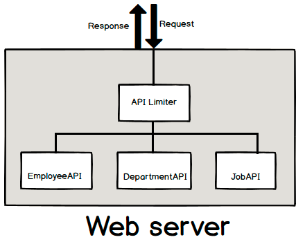
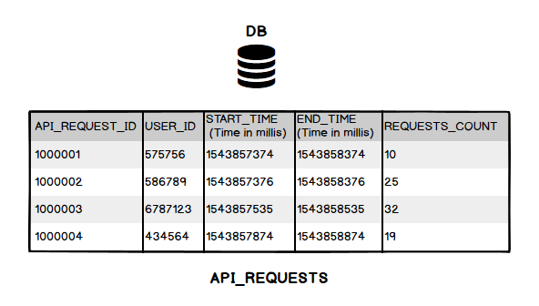
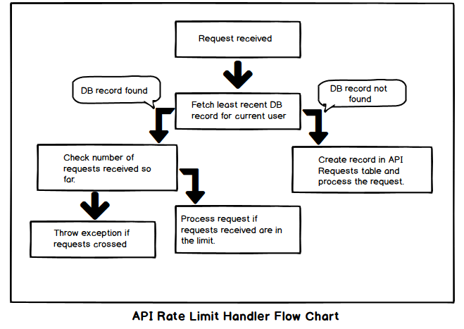

# Design API rate limiter

## Problem statement:

Design and write classes need to implement api rate limiter. List out the data structures and design patterns needed for this implementation.

For example rate limiter should allow only 50 reqs/sec for free plan user, 500 reqs/sec for standard plan user and 1000 reqs/sec for pro plan user. Rate limiter should throw error for each REQUEST beyond this rate limit for each SECOND.

Note: This is not complete design and this design is theoritacal and not implemented practically.

Solution:
----------
- The idea is to send all requests through API rate limit handler and processing further. This sounds like using interceptor design pattern.

- As shown in above image, all requests will pass through rate limit handler. So for every request we can verify how many requests this user has sent in last one second, minute or hour based on user plan.
- We should use some kind of storage mechanism to count the number of requests/duration. Below is the sample table schema looks like.

- In the schema, start time and end time are the boundaries for requests. It means let's say a user is in free plan that means from the problem statement we should allow only 50 reqs/sec. So start and end time will be differ by 1000 milli secs.
- We'll have our logic like when API rate limiter receives a request if checks in the database for a record which is least recent in start time having empty end time for the current user. If it found then validates the number of requests and proceeds further if limit is not reached else throws exception.


# Rate limiter

<!-- MarkdownTOC -->

- [Goals](#goals)
- [Algorithm](#algorithm)
        - [Token bucket](#token-bucket)
        - [Leaky bucket](#leaky-bucket)
        - [Fixed window](#fixed-window)
        - [Sliding log](#sliding-log)
        - [Sliding window](#sliding-window)
- [Single machine rate limit](#single-machine-rate-limit)
        - [Guava rate limiter](#guava-rate-limiter)
                - [Implementation](#implementation)
                        - [Producer consumer pattern](#producer-consumer-pattern)
                - [Record the next time a token is available](#record-the-next-time-a-token-is-available)
                        - [Warm up feature](#warm-up-feature)
        - [Ratelimiter within Resiliency4J](#ratelimiter-within-resiliency4j)
- [Distributed rate limit](#distributed-rate-limit)
        - [Sticky sessions](#sticky-sessions)
        - [Nginx based rate limiting](#nginx-based-rate-limiting)
        - [Redis based rate limiter](#redis-based-rate-limiter)
                - [Implementation](#implementation-1)
                        - [Sliding log implementation using ZSet](#sliding-log-implementation-using-zset)
                        - [Sliding window implementation](#sliding-window-implementation)
                        - [Token bucket implementation](#token-bucket-implementation)
                - [Challenges](#challenges)
                        - [How to handle race conditions](#how-to-handle-race-conditions)
                        - [How to handle the additional latency introduce by performance](#how-to-handle-the-additional-latency-introduce-by-performance)
                        - [How to avoid multiple round trips for different buckets:](#how-to-avoid-multiple-round-trips-for-different-buckets)
                        - [Performance bottleneck and single point failure due to Redis](#performance-bottleneck-and-single-point-failure-due-to-redis)
                        - [Static rate limit threshold](#static-rate-limit-threshold)
        - [Ratelimiter within CloudBouncer](#ratelimiter-within-cloudbouncer)
        - [Redis cell rate limiter](#redis-cell-rate-limiter)

<!-- /MarkdownTOC -->


## Goals
* Sharing access to limited resources: Requests made to an API where the limited resources are your server capacity, database load, etc.
* Security: Limiting the number of second factor attempts that a user is allowed to perform, or the number of times they’re allowed to get their password wrong.
* Revenue: Certain services might want to limit actions based on the tier of their customer’s service, and thus create a revenue model based on rate limiting.

## Algorithm
### Token bucket
* The token bucket limits the average inflow rate and allows sudden increase in traffic.
        - Steps
        1. A token is added every t time.
        2. The bucket can hold at most b tokens. If a token arrive when bucket is full the token will be discarded.
        3. When a packet of m bytes arrived m tokens are removed from the bucket and the packet is sent to the network.
        4. If less than n tokens are available no tokens will be removed from the bucket and the packet is considered to be non-comformant.
    - Pros
        - Smooth out the requests and process them at an approximately average rate.
    - Cons
        - A burst of request could fill up the queue with old requests and starve the more recent requests from being processed. Does not guarantee that requests get processed within a fixed amount of time. Consider an antisocial script that can make enough concurrent requests that it can exhaust its rate limit in short order and which is regularly overlimit. Once an hour as the limit resets, the script bombards the server with a new series of requests until its rate is exhausted once again. In this scenario the server always needs enough extra capacity to handle these short intense bursts and which will likely go to waste during the rest of the hour.

### Leaky bucket
* The leaky bucket limits the constant outflow rate, which is set to a fixed value. Imagine a bucket partially filled with water and which has some fixed capacity (τ). The bucket has a leak so that some amount of water is escaping at a constant rate (T)
* Steps
        1. Initialize the counter to N at every tick of the clock
    2. If N is greater than the size of the packet in front of the queue send the packet to network and decrement the counter by the size of the packet.
    3. Reset the counter and go to Step - 1.
* Pros:
    - The leaky bucket produces a very smooth rate limiting effect. A user can still exhaust their entire quota by filling their entire bucket nearly instantaneously, but after realizing the error, they should still have access to more quota quickly as the leak starts to drain the bucket.
    - The token bucket allows for sudden increase in traffic to some extent, while the leaky bucket is mainly used to ensure the smooth outflow rate.
* Cons:
    - When compared with token bucket, packet will be discarded instead of token.
    - The leaky bucket is normally implemented using a background process that simulates a leak. It looks for any active buckets that need to be drained, and drains each one in turn. The naive leaky bucket’s greatest weakness is its “drip” process. If it goes offline or gets to a capacity limit where it can’t drip all the buckets that need to be dripped, then new incoming requests might be limited incorrectly. There are a number of strategies to help avoid this danger, but if we could build an algorithm without a drip, it would be fundamentally more stable.

### Fixed window 
* Steps
        1. A window of size N is used to track the requests.
    2. Each request increments the counter for the window.
    3. If the counter exceeds a threshold, the request is discarded.
* Pros
    - It ensures recent requests get processed without being starved by old requests.
* Cons
    - Stamping elephant problem: A single burst of traffic that occurs near the boundary of a window can result in twice the rate of requests being processed, because it will allow requests for both the current and next windows within a short time.
    - If many consumers wait for a reset window, for example at the top of the hour, then they may stampede your API at the same time.

### Sliding log
* Steps
    1. Tracking a time stamped log for each consumer’s request.
    2. These logs are usually stored in a hash set or table that is sorted by time. Logs with timestamps beyond a threshold are discarded.
    3. When a new request comes in, we calculate the sum of logs to determine the request rate. If the request would exceed the threshold rate, then it is held.
* Pros
    - It does not suffer from the boundary conditions of fixed windows. The rate limit will be enforced precisely. - Since the sliding log is tracked for each consumer, you don’t have the stampede effect that challenges fixed windows
* Cons
    - It can be very expensive to store an unlimited number of logs for every request. It’s also expensive to compute because each request requires calculating a summation over the consumer’s prior requests, potentially across a cluster of servers.

### Sliding window
* Steps
        1. Like the fixed window algorithm, we track a counter for each fixed window.
    2. Next, we account for a weighted value of the previous window’s request rate based on the current timestamp to smooth out bursts of traffic.
* Pros
    - It avoids the starvation problem of leaky bucket.
    - It also avoids the bursting problems of fixed window implementations.
* Please see the section on https://hechao.li/2018/06/25/Rate-Limiter-Part1/ for detailed rate limiter implementations.

## Single machine rate limit

### Guava rate limiter 
* Implemented on top of token bucket. It has two implementations:
* SmoothBursty / SmoothWarmup (The RateLimiterSmoothWarmingUp method has a warm-up period after teh startup. It gradually increases the distribution rate to the configured value. This feature is suitable for scenarios where the system needs some time to warm up after startup.)

#### Implementation  
##### Producer consumer pattern
* Def: Use a producer thread to add token, the thread who uses rate limiter act as consumer.
* Cons:
  - High cost for maintaining so many threads: Suppose use server cron timer as producer to add token. Suppose the goal is to rate limit on user visiting frequency andd there are 6 million users, then 6 million cron functionality needs to be created.
  - Rate limiting are usually used under high server loads. During such peak traffic time the server timer might not be that accurate and reliable.

#### Record the next time a token is available
* Each time a token is expected, first take from the storedPermits; If not enough, then compare against nextFreeTicketMicros (update simultaneously using resync function) to see whether freshly generated tokens could satisfy the requirement. If not, sleep until nextFreeTicketMicros to acquire the next available fresh token.

```
// The number of currently stored tokens
double storedPermits;
// The maximum number of stored tokens
double maxPermits;
// The interval to add tokens
double stableIntervalMicros;
/**
 * The time for the next thread to call the acquire() method
 * RateLimiter allows preconsumption. After a thread preconsumes any tokens,
 the next thread needs to wait until nextFreeTicketMicros to acquire tokens.
 */
private long nextFreeTicketMicros = 0L;
```

```
/**
 * Updates {@code storedPermits} and {@code nextFreeTicketMicros} based on the current time.
 */
void resync(long nowMicros) {
    // if nextFreeTicket is in the past, resync to now
    if (nowMicros > nextFreeTicketMicros) {
      double newPermits = (nowMicros - nextFreeTicketMicros) / coolDownIntervalMicros();
      storedPermits = min(maxPermits, storedPermits + newPermits);
      nextFreeTicketMicros = nowMicros;
    }
}
```
##### Warm up feature
* Motivation: How to gracefully deal past underutilization
  - Past underutilization could mean that excess resources are available. Then, the RateLimiter should speed up for a while, to take advantage of these resources. This is important when the rate is applied to networking (limiting bandwidth), where past underutilization typically translates to "almost empty buffers", which can be filled immediately.
  - Past underutilization could mean that "the server responsible for handling the request has become less ready for future requests", i.e. its caches become stale, and requests become more likely to trigger expensive operations (a more extreme case of this example is when a server has just booted, and it is mostly busy with getting itself up to speed).

* Implementation
   - When the RateLimiter is not used, this goes right (up to maxPermits)
   - When the RateLimiter is used, this goes left (down to zero), since if we have storedPermits, we serve from those first
   - When _unused_, we go right at a constant rate! The rate at which we move to the right is chosen as maxPermits / warmupPeriod. This ensures that the time it takes to go from 0 to maxPermits is equal to warmupPeriod.
   - When _used_, the time it takes, as explained in the introductory class note, is equal to the integral of our function, between X permits and X-K permits, assuming we want to spend K saved permits.

```
             ^ throttling
             |
       cold  +                  /
    interval |                 /.
             |                / .
             |               /  .   ← "warmup period" is the area of the trapezoid between
             |              /   .     thresholdPermits and maxPermits
             |             /    .
             |            /     .
             |           /      .
      stable +----------/  WARM .
    interval |          .   UP  .
             |          . PERIOD.
             |          .       .
           0 +----------+-------+--------------→ storedPermits
             0 thresholdPermits maxPermits
```

* References
    1. https://segmentfault.com/a/1190000012875897?spm=a2c65.11461447.0.0.74817a50Dt3FUO
    2. https://www.alibabacloud.com/blog/detailed-explanation-of-guava-ratelimiters-throttling-mechanism_594820

### Ratelimiter within Resiliency4J
* https://dzone.com/articles/rate-limiter-internals-in-resilience4j
* https://blog.csdn.net/mickjoust/article/details/102411585

## Distributed rate limit
### Sticky sessions
- The simplest way to enforce the limit is to set up sticky sessions in your load balancer so that each consumer gets sent to exactly one node. The disadvantages include a lack of fault tolerance and scaling problems when nodes get overloaded.

### Nginx based rate limiting

### Redis based rate limiter
* Use a centralized data store such as Redis to store the counts for each window and consumer.

#### Implementation
##### Sliding log implementation using ZSet
* See [Dojo engineering blog for details](https://engineering.classdojo.com/blog/2015/02/06/rolling-rate-limiter/)
    1. Each identifier/user corresponds to a sorted set data structure. The keys and values are both equal to the (microsecond) times at which actions were attempted, allowing easy manipulation of this list.
    2. When a new action comes in for a user, all elements in the set that occurred earlier than (current time - interval) are dropped from the set.
    3. If the number of elements in the set is still greater than the maximum, the current action is blocked.
    4. If a minimum difference has been set and the most recent previous element is too close to the current time, the current action is blocked.
    5. The current action is then added to the set.
    6. Note: if an action is blocked, it is still added to the set. This means that if a user is continually attempting actions more quickly than the allowed rate, all of their actions will be blocked until they pause or slow their requests.
    7. If the limiter uses a redis instance, the keys are prefixed with namespace, allowing a single redis instance to support separate rate limiters.
    8. All redis operations for a single rate-limit check/update are performed as an atomic transaction, allowing rate limiters running on separate processes or machines to share state safely.

##### Sliding window implementation
* https://blog.callr.tech/rate-limiting-for-distributed-systems-with-redis-and-lua/
* https://github.com/wangzheng0822/ratelimiter4j

##### Token bucket implementation
* https://github.com/vladimir-bukhtoyarov/bucket4j

#### Challenges
##### How to handle race conditions
1. One way to avoid this problem is to put a “lock” around the key in question, preventing any other processes from accessing or writing to the counter. This would quickly become a major performance bottleneck, and does not scale well, particularly when using remote servers like Redis as the backing datastore.
2. A better approach is to use a “set-then-get” mindset, relying on Redis' atomic operators that implement locks in a very performant fashion, allowing you to quickly increment and check counter values without letting the atomic operations get in the way.
3. Use Lua scripts for atomic and better performance.

##### How to handle the additional latency introduce by performance
1. In order to make these rate limit determinations with minimal latency, it’s necessary to make checks locally in memory. This can be done by relaxing the rate check conditions and using an eventually consistent model. For example, each node can create a data sync cycle that will synchronize with the centralized data store.
2. Each node periodically pushes a counter increment for each consumer and window it saw to the datastore, which will atomically update the values. The node can then retrieve the updated values to update it’s in-memory version. This cycle of converge → diverge → reconverge among nodes in the cluster is eventually consistent.
  - https://konghq.com/blog/how-to-design-a-scalable-rate-limiting-algorithm/
  -

##### How to avoid multiple round trips for different buckets:
* Use Redis Pipeline to combine the INCRE and EXPIRE commands
* If using N multiple bucket sizes, still need N round trips to Redis.
  - TODO: Could we also combine different bucket size together? How will the result for multiple results being passed back from Redis pipeline
* [Redis rate limiter implementation in python](https://www.binpress.com/rate-limiting-with-redis-1/)

##### Performance bottleneck and single point failure due to Redis
* Solution: ??

##### Static rate limit threshold
* Concurrency rate limit
  - Netflix Concurrency Limits: https://github.com/Netflix/concurrency-limits
  - Resiliency 4j said no for cache-based distributed rate limit: https://github.com/resilience4j/resilience4j/issues/350
  - Resiliency 4j adaptive capacity management: https://github.com/resilience4j/resilience4j/issues/201

### Ratelimiter within CloudBouncer
* Use gossip protocol to sync redis counters
  - https://yahooeng.tumblr.com/post/111288877956/cloud-bouncer-distributed-rate-limiting-at-yahoo

### Redis cell rate limiter
* An advanced version of GRCA algorithm
* References
    - You could find the intuition on https://jameslao.com/post/gcra-rate-limiting/
    - It is implemented in Rust because it offers more memory security. https://redislabs.com/blog/redis-cell-rate-limiting-redis-module/
                                                                                                                                                                                                               246,1         Bot


# Scaling your API with rate limiter

Rate limiting is a common technique used to improve the security and durability of a web application.

For example, a simple script can make thousands of web requests per second. Whether malicious, apathetic, or just a bug, your application and infrastructure may not be able to cope with the load. For more details, see Denial-of-service attack. Most cases can be mitigated by limiting the rate of requests from a single IP address.

Most brute-force attacks are similarly mitigated by a rate limit.


Availability and reliability are paramount for all web applications and APIs. If you’re providing an API, chances are you’ve already experienced sudden increases in traffic that affect the quality of your service, potentially even leading to a service outage for all your users.

The first few times this happens, it’s reasonable to just add more capacity to your infrastructure to accommodate user growth. However, when you’re running a production API, not only do you have to make it robust with techniques like idempotency, you also need to build for scale and ensure that one bad actor can’t accidentally or deliberately affect its availability.

Rate limiting can help make your API more reliable in the following scenarios:

* One of your users is responsible for a spike in traffic, and you need to stay up for everyone else.
* One of your users has a misbehaving script which is accidentally sending you a lot of requests. Or, even worse, one of your users is intentionally trying to overwhelm your servers.
* A user is sending you a lot of lower-priority requests, and you want to make sure that it doesn’t affect your high-priority traffic. For example, users sending a high volume of requests for analytics data could affect critical transactions for other users.
* Something in your system has gone wrong internally, and as a result you can’t serve all of your regular traffic and need to drop low-priority requests.

At Stripe, we’ve found that carefully implementing a few rate limiting strategies helps keep the API available for everyone. In this post, we’ll explain in detail which rate limiting strategies we find the most useful, how we prioritize some API requests over others, and how we started using rate limiters safely without affecting our existing users’ workflows.

## Rate limiters and load shedders

A rate limiter is used to control the rate of traffic sent or received on the network. **When should you use a rate limiter?** If your users can afford to change the pace at which they hit your API endpoints without affecting the outcome of their requests, then a rate limiter is appropriate. If spacing out their requests is not an option (typically for real-time events), then you’ll need another strategy outside the scope of this post (most of the time you just need more infrastructure capacity).

Our users can make a lot of requests: for example, batch processing payments causes sustained traffic on our API. We find that clients can always (barring some extremely rare cases) spread out their requests a bit more and not be affected by our rate limits.

Rate limiters are amazing for day-to-day operations, but during incidents (for example, if a service is operating more slowly than usual), we sometimes need to drop low-priority requests to make sure that more critical requests get through. This is called load shedding. It happens infrequently, but it is an important part of keeping Stripe available.

A load shedder makes its decisions based on the whole state of the system rather than the user who is making the request. Load shedders help you deal with emergencies, since they keep the core part of your business working while the rest is on fire.

Using different kinds of rate limiters in concert

Once you know rate limiters can improve the reliability of your API, you should decide which types are the most relevant.

At Stripe, we operate 4 different types of limiters in production. The first one, the Request Rate Limiter, is by far the most important one. We recommend you start here if you want to improve the robustness of your API.

## Request rate limiter

This rate limiter restricts each user to N requests per second. Request rate limiters are the first tool most APIs can use to effectively manage a high volume of traffic.

Our rate limits for requests is constantly triggered. It has rejected millions of requests this month alone, especially for test mode requests where a user inadvertently runs a script that’s gotten out of hand.

Our API provides the same rate limiting behavior in both test and live modes. This makes for a good developer experience: scripts won't encounter side effects due to a particular rate limit when moving from development to production.

After analyzing our traffic patterns, we added the ability to briefly burst above the cap for sudden spikes in usage during real-time events (e.g. a flash sale.)


Request rate limiters restrict users to a maximum number of requests per second.

Concurrent requests limiter

Instead of “You can use our API 1000 times a second”, this rate limiter says “You can only have 20 API requests in progress at the same time”. Some endpoints are much more resource-intensive than others, and users often get frustrated waiting for the endpoint to return and then retry. These retries add more demand to the already overloaded resource, slowing things down even more. The concurrent rate limiter helps address this nicely.

Our concurrent request limiter is triggered much less often (12,000 requests this month), and helps us keep control of our CPU-intensive API endpoints. Before we started using a concurrent requests limiter, we regularly dealt with resource contention on our most expensive endpoints caused by users making too many requests at one time. The concurrent request limiter totally solved this.

It is completely reasonable to tune this limiter up so it rejects more often than the Request Rate Limiter. It asks your users to use a different programming model of “Fork off X jobs and have them process the queue” compared to “Hammer the API and back off when I get a HTTP 429”. Some APIs fit better into one of those two patterns so feel free to use which one is most suitable for the users of your API.


Concurrent request limiters manage resource contention for CPU-intensive API endpoints.

Fleet usage load shedder

Using this type of load shedder ensures that a certain percentage of your fleet will always be available for your most important API requests.

We divide up our traffic into two types: critical API methods (e.g. creating charges) and non-critical methods (e.g. listing charges.) We have a Redis cluster that counts how many requests we currently have of each type.

We always reserve a fraction of our infrastructure for critical requests. If our reservation number is 20%, then any non-critical request over their 80% allocation would be rejected with status code 503.

We triggered this load shedder for a very small fraction of requests this month. By itself, this isn’t a big deal—we definitely had the ability to handle those extra requests. But we’ve had other months where this has prevented outages.


Fleet usage load shedders reserves fleet resources for critical requests.

Worker utilization load shedder

Most API services use a set of workers to independently respond to incoming requests in a parallel fashion. This load shedder is the final line of defense. If your workers start getting backed up with requests, then this will shed lower-priority traffic.

This one gets triggered very rarely, only during major incidents.

We divide our traffic into 4 categories:

Critical methods
POSTs
GETs
Test mode traffic
We track the number of workers with available capacity at all times. If a box is too busy to handle its request volume, it will slowly start shedding less-critical requests, starting with test mode traffic. If shedding test mode traffic gets it back into a good state, great! We can start to slowly bring traffic back. Otherwise, it’ll escalate and start shedding even more traffic.

It’s very important that shedding and bringing load happen slowly, or you can end up flapping (“I got rid of testmode traffic! Everything is fine! I brought it back! Everything is awful!”). We used a lot of trial and error to tune the rate at which we shed traffic, and settled on a rate where we shed a substantial amount of traffic within a few minutes.

Only 100 requests were rejected this month from this rate limiter, but in the past it’s done a lot to help us recover more quickly when we have had load problems. This load shedder limits the impact of incidents that are already happening and provides damage control, while the first three are more preventative.


Worker utilization load shedders reserve workers for critical requests.

Building rate limiters in practice

Now that we’ve outlined the four basic kinds of rate limiters we use and what they’re for, let’s talk about their implementation. What rate limiting algorithms are there? How do you actually implement them in practice?

We use the token bucket algorithm to do rate limiting. This algorithm has a centralized bucket host where you take tokens on each request, and slowly drip more tokens into the bucket. If the bucket is empty, reject the request. In our case, every Stripe user has a bucket, and every time they make a request we remove a token from that bucket.

We implement our rate limiters using Redis. You can either operate the Redis instance yourself, or, if you use Amazon Web Services, you can use a managed service like ElastiCache.

Here are important things to consider when implementing rate limiters:

Hook the rate limiters into your middleware stack safely. Make sure that if there were bugs in the rate limiting code (or if Redis were to go down), requests wouldn’t be affected. This means catching exceptions at all levels so that any coding or operational errors would fail open and the API would still stay functional.
Show clear exceptions to your users. Figure out what kinds of exceptions to show your users. In practice, you should decide if you want HTTP 429 (Too Many Requests) or HTTP 503 (Service Unavailable) and what is the most accurate depending on the situation. The message you return should also be actionable.
Build in safeguards so that you can turn off the limiters. Make sure you have kill switches to disable the rate limiters should they kick in erroneously. Having feature flags in place can really help should you need a human escape valve. Set up alerts and metrics to understand how often they are triggering.
Dark launch each rate limiter to watch the traffic they would block. Evaluate if it is the correct decision to block that traffic and tune accordingly. You want to find the right thresholds that would keep your API up without affecting any of your users’ existing request patterns. This might involve working with some of them to change their code so that the new rate limit would work for them.
Conclusion

Rate limiting is one of the most powerful ways to prepare your API for scale. The different rate limiting strategies described in this post are not all necessary on day one, you can gradually introduce them once you realize the need for rate limiting.

Our recommendation is to follow the following steps to introduce rate limiting to your infrastructure:

Start by building a Request Rate Limiter. It is the most important one to prevent abuse, and it’s by far the one that we use the most frequently.
Introduce the next three types of rate limiters over time to prevent different classes of problems. They can be built slowly as you scale.
Follow good launch practices as you're adding new rate limiters to your infrastructure. Handle any errors safely, put them behind feature flags to turn them off easily at any time, and rely on very good observability and metrics to see how often they’re triggering.
