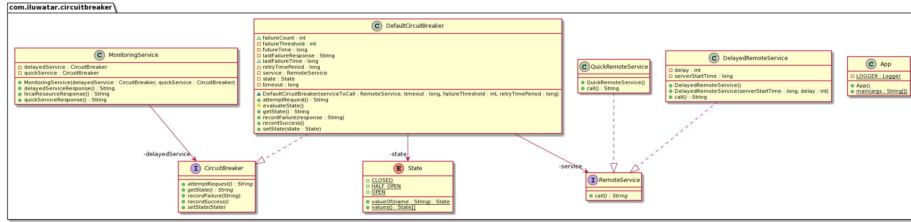

## Intent

Handle costly remote service calls in such a way that the failure of a single service/component 
cannot bring the whole application down, and we can reconnect to the service as soon as possible.

## Explanation

Real world example

> Imagine a web application that has both local files/images and remote services that are used for 
> fetching data. These remote services may be either healthy and responsive at times, or may become 
> slow and unresponsive at some point of time due to variety of reasons. So if one of the remote 
> services is slow or not responding successfully, our application will try to fetch response from 
> the remote service using multiple threads/processes, soon all of them will hang (also called 
> [thread starvation](https://en.wikipedia.org/wiki/Starvation_(computer_science))) causing our entire web application to crash. We should be able to detect 
> this situation and show the user an appropriate message so that he/she can explore other parts of 
> the app unaffected by the remote service failure. Meanwhile, the other services that are working 
> normally, should keep functioning unaffected by this failure.

In plain words

> Circuit Breaker allows graceful handling of failed remote services. It's especially useful when 
> all parts of our application are highly decoupled from each other, and failure of one component 
> doesn't mean the other parts will stop working.

Wikipedia says

> Circuit breaker is a design pattern used in modern software development. It is used to detect 
> failures and encapsulates the logic of preventing a failure from constantly recurring, during 
> maintenance, temporary external system failure or unexpected system difficulties.

## Understand CircuitBreaker Design pattern with simple practical example

### Problem Statement
We have a serviceA which has two APIs
* /data which depends on serviceB
* /data2 does not depend on any external service


### Without Circuit Breaker
serviceB implementation below. The API is returning a 5 second delayed response to a request for the first 5 minutes. It’s running on port 8000.
```
server.route({
  method: 'GET',
  path: '/flakycall',
  handler: async (request, h) => {
    const currentTime = Date.now();
    if ((currentTime - serverStartTime) < (1000 * 60 * 5)) {
      const result = await new Promise((resolve) => {
        setTimeout(() => {
          resolve('This is a delayed repsonse');
        }, 5000);
      });
      return h.response(result);
    }
    return h.response('This is immediate response');
  },
});
```
serviceB: Simulating delayed response


serviceA implementation which will make http request to serviceB
```
server.route({
  method: 'GET',
  path: '/data2',
  handler: (request, h) => {
    try {
      return h.response('data2');
    } catch (err) {
      throw Boom.clientTimeout(err);
    }
  },
});

server.route({
  method: 'GET',
  path: '/data',
  handler: async (request, h) => {
    try {
      const response = await axios({
        url: 'http://0.0.0.0:8000/flakycall',
        timeout: 6000,
        method: 'get',

      });
      return h.response(response.data);
    } catch (err) {
      throw Boom.clientTimeout(err);
    }
  },
});
```

We will simulate the load using jMeter . Within few seconds, serviceA would be starved of resources. All the requests are waiting for http request to complete. First API would start throwing error and it will eventually crash as it would reach its max heap size.


jMeter report for failing API


```
<--- Last few GCs --->
[90303:0x102801600]    90966 ms: Mark-sweep 1411.7 (1463.4) -> 1411.3 (1447.4) MB, 1388.3 / 0.0 ms  (+ 0.0 ms in 0 steps since start of marking, biggest step 0.0 ms, walltime since start of marking 1388 ms) last resort GC in old space requested
[90303:0x102801600]    92377 ms: Mark-sweep 1411.3 (1447.4) -> 1411.7 (1447.4) MB, 1410.9 / 0.0 ms  last resort GC in old space requested
<--- JS stacktrace --->
==== JS stack trace =========================================
Security context: 0x2c271c925ee1 <JSObject>
    1: clone [/Users/abhinavdhasmana/Documents/Personal/sourcecode/circuitBreaker/client/node_modules/hoek/lib/index.js:~20] [pc=0x10ea64e3ebcb](this=0x2c2775156bd9 <Object map = 0x2c276089fe19>,obj=0x2c277be1e761 <WritableState map = 0x2c27608b1329>,seen=0x2c2791b76f41 <Map map = 0x2c272c2848d9>)
    2: clone [/Users/abhinavdhasmana//circuitBreaker/client/node_modul...
```

Now, instead of one, we have two services which are not working. This would escalate throughout the system and the whole infrastructure will come down.

### Why we need a circuit breaker
In case we have serviceB down, serviceA should still try to recover from this and try to do one of the followings:

* **Custom fallback:** Try to get the same data from some other source. If not possible, use its own cache value.
* **Fail fast:** If serviceA knows that serviceB is down, there is no point waiting for the timeout and consuming its own resources. It should return ASAP “knowing” that serviceB is down
* **Don't crash:** As we saw in this case, serviceA should not have crashed.
* **Heal automatic:** Periodically check if serviceB is working again.
* **Other APIs should work:** All other APIs should continue to work.

### What is circuit breaker design?
The idea behind is simple:

* Once serviceA “knows” that serviceB is down, there is no need to make request to serviceB. serviceA should return cached data or timeout error as soon as it can. This is the **OPEN** state of the circuit
* Once serviceA “knows” that serviceB is up, we can **CLOSE** the circuit so that request can be made to serviceB again.
* Periodically make fresh calls to serviceB to see if it is successfully returning the result. This state is **HALF-OPEN**.


This is how our circuit state diagram would look like


### Implementation with Circuit Breaker
Let's implement a circuitBreaker which makes GET http calls. We need three parameters for our simple circuitBreaker

* How many failures should happen before we OPEN the circuit.
* What is the time period after which we should retry the failed service once the circuit is in OPEN state?
* In our case, the timeout for the API request.

With this information, we can create our circuitBreaker class.
```
class CircuitBreaker {
  constructor(timeout, failureThreshold, retryTimePeriod) {
    // We start in a closed state hoping that everything is fine
    this.state = 'CLOSED';
    // Number of failures we receive from the depended service before we change the state to 'OPEN'
    this.failureThreshold = failureThreshold;
    // Timeout for the API request.
    this.timeout = timeout;
    // Time period after which a fresh request be made to the dependent
    // service to check if service is up.
    this.retryTimePeriod = retryTimePeriod;
    this.lastFailureTime = null;
    this.failureCount = 0;
  }
}
```

Next, let's implement a function which would call the API to serviceB.
```
async call(urlToCall) {
    // Determine the current state of the circuit.
    this.setState();
    switch (this.state) {
      case 'OPEN':
      // return  cached response if no the circuit is in OPEN state
        return { data: 'this is stale response' };
      // Make the API request if the circuit is not OPEN
      case 'HALF-OPEN':
      case 'CLOSED':
        try {
          const response = await axios({
            url: urlToCall,
            timeout: this.timeout,
            method: 'get',
          });
          // Yay!! the API responded fine. Lets reset everything.
          this.reset();
          return response;
        } catch (err) {
          // Uh-oh!! the call still failed. Lets update that in our records.
          this.recordFailure();
          throw new Error(err);
        }
      default:
        console.log('This state should never be reached');
        return 'unexpected state in the state machine';
    }
  }
```
Let’s implement all the associated functions.
```
// reset all the parameters to the initial state when circuit is initialized
  reset() {
    this.failureCount = 0;
    this.lastFailureTime = null;
    this.state = 'CLOSED';
  }

  // Set the current state of our circuit breaker.
  setState() {
    if (this.failureCount > this.failureThreshold) {
      if ((Date.now() - this.lastFailureTime) > this.retryTimePeriod) {
        this.state = 'HALF-OPEN';
      } else {
        this.state = 'OPEN';
      }
    } else {
      this.state = 'CLOSED';
    }
  }

  recordFailure() {
    this.failureCount += 1;
    this.lastFailureTime = Date.now();
  }
```

Next step is to modify our serviceA . We would wrap our call inside the circuitBreaker we just created.

```
let numberOfRequest = 0;

server.route({
  method: 'GET',
  path: '/data2',
  handler: (request, h) => {
    try {
      return h.response('data2');
    } catch (err) {
      throw Boom.clientTimeout(err);
    }
  },
});

const circuitBreaker = new CircuitBreaker(3000, 5, 2000);


server.route({
  method: 'GET',
  path: '/data',
  handler: async (request, h) => {
    numberOfRequest += 1;
    try {
      console.log('numberOfRequest received on client:', numberOfRequest);
      const response = await circuitBreaker.call('http://0.0.0.0:8000/flakycall');
      // console.log('response is ', response.data);
      return h.response(response.data);
    } catch (err) {
      throw Boom.clientTimeout(err);
    }
  },
});
```
Important changes to note in this code with respect to the previous code:

* We are initializing the circuitBreaker const circuitBreaker = new CircuitBreaker(3000, 5, 2000);
* We are calling the API via our circuit breaker const response = await circuitBreaker.call(‘http://0.0.0.0:8000/flakycall');

That’s it! Now let’s run our jMeter test again and we can see that our serviceA is not crashing and our error rate has gone down significantly.


############################################################################# Programmatic Example #############################################################################

So, how does this all come together? With the above example in mind we will imitate the 
functionality in a simple example. A monitoring service mimics the web app and makes both local and 
remote calls.

The service architecture is as follows:


In terms of code, the end user application is:

```java
public class App {

  private static final Logger LOGGER = LoggerFactory.getLogger(App.class);

  /**
   * Program entry point.
   *
   * @param args command line args
   */
  public static void main(String[] args) {

    var serverStartTime = System.nanoTime();

    var delayedService = new DelayedRemoteService(serverStartTime, 5);
    var delayedServiceCircuitBreaker = new DefaultCircuitBreaker(delayedService, 3000, 2,
        2000 * 1000 * 1000);

    var quickService = new QuickRemoteService();
    var quickServiceCircuitBreaker = new DefaultCircuitBreaker(quickService, 3000, 2,
        2000 * 1000 * 1000);

    //Create an object of monitoring service which makes both local and remote calls
    var monitoringService = new MonitoringService(delayedServiceCircuitBreaker,
        quickServiceCircuitBreaker);

    //Fetch response from local resource
    LOGGER.info(monitoringService.localResourceResponse());

    //Fetch response from delayed service 2 times, to meet the failure threshold
    LOGGER.info(monitoringService.delayedServiceResponse());
    LOGGER.info(monitoringService.delayedServiceResponse());

    //Fetch current state of delayed service circuit breaker after crossing failure threshold limit
    //which is OPEN now
    LOGGER.info(delayedServiceCircuitBreaker.getState());

    //Meanwhile, the delayed service is down, fetch response from the healthy quick service
    LOGGER.info(monitoringService.quickServiceResponse());
    LOGGER.info(quickServiceCircuitBreaker.getState());

    //Wait for the delayed service to become responsive
    try {
      LOGGER.info("Waiting for delayed service to become responsive");
      Thread.sleep(5000);
    } catch (InterruptedException e) {
      e.printStackTrace();
    }
    //Check the state of delayed circuit breaker, should be HALF_OPEN
    LOGGER.info(delayedServiceCircuitBreaker.getState());

    //Fetch response from delayed service, which should be healthy by now
    LOGGER.info(monitoringService.delayedServiceResponse());
    //As successful response is fetched, it should be CLOSED again.
    LOGGER.info(delayedServiceCircuitBreaker.getState());
  }
}
```

The monitoring service: 

```java
public class MonitoringService {

  private final CircuitBreaker delayedService;

  private final CircuitBreaker quickService;

  public MonitoringService(CircuitBreaker delayedService, CircuitBreaker quickService) {
    this.delayedService = delayedService;
    this.quickService = quickService;
  }

  //Assumption: Local service won't fail, no need to wrap it in a circuit breaker logic
  public String localResourceResponse() {
    return "Local Service is working";
  }

  /**
   * Fetch response from the delayed service (with some simulated startup time).
   *
   * @return response string
   */
  public String delayedServiceResponse() {
    try {
      return this.delayedService.attemptRequest();
    } catch (RemoteServiceException e) {
      return e.getMessage();
    }
  }

  /**
   * Fetches response from a healthy service without any failure.
   *
   * @return response string
   */
  public String quickServiceResponse() {
    try {
      return this.quickService.attemptRequest();
    } catch (RemoteServiceException e) {
      return e.getMessage();
    }
  }
}
```
As it can be seen, it does the call to get local resources directly, but it wraps the call to 
remote (costly) service in a circuit breaker object, which prevents faults as follows:

```java
public class DefaultCircuitBreaker implements CircuitBreaker {

  private final long timeout;
  private final long retryTimePeriod;
  private final RemoteService service;
  long lastFailureTime;
  private String lastFailureResponse;
  int failureCount;
  private final int failureThreshold;
  private State state;
  private final long futureTime = 1000 * 1000 * 1000 * 1000;

  /**
   * Constructor to create an instance of Circuit Breaker.
   *
   * @param timeout          Timeout for the API request. Not necessary for this simple example
   * @param failureThreshold Number of failures we receive from the depended service before changing
   *                         state to 'OPEN'
   * @param retryTimePeriod  Time period after which a new request is made to remote service for
   *                         status check.
   */
  DefaultCircuitBreaker(RemoteService serviceToCall, long timeout, int failureThreshold,
      long retryTimePeriod) {
    this.service = serviceToCall;
    // We start in a closed state hoping that everything is fine
    this.state = State.CLOSED;
    this.failureThreshold = failureThreshold;
    // Timeout for the API request.
    // Used to break the calls made to remote resource if it exceeds the limit
    this.timeout = timeout;
    this.retryTimePeriod = retryTimePeriod;
    //An absurd amount of time in future which basically indicates the last failure never happened
    this.lastFailureTime = System.nanoTime() + futureTime;
    this.failureCount = 0;
  }

  // Reset everything to defaults
  @Override
  public void recordSuccess() {
    this.failureCount = 0;
    this.lastFailureTime = System.nanoTime() + futureTime;
    this.state = State.CLOSED;
  }

  @Override
  public void recordFailure(String response) {
    failureCount = failureCount + 1;
    this.lastFailureTime = System.nanoTime();
    // Cache the failure response for returning on open state
    this.lastFailureResponse = response;
  }

  // Evaluate the current state based on failureThreshold, failureCount and lastFailureTime.
  protected void evaluateState() {
    if (failureCount >= failureThreshold) { //Then something is wrong with remote service
      if ((System.nanoTime() - lastFailureTime) > retryTimePeriod) {
        //We have waited long enough and should try checking if service is up
        state = State.HALF_OPEN;
      } else {
        //Service would still probably be down
        state = State.OPEN;
      }
    } else {
      //Everything is working fine
      state = State.CLOSED;
    }
  }

  @Override
  public String getState() {
    evaluateState();
    return state.name();
  }

  /**
   * Break the circuit beforehand if it is known service is down Or connect the circuit manually if
   * service comes online before expected.
   *
   * @param state State at which circuit is in
   */
  @Override
  public void setState(State state) {
    this.state = state;
    switch (state) {
      case OPEN:
        this.failureCount = failureThreshold;
        this.lastFailureTime = System.nanoTime();
        break;
      case HALF_OPEN:
        this.failureCount = failureThreshold;
        this.lastFailureTime = System.nanoTime() - retryTimePeriod;
        break;
      default:
        this.failureCount = 0;
    }
  }

  /**
   * Executes service call.
   *
   * @return Value from the remote resource, stale response or a custom exception
   */
  @Override
  public String attemptRequest() throws RemoteServiceException {
    evaluateState();
    if (state == State.OPEN) {
      // return cached response if the circuit is in OPEN state
      return this.lastFailureResponse;
    } else {
      // Make the API request if the circuit is not OPEN
      try {
        //In a real application, this would be run in a thread and the timeout
        //parameter of the circuit breaker would be utilized to know if service
        //is working. Here, we simulate that based on server response itself
        var response = service.call();
        // Yay!! the API responded fine. Let's reset everything.
        recordSuccess();
        return response;
      } catch (RemoteServiceException ex) {
        recordFailure(ex.getMessage());
        throw ex;
      }
    }
  }
}
```

How does the above pattern prevent failures? Let's understand via this finite state machine 
implemented by it.


- We initialize the Circuit Breaker object with certain parameters: `timeout`, `failureThreshold` and `retryTimePeriod` which help determine how resilient the API is.
- Initially, we are in the `closed` state and nos remote calls to the API have occurred.
- Every time the call succeeds, we reset the state to as it was in the beginning.
- If the number of failures cross a certain threshold, we move to the `open` state, which acts just like an open circuit and prevents remote service calls from being made, thus saving resources. (Here, we return the response called ```stale response from API```)
- Once we exceed the retry timeout period, we move to the `half-open` state and make another call to the remote service again to check if the service is working so that we can serve fresh content. A failure sets it back to `open` state and another attempt is made after retry timeout period, while a success sets it to `closed` state so that everything starts working normally again. 

## Class diagram



## Applicability

Use the Circuit Breaker pattern when

- Building a fault-tolerant application where failure of some services shouldn't bring the entire application down.
- Building a continuously running (always-on) application, so that its components can be upgraded without shutting it down entirely.

## Related Patterns

- [Retry Pattern](https://github.com/iluwatar/java-design-patterns/tree/master/retry)

## Real world examples

* [Spring Circuit Breaker module](https://spring.io/guides/gs/circuit-breaker)
* [Netflix Hystrix API](https://github.com/Netflix/Hystrix)

## Credits

* [Understanding Circuit Breaker Pattern](https://itnext.io/understand-circuitbreaker-design-pattern-with-simple-practical-example-92a752615b42)
* [Martin Fowler on Circuit Breaker](https://martinfowler.com/bliki/CircuitBreaker.html)
* [Fault tolerance in a high volume, distributed system](https://medium.com/netflix-techblog/fault-tolerance-in-a-high-volume-distributed-system-91ab4faae74a)
* [Circuit Breaker pattern](https://docs.microsoft.com/en-us/azure/architecture/patterns/circuit-breaker)
