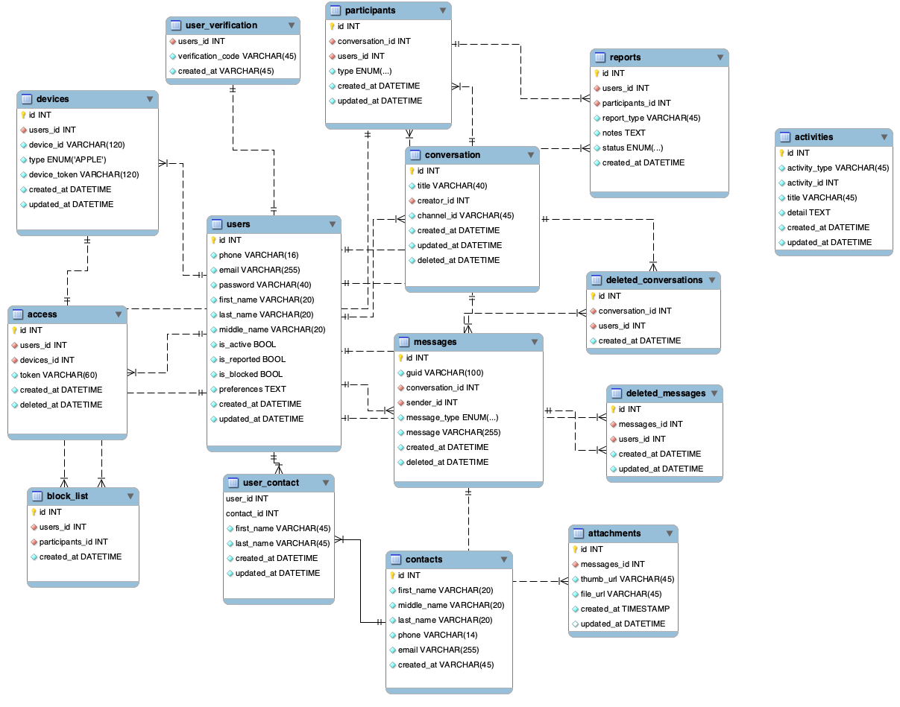

# Design the data structures for a social network like Facebook or LinkedIn

How would you design the data structures for a very large social network like Facebook or Linkedln? Describe how you would design an algorithm to show the shortest path between two people (e.g., Me-> Bob-> Susan-> Jason-> You).

*Note: This document links directly to relevant areas found in the [system design topics](https://github.com/donnemartin/system-design-primer#index-of-system-design-topics) to avoid duplication.  Refer to the linked content for general talking points, tradeoffs, and alternatives.*

A good way to approach this problem is to remove some of the constraints and solve it for that situation first.

## Case 1: Simplify the Problem (Not considering millions of people)
We can construct a graph by treating each person as a node and letting an edge between two nodes indicate that the two users are friends. If we want to find the path between two people, we start with one person and do a simple breadth-first search. Alternatively, we can do bidirectional breadth first search. This means doing two breadth first searches, one from the source and one from the destination. When the searches collide, we know we’ve found a path.

**Why not a depth-first search work well?** 
First, the depth-first search would just find a path. It wouldn’t necessarily find the shortest path. Second, even if we just needed any path, it would be very inefficient. Two users might be only one degree of separation apart, but it could search millions of nodes in their”subtrees” before finding this relatively immediate connection.

In the implementation, we’ll use two classes to help us. BFSData holds the data needed for a breadth-first search, such as the isVisited hash table and the toVisit queue. PathNode represents the path as we’re searching, storing each Person and the previousNode we visited in this path.

```
Linkedlist<Person> findPathBiBFS(HashMap<Integer, Person> people, 
                                    int source, int destination) 
{ 
    BFSData sourceData = new BFSData(people.get(source)); 
    BFSData destData = new BFSData(people.get(destination)); 
  
    while (!sourceData.isFinished() && !destData.isFinished()) 
    { 
  
        /* Search out from source. */
        Person collision = searchlevel(people, sourceData, destData); 
        if (collision != null) 
            return mergePaths(sourceData, destData, collision.getID()); 
  
        /* Search out from destination. */
        collision = searchlevel(people, destData, sourceData); 
        if (collision != null) 
            return mergePaths(sourceData, destData, collision.getID()); 
    } 
  
    return null; 
} 
  
  
/* Search one level and return collision, if any.*/
Person searchLevel(HashMap<Integer, Person> people, 
                BFSData primary, BFSData secondary) 
{ 
  
    /* We only want to search one level at a time. Count 
       how many nodes are currently 
       in the primary's level and only do that many nodes. 
       We continue to add nodes to the end. */
  
    int count = primary.toVisit.size(); 
    for (int i= 0; i < count; i++) 
    { 
        /* Pull out first node. */
        PathNode pathNode = primary.toVisit.poll(); 
        int personld = pathNode.getPerson().getID(); 
  
        /* Check if it's already been visited. */
        if (secondary.visited.containsKey(personid)) 
            return pathNode.getPerson(); 
  
        /* Add friends to queue. */
        Person person = pathNode. getPerson(); 
        Arraylist<Integer> friends = person.getFriends(); 
        for (int friendid : friends) 
        { 
            if (!primary.visited.containsKey(friendid)) 
            { 
                Person friend= people.get(friendld); 
                PathNode next = new PathNode(friend, pathNode); 
                primary.visited.put(friendld, next); 
                primary.toVisit.add(next); 
            } 
        } 
    } 
    return null; 
} 
  
  
/* Merge paths where searches met at the connection. */
Linkedlist<Person> mergePaths(BFSData bfsl, BFSData bfs2, 
                                          int connection) 
{ 
    // endl -> source, end2 -> dest 
    PathNode endl = bfsl.visited.get(connection); 
    PathNode end2 = bfs2.visited.get(connection); 
  
    Linkedlist<Person> pathOne = endl.collapse(false); 
    Linkedlist<Person> pathTwo = end2.collapse(true); 
  
    pathTwo.removeFirst(); // remove connection 
    pathOne.addAll(pathTwo); // add second path 
  
    return pathOne; 
} 
  
class PathNode 
{ 
    private Person person = null; 
    private PathNode previousNode = null; 
    public PathNode(Person p, PathNode previous) 
    { 
        person = p; 
        previousNode = previous; 
    } 
  
    public Person getPerson() 
    { 
        return person; 
    } 
  
    public Linkedlist<Person> collapse(boolean startsWithRoot) 
    { 
        Linkedlist<Person> path= new Linkedlist<Person>(); 
        PathNode node = this; 
        while (node != null) 
        { 
            if (startsWithRoot) 
                path.addlast(node.person); 
            else
                path.addFirst(node.person); 
            node = node.previousNode; 
        } 
  
        return path; 
    } 
} 
  
class BFSData 
{ 
    public Queue<PathNode> toVisit = new Linkedlist<PathNode>(); 
    public HashMap<Integer, PathNode> visited = 
                                 new HashMap<Integer, PathNode>(); 
  
    public BFSData(Person root) 
    { 
        PathNode sourcePath = new PathNode(root, null); 
        toVisit.add(sourcePath); 
        visited.put(root.getID(), sourcePath); 
    } 
    public boolean isFinished() 
    { 
        return toVisit.isEmpty(); 
    } 
}  
```

### How fast is above BFS based solution?
Suppose every person has k friends, and Source S and Destination D have a friend C in common.

1. Traditional breadth-first search from S to D: We go through roughly k + k * k nodes: each of S’s k friends, and then each of their k friends.

2. Bidirectional breadth-first search: We go through 2k nodes: each of S’s k friends and each of D’s k friends. Of course, 2k is much less than k + k * k.

3. Generalizing this to a path of length q, we have this:
3.1 BFS: O(kq)
3.2 Bidirectional BFS: 0( kq/2 + kq/2), which is just 0( kq/2)

If we imagine a path like A->B->C->D->E where each person has 100 friends, this is a big difference. BFS will require looking at 100 million (1004) nodes. A bidirectional BFS will require looking at only 20,000 nodes (2 x 100^2).

## Case 2: Handle Millions of Users
For these many users, we cannot possibly keep all of our data on one machine. That means that our simple Person data structure from above doesn’t quite work-our friends may not live on the same machine as we do. Instead, we can replace our list of friends with a list of their IDs, and traverse as follows:

1: For each friend ID: int machine index = getMachineIDForUser(person_ID);

2: Go to machine #machine_index

3: On that machine, do: Person friend = getPersonWithID( person_ID);

The code below outlines this process. We’ve defined a class Server, which holds a list of all the machines, and a class Machine, which represents a single machine. Both classes have hash tables to efficiently lookup data.
```
// A server that holds list of all machines 
class Server 
{ 
	HashMap<Integer, Machine> machines = 
					new HashMap<Integer, Machine>(); 
	HashMap<Integer, Integer> personToMachineMap = 
						new HashMap<Integer, Integer>(); 

	public Machine getMachineWithid(int machineID) 
	{ 
		return machines.get(machineID); 
	} 

	public int getMachineIDForUser(int personID) 
	{ 
		Integer machineID = personToMachineMap.get(personID); 
		return machineID == null ? -1 : machineID; 
	} 

	public Person getPersonWithID(int personID) 
	{ 
		Integer machineID = personToMachineMap.get(personID); 
		if (machineID == null) return null; 

		Machine machine = getMachineWithid(machineID); 
		if (machine == null) return null; 

		return machine.getPersonWithID(personID); 
	} 
} 

// A person on social network has id, friends and other info 
class Person 
{ 
	private Arraylist<Integer> friends = 
							new Arraylist<Integer>(); 
	private int personID; 
	private String info; 

	public Person(int id) 
	{ 
		this.personID =id; 
	} 
	public String getinfo() 
	{ 
		return info; 
	} 
	public void setinfo(String info) 
	{ 
		this.info = info; 
	} 
	public Arraylist<Integer> getFriends() 
	{ 
		return friends; 
	} 
	public int getID() 
	{ 
		return personID; 
	} 
	public void addFriend(int id) 
	{ 
		friends.add(id); 
	} 
} 
```
**Following are some optimizations and follow-up questions**.

**Optimization: Reduce machine jumps**
Jumping from one machine to another is expensive. Instead of randomly jumping from machine to machine with each friend, try to batch this jumps-e.g., if five of my friends live on one machine, I should look them up all at once.

**Optimization: Smart division of people and machines**
People are much more likely to be friends with people who live in the same country as they do. Rather than randomly dividing people across machines, try to divide them by country, city, state, and so on. This will reduce the number of jumps.

**Question: Breadth-first search usually requires “marking” a node as visited. How do you do that in this case**?
Usually, in BFS, we mark a node as visited by setting a visited flag in its node class. Here, we don’t want to do that. There could be multiple searches going on at the same time, so it’s a bad idea to just edit our data.

Instead, we could mimic the marking of nodes with a hash table to look up a node id and determine whether it’s been visited.

**Other Follow-Up Questions**:
1. In the real world, servers fail. How does this affect you?
2. How could you take advantage of caching?
3. Do you search until the end of the graph (infinite)? How do you decide when to give up?
4. In real life, some people have more friends of friends than others and are therefore more likely to make a path between you and someone else. How could you use this data to pick where to start traversing?


## Step 1: Outline use cases and constraints

> Gather requirements and scope the problem.
> Ask questions to clarify use cases and constraints.
> Discuss assumptions.

Without an interviewer to address clarifying questions, we'll define some use cases and constraints.

### Use cases

#### We'll scope the problem to handle only the following use cases

* **User** searches for someone and sees the shortest path to the searched person
* **Service** has high availability

### Constraints and assumptions

#### State assumptions

* Traffic is not evenly distributed
    * Some searches are more popular than others, while others are only executed once
* Graph data won't fit on a single machine
* Graph edges are unweighted
* 100 million users
* 50 friends per user average
* 1 billion friend searches per month

Exercise the use of more traditional systems - don't use graph-specific solutions such as [GraphQL](http://graphql.org/) or a graph database like [Neo4j](https://neo4j.com/)

#### Calculate usage

**Clarify with your interviewer if you should run back-of-the-envelope usage calculations.**

* 5 billion friend relationships
    * 100 million users * 50 friends per user average
* 400 search requests per second

Handy conversion guide:

* 2.5 million seconds per month
* 1 request per second = 2.5 million requests per month
* 40 requests per second = 100 million requests per month
* 400 requests per second = 1 billion requests per month

## Step 2: Create a high level design

> Outline a high level design with all important components.


## Step 3: Design core components

> Dive into details for each core component.

## Database design:
We can refer Messenger Database Design



Also refer [messenger.sql](messanger.sql)

### Use case: User searches for someone and sees the shortest path to the searched person

**Clarify with your interviewer how much code you are expected to write**.

Without the constraint of millions of users (vertices) and billions of friend relationships (edges), we could solve this unweighted shortest path task with a general BFS approach:

```
class Graph(Graph):

    def shortest_path(self, source, dest):
        if source is None or dest is None:
            return None
        if source is dest:
            return [source.key]
        prev_node_keys = self._shortest_path(source, dest)
        if prev_node_keys is None:
            return None
        else:
            path_ids = [dest.key]
            prev_node_key = prev_node_keys[dest.key]
            while prev_node_key is not None:
                path_ids.append(prev_node_key)
                prev_node_key = prev_node_keys[prev_node_key]
            return path_ids[::-1]

    def _shortest_path(self, source, dest):
        queue = deque()
        queue.append(source)
        prev_node_keys = {source.key: None}
        source.visit_state = State.visited
        while queue:
            node = queue.popleft()
            if node is dest:
                return prev_node_keys
            prev_node = node
            for adj_node in node.adj_nodes.values():
                if adj_node.visit_state == State.unvisited:
                    queue.append(adj_node)
                    prev_node_keys[adj_node.key] = prev_node.key
                    adj_node.visit_state = State.visited
        return None
```

We won't be able to fit all users on the same machine, we'll need to [shard](https://github.com/donnemartin/system-design-primer#sharding) users across **Person Servers** and access them with a **Lookup Service**.

* The **Client** sends a request to the **Web Server**, running as a [reverse proxy](https://github.com/donnemartin/system-design-primer#reverse-proxy-web-server)
* The **Web Server** forwards the request to the **Search API** server
* The **Search API** server forwards the request to the **User Graph Service**
* The **User Graph Service** does the following:
    * Uses the **Lookup Service** to find the **Person Server** where the current user's info is stored
    * Finds the appropriate **Person Server** to retrieve the current user's list of `friend_ids`
    * Runs a BFS search using the current user as the `source` and the current user's `friend_ids` as the ids for each `adjacent_node`
    * To get the `adjacent_node` from a given id:
        * The **User Graph Service** will *again* need to communicate with the **Lookup Service** to determine which **Person Server** stores the`adjacent_node` matching the given id (potential for optimization)

**Clarify with your interviewer how much code you should be writing**.

**Note**: Error handling is excluded below for simplicity.  Ask if you should code proper error handing.

**Lookup Service** implementation:

```
class LookupService(object):

    def __init__(self):
        self.lookup = self._init_lookup()  # key: person_id, value: person_server

    def _init_lookup(self):
        ...

    def lookup_person_server(self, person_id):
        return self.lookup[person_id]
```

**Person Server** implementation:

```
class PersonServer(object):

    def __init__(self):
        self.people = {}  # key: person_id, value: person

    def add_person(self, person):
        ...

    def people(self, ids):
        results = []
        for id in ids:
            if id in self.people:
                results.append(self.people[id])
        return results
```

**Person** implementation:

```
class Person(object):

    def __init__(self, id, name, friend_ids):
        self.id = id
        self.name = name
        self.friend_ids = friend_ids
```

**User Graph Service** implementation:

```
class UserGraphService(object):

    def __init__(self, lookup_service):
        self.lookup_service = lookup_service

    def person(self, person_id):
        person_server = self.lookup_service.lookup_person_server(person_id)
        return person_server.people([person_id])

    def shortest_path(self, source_key, dest_key):
        if source_key is None or dest_key is None:
            return None
        if source_key is dest_key:
            return [source_key]
        prev_node_keys = self._shortest_path(source_key, dest_key)
        if prev_node_keys is None:
            return None
        else:
            # Iterate through the path_ids backwards, starting at dest_key
            path_ids = [dest_key]
            prev_node_key = prev_node_keys[dest_key]
            while prev_node_key is not None:
                path_ids.append(prev_node_key)
                prev_node_key = prev_node_keys[prev_node_key]
            # Reverse the list since we iterated backwards
            return path_ids[::-1]

    def _shortest_path(self, source_key, dest_key, path):
        # Use the id to get the Person
        source = self.person(source_key)
        # Update our bfs queue
        queue = deque()
        queue.append(source)
        # prev_node_keys keeps track of each hop from
        # the source_key to the dest_key
        prev_node_keys = {source_key: None}
        # We'll use visited_ids to keep track of which nodes we've
        # visited, which can be different from a typical bfs where
        # this can be stored in the node itself
        visited_ids = set()
        visited_ids.add(source.id)
        while queue:
            node = queue.popleft()
            if node.key is dest_key:
                return prev_node_keys
            prev_node = node
            for friend_id in node.friend_ids:
                if friend_id not in visited_ids:
                    friend_node = self.person(friend_id)
                    queue.append(friend_node)
                    prev_node_keys[friend_id] = prev_node.key
                    visited_ids.add(friend_id)
        return None
```

We'll use a public [**REST API**](https://github.com/donnemartin/system-design-primer#representational-state-transfer-rest):

```
$ curl https://social.com/api/v1/friend_search?person_id=1234
```

Response:

```
{
    "person_id": "100",
    "name": "foo",
    "link": "https://social.com/foo",
},
{
    "person_id": "53",
    "name": "bar",
    "link": "https://social.com/bar",
},
{
    "person_id": "1234",
    "name": "baz",
    "link": "https://social.com/baz",
},
```

For internal communications, we could use [Remote Procedure Calls](https://github.com/donnemartin/system-design-primer#remote-procedure-call-rpc).

## Step 4: Scale the design

> Identify and address bottlenecks, given the constraints.


**Important: Do not simply jump right into the final design from the initial design!**

State you would 1) **Benchmark/Load Test**, 2) **Profile** for bottlenecks 3) address bottlenecks while evaluating alternatives and trade-offs, and 4) repeat.  See [Design a system that scales to millions of users on AWS](../scaling_aws/README.md) as a sample on how to iteratively scale the initial design.

It's important to discuss what bottlenecks you might encounter with the initial design and how you might address each of them.  For example, what issues are addressed by adding a **Load Balancer** with multiple **Web Servers**?  **CDN**?  **Master-Slave Replicas**?  What are the alternatives and **Trade-Offs** for each?

We'll introduce some components to complete the design and to address scalability issues.  Internal load balancers are not shown to reduce clutter.

*To avoid repeating discussions*, refer to the following [system design topics](https://github.com/donnemartin/system-design-primer#index-of-system-design-topics) for main talking points, tradeoffs, and alternatives:

* [DNS](https://github.com/donnemartin/system-design-primer#domain-name-system)
* [Load balancer](https://github.com/donnemartin/system-design-primer#load-balancer)
* [Horizontal scaling](https://github.com/donnemartin/system-design-primer#horizontal-scaling)
* [Web server (reverse proxy)](https://github.com/donnemartin/system-design-primer#reverse-proxy-web-server)
* [API server (application layer)](https://github.com/donnemartin/system-design-primer#application-layer)
* [Cache](https://github.com/donnemartin/system-design-primer#cache)
* [Consistency patterns](https://github.com/donnemartin/system-design-primer#consistency-patterns)
* [Availability patterns](https://github.com/donnemartin/system-design-primer#availability-patterns)

To address the constraint of 400 *average* read requests per second (higher at peak), person data can be served from a **Memory Cache** such as Redis or Memcached to reduce response times and to reduce traffic to downstream services.  This could be especially useful for people who do multiple searches in succession and for people who are well-connected.  Reading 1 MB sequentially from memory takes about 250 microseconds, while reading from SSD takes 4x and from disk takes 80x longer.<sup><a href=https://github.com/donnemartin/system-design-primer#latency-numbers-every-programmer-should-know>1</a></sup>

Below are further optimizations:

* Store complete or partial BFS traversals to speed up subsequent lookups in the **Memory Cache**
* Batch compute offline then store complete or partial BFS traversals to speed up subsequent lookups in a **NoSQL Database**
* Reduce machine jumps by batching together friend lookups hosted on the same **Person Server**
    * [Shard](https://github.com/donnemartin/system-design-primer#sharding) **Person Servers** by location to further improve this, as friends generally live closer to each other
* Do two BFS searches at the same time, one starting from the source, and one from the destination, then merge the two paths
* Start the BFS search from people with large numbers of friends, as they are more likely to reduce the number of [degrees of separation](https://en.wikipedia.org/wiki/Six_degrees_of_separation) between the current user and the search target
* Set a limit based on time or number of hops before asking the user if they want to continue searching, as searching could take a considerable amount of time in some cases
* Use a **Graph Database** such as [Neo4j](https://neo4j.com/) or a graph-specific query language such as [GraphQL](http://graphql.org/) (if there were no constraint preventing the use of **Graph Databases**)

## Additional talking points

> Additional topics to dive into, depending on the problem scope and time remaining.

### SQL scaling patterns

* [Read replicas](https://github.com/donnemartin/system-design-primer#master-slave-replication)
* [Federation](https://github.com/donnemartin/system-design-primer#federation)
* [Sharding](https://github.com/donnemartin/system-design-primer#sharding)
* [Denormalization](https://github.com/donnemartin/system-design-primer#denormalization)
* [SQL Tuning](https://github.com/donnemartin/system-design-primer#sql-tuning)

#### NoSQL

* [Key-value store](https://github.com/donnemartin/system-design-primer#key-value-store)
* [Document store](https://github.com/donnemartin/system-design-primer#document-store)
* [Wide column store](https://github.com/donnemartin/system-design-primer#wide-column-store)
* [Graph database](https://github.com/donnemartin/system-design-primer#graph-database)
* [SQL vs NoSQL](https://github.com/donnemartin/system-design-primer#sql-or-nosql)

### Caching

* Where to cache
    * [Client caching](https://github.com/donnemartin/system-design-primer#client-caching)
    * [CDN caching](https://github.com/donnemartin/system-design-primer#cdn-caching)
    * [Web server caching](https://github.com/donnemartin/system-design-primer#web-server-caching)
    * [Database caching](https://github.com/donnemartin/system-design-primer#database-caching)
    * [Application caching](https://github.com/donnemartin/system-design-primer#application-caching)
* What to cache
    * [Caching at the database query level](https://github.com/donnemartin/system-design-primer#caching-at-the-database-query-level)
    * [Caching at the object level](https://github.com/donnemartin/system-design-primer#caching-at-the-object-level)
* When to update the cache
    * [Cache-aside](https://github.com/donnemartin/system-design-primer#cache-aside)
    * [Write-through](https://github.com/donnemartin/system-design-primer#write-through)
    * [Write-behind (write-back)](https://github.com/donnemartin/system-design-primer#write-behind-write-back)
    * [Refresh ahead](https://github.com/donnemartin/system-design-primer#refresh-ahead)

### Asynchronism and microservices

* [Message queues](https://github.com/donnemartin/system-design-primer#message-queues)
* [Task queues](https://github.com/donnemartin/system-design-primer#task-queues)
* [Back pressure](https://github.com/donnemartin/system-design-primer#back-pressure)
* [Microservices](https://github.com/donnemartin/system-design-primer#microservices)

### Communications

* Discuss tradeoffs:
    * External communication with clients - [HTTP APIs following REST](https://github.com/donnemartin/system-design-primer#representational-state-transfer-rest)
    * Internal communications - [RPC](https://github.com/donnemartin/system-design-primer#remote-procedure-call-rpc)
* [Service discovery](https://github.com/donnemartin/system-design-primer#service-discovery)

### Security

Refer to the [security section](https://github.com/donnemartin/system-design-primer#security).

### Latency numbers

See [Latency numbers every programmer should know](https://github.com/donnemartin/system-design-primer#latency-numbers-every-programmer-should-know).

### Ongoing

* Continue benchmarking and monitoring your system to address bottlenecks as they come up
* Scaling is an iterative process


# Design a simple model of Facebook where people can add other people as friends. In addition, where people can post messages and that messages are visible on their friend's page. The design should be such that it can handle 10M of people. There may be, on an average 100 friends each person has. Every day each person posts around 10 messages on an average.

## Use Case
A user can create their own profile.
A user can add other users to his friend list.
Users can post messages to their timeline.
The system should display posts of friends to the display board/timeline.
People can like a post.
People can share their friends post to their own display board/timeline.

## Constraints
Consider a whole network of people as represented by a graph. Each person is a node and each friend
relationship is an edge of the graph.
Total number of distinct users / nodes: 10 million
Total number of distinct friend’s relationship / edges in the graph: 100 * 10 million
Number of messages posted by a single user per day: 10
Total number of messages posted by the whole network per day: 10 * 10 million

## Basic Design
Our system architecture is divided into two parts:

First, the web server that will handle all the incoming requests.
The second database, which will store the entire person's profile, their friend relations and posts.
First, three requirements creating a profile, adding friends, posting messages are written some information
to the database. While the last operation is reading data from the database.

The system will look like this:

Each user will have a profile.
There will be a list of friends in each user profile.
Each user will have their own homepage where his posts will be visible.
A user can like any post of their friend and that likes will reflect on the actual message shared by his
friend.
If a user shares some post, then this post will be added to the user home page and all the other friends of
the user will see this post as a new post.

### Bottleneck
A number of requests posted per day is 100 million. Approximate some 1000 request are posted per
second. There will be an uneven distribution of load so the system that we will design should be able to
handle a few thousand requests per seconds.

### Scalability
Since there is, a heavy load we need horizontal scaling many web servers will be handling the requests.
In doing this we need to have a load balancer, which will distribute the request among the servers.
This approach gives us a flexibility that when the load increases, we can add more web servers to handle
the increased load.
These web servers are responsible for handling new post added by the user. They are responsible for
generating various user homepage and timeline pages. In our case, the client is the web browser,
which is rendering the page for the user.

We need to store data about user profile, Users friend list, User-generated posts, User like statues to the
posts.
Let us find out how much storage we need to store all this data. The total number of users 10 million. Let
us suppose each user is using Facebook for 5 to 6 years, so the total number of posts that a user had
produced in this whole time is approximately 20,000 million or 20 billion. Let us suppose each message
consists of 100 words or 500 characters. Let us assume each character take 2 bytes.

```
Total memory required = 20 * 500 * 2 billion bytes.
= 20,000 billion bytes
= 20, 000 GB
= 20 TB
1 gigabyte (GB) = 1 billion bytes
1000 gigabytes (GB) = 1 Terabytes 
```

Most of the memory is taken from the posts and the user profile and friend list will take nominal as
compared with the posts. We can use a relational database like SQL to store this data. Facebook and
twitter are using a relational database to store their data.

Responsiveness is key for social networking site. Databases have their own cache to increase their
performance. Still database access is slow as databases are stored on hard drives and they are slower
than RAM. Database performance can be increased by replication of the database. Requests can be
distributed between the various copies of the databases.

Also, there will be more reads then writes in the database so there can be multiple slave DB which are
used for reading and there can be few master DB for writing. Still database access is slow to we will use
some caching mechanism like Memcached in between application server and database. Highly popular
users and their home page will always remain in the cache.

There may be the case when the replication no longer solves the performance problem. In addition, we
need to do some Geo-location based optimization in our solution.
Again, look for a complete diagram in the scalability theory section.
If it were asked in the interview how you would store the data in the database. The schema of the
database can look like:

### Table Users:
1. User Id
2. First Name
3. Last Name
4. Email
5. Password
6. Gender
7. DOB
8. Relationship

### Table Posts:
1. Post Id
2.  Author Id
3.  Date of Creation
4.  Content

### Table Friends:
1. Relation Id
2. First Friend Id
3. Second Friend Id

### Table Likes:
1. Id
2. Post Id
3. User Id

Ref: https://leetcode.com/discuss/interview-question/719253/Design-Facebook-%3A-System-Design-Interview/609979

